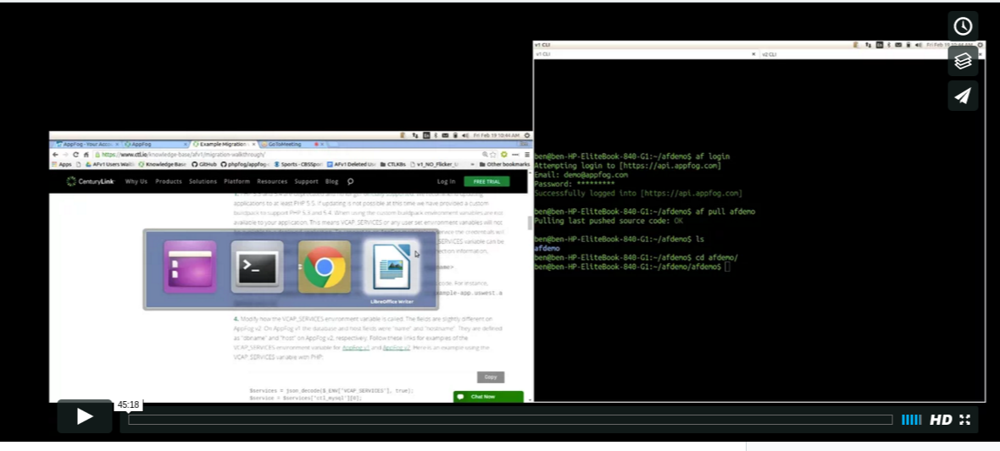

{{{
  "title": "Migration Webinar",
  "date": "02-23-2016",
  "author": "Ben Heisel",
  "attachments": [],
  "related-products" : [],
  "contentIsHTML": false,
  "sticky": true
}}}

### IMPORTANT

This presentation for users of AppFog v1 for migration to the next generation of AppFog that is located in CenturyLink Cloud Control Portal.

Before deleting any applications or services on AppFog v1 ensure you have local copies. Once apps and services are deleted it is **permanent**. We will not be able to provide a backup.

When migration is complete your billing subscription can be canceled from the [Account](https://console.appfog.com/#account) page of the web console. Please be sure to cancel your subscription as we are not aware when individual user migration is complete. The billing system will not automatically prorate the subscription and issue a refund. If applicable, please open a [Support Ticket](https://support.appfog.com/tickets/new) or email support@appfog.com to receive a prorated refund of your subscription.

### View Migration Webinar

This presentation outlines the steps needed to migrate a PHP 5.3 application using a MySQL service on AppFog v1, and follows the steps in our [Example Migration Walkthrough](migration-walkthrough.md) article.

[](https://vimeo.com/157172247)

**Note:** *This is not a complete guide for every application and additional reading of our [Migration Articles](../AppFog/Legacy Version 1/appfog-version-1-docs.md) may be necessary. For questions or assistance migrating please open a [Support Ticket](https://support.appfog.com/tickets/new) or email support@appfog.com.*

### List of Commands

The following commands were used on a Linux OS in the webinar and may prove useful when modifying your application:

* Search for AppFog v1 domains in use:
```
grep -r aws.af.cm
```
* List application environment variables:
```
af env <APP_NAME>
```
* From the root of an application search for the AppFog v1 VCAP_SERVICES MySQL service name:
```
grep -rn mysql-5.1
```
* To prevent unintentional changes other than VCAP_SERVICES fields note the location of `hostname` and `name` search results. These terms may be used outside of VCAP_SERVICES configuration. Modifications to the provided sed commands may be necessary.
* In the current directory change all instances of `mysql-5.1` to `ctl_mysql` in all file ending with the extension .php:
```
sed -i 's/mysql-5.1/ctl_mysql/g' *.php
```
* Update `hostname` with `host` and `name` with `dbname` in VCAP_SERVICES configuration:
```
sed -i 's/\["hostname"\]/\["host"\]/g' *.php
sed -i 's/\["name"\]/\["dbname"\]/g' *.php
```
* Commands to create a `.bp-config` directory and an `options.json` file within it:
```
mkdir .bp-config
touch .bp-config/options.json
```
* Within the options.json file, specify PHP version 5.3 and provide PHP extensions:

```
{ 
"PHP_VERSION" : "{PHP_53_LATEST}",
"PHP_EXTENSIONS": ["pdo_mysql", "mysqli", "mysql", "mbstring", "mcrypt", "gd", "zip", "openssl", "sockets"] 
}
```
* Create a `.user.ini` file for php.ini configuration overrides:
```
touch .user.ini
```
* Push the application setting the memory allocation to 512M and using the custom buildpack to support PHP 5.3:
```
cf push <APP_NAME> -m 512M -b https://github.com/CenturyLinkCloud/php-buildpack.git#af_custom_php
```
* Export a database:
```
af export-service <SERVICE_NAME>
```
* Download the exported service using the provided URL:
```
wget -c -O <FILE_NAME>.zip <EXPORT-SERVICE_URL>
```
* View service offerings, details of a service:
```
cf marketplace
cf marketplace -s <SERVICE>
```
* Create a service, bind a service to an application:
```
cf create-service <SERVICE> <PLAN> <SERVICE_NAME>
cf bind-service <APP_NAME> <SERVICE_NAME>
```
* View an application's environment variables:
```
cf env <APP_NAME>
```
* From the command line use a locally installed MySQL client and the provided VCAP_SERVICES credentials to import the previously exported MySQL service into the new AppFog v2 service. The credentials can also be used with a third-party tool:
```
mysql -h <HOST_ADDRESS> <DBNAME> -u <USERNAME> -p -P <PORT_NUMBER> < /path/to/file/<EXPORTED_mysqldump_FILE>.sql
```
* Create a domain:
```
cf create-domain <ORGANIZATION> <DOMAIN>
```
* Map a domain to an application:
```
cf map-route <APP_NAME> <DOMAIN>
```
