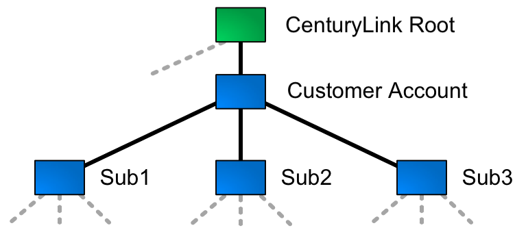
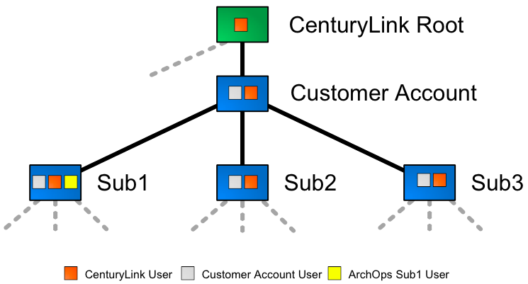
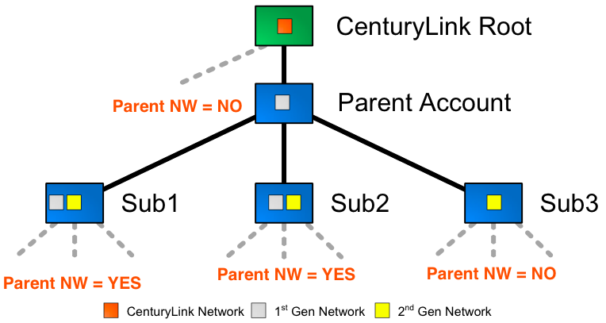
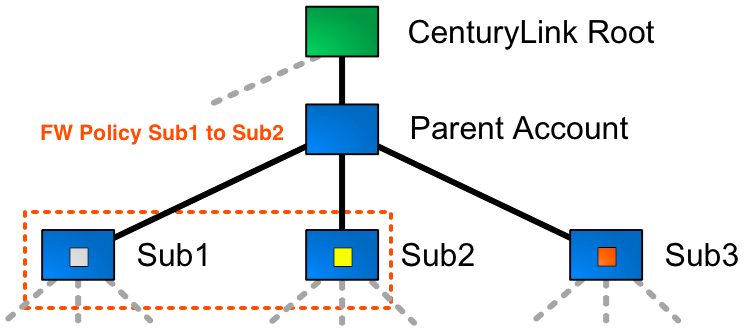
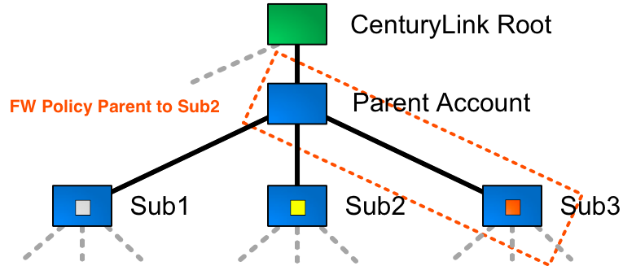
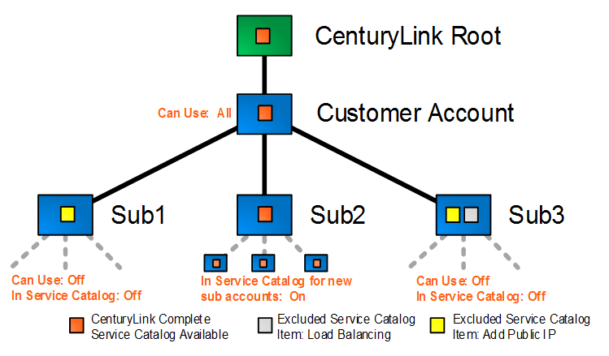
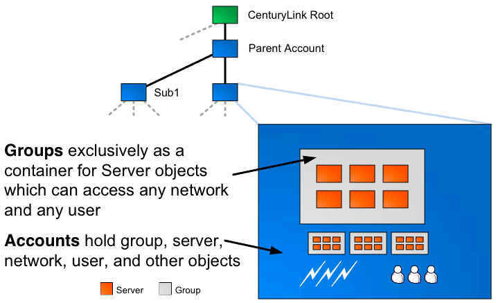

{{{
  "title": "Account Hierarchy User, Network, Service Catalog, and Firewall Policy Primer",
  "date": "6-16-2015",
  "author": "Chris Little",
  "attachments": [],
  "contentIsHTML": false,
  "sticky": true
}}}

### Overview

CenturyLink Cloud provides a secure multi-tenant platform by strictly segmenting customer accounts from each other.  This includes a strict separation between customer accounts including: cloud servers, networks, users, firewall policies, and all associated metadata.  The ability to create hard fenced accounts has been fully extended to customers through the introduction of [Sub Accounts](../Accounts & Users/creating-a-sub-account.md).

### Account and Subaccount Structure

Accounts and their children (subaccounts) are organized in a tree structure.  Assets rooted at any account level have no upward visibility in higher level branches of the tree.  In general assets have visibility and access into their children and all structure residing beneath themselves.

Visualize an account structure like the following:

### User Permissions in Subaccounts

User permissions flow down to all children below the sub account where they're created.  The [permission](../Accounts & Users/practical-guide-for-using-roles.md) roles associated with users are effective in all of these subaccounts.

### Network Access in Subaccounts

By default network access is completely segmented between all accounts and subaccounts.  When configuring a subaccount an administrator may elect to "Share Parent Networks".  When this is enabled the parent account networks are visible to the subaccount.  Servers in the subaccount can be deployed on parent networks or their own networks.

### Cross-Account Firewall Policy

Parent accounts can control firewall policies associated with parent-child networks or child-child networks.

### Service Catalog

The [Service Catalog](../General/getting-started-with-the-service-catalog.md) allows Account Administrators to enable or disable certain cloud platform services for users of individual parent or sub accounts.

### Accounts versus Groups

Take note that accounts and Server Groups are very different.  Whereas accounts are a strong fence that contains all object types, groups are a lightweight organizational object to help with managing and structuring servers.

### Considerations and Example Use Cases

The CenturyLink Cloud onboarding services team is specially positioned to help customers design the most effective account hierarchy.  Note that account structure and naming cannot be changed once created (though subaccounts can always be created/removed).  
