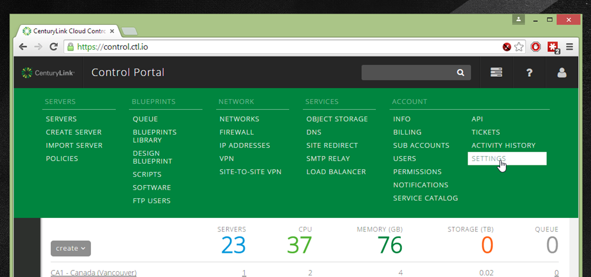
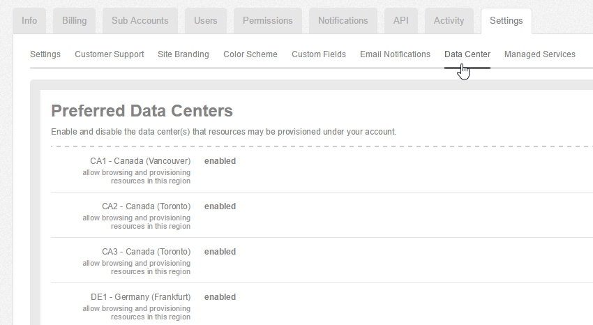
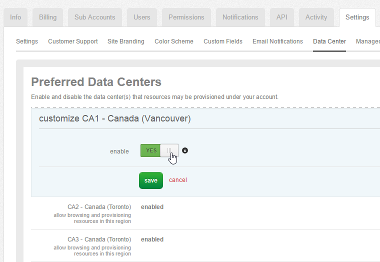
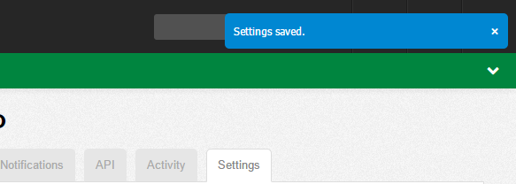
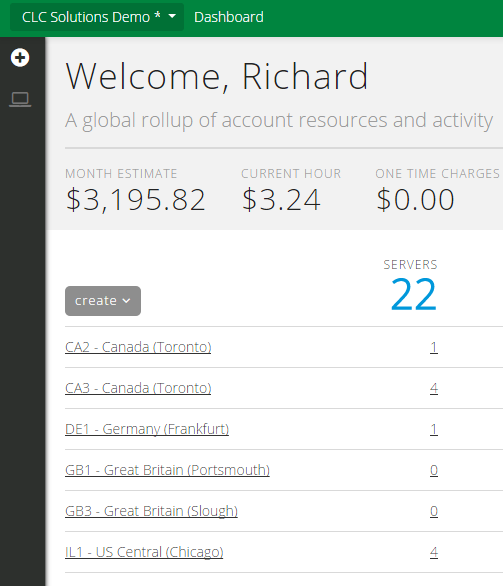
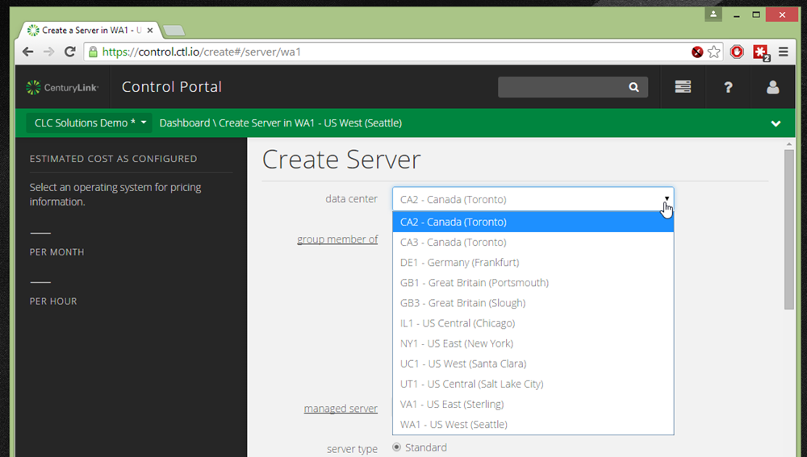

{{{
  "title": "Applying Data Center Preferences",
  "date": "3-11-2015",
  "author": "Richard Seroter",
  "attachments": [],
  "contentIsHTML": false
}}}

###Description

CenturyLink Cloud customers can choose which data centers to make available to the users of an account. **Changing these settings has implications on the user experience, and how new data centers are exposed to the account.** Read the steps below to learn how to enable/disable data centers, and the implications on the API.

###Audience

- [Account administrators and security managers](role-permissions-matrix.md)

###Detailed Steps

1. Log into the Control Portal
1. From the top menu, locate the **Settings** option under the **Acount** section.

1. Choose the **Data Center** sub tab.

1. Select the data center you wish to enable or disable and click the slider. (To enable, the slider will be in the right position with “YES” highlighted in green).

1. Confirmation of your new settings will be provided in the upper right-hand corner of the page.

1. Once a data center is disabled (in this example, CA1), it no longer appears on the dashboard overview.

1. A disabled data center (in this example, CA1) is also excluded from the **Create Server** page.

1. A disabled data center is also unavailable for any API operations that use a data center parameter (e.g. [Get Data Center List](http://www.ctl.io/api-docs/v2#data-centers-get-data-center-list)).

> **NOTE** If you apply data center preferences to your account, than any **new** CenturyLink Cloud data centers will **NOT** automatically show up in the Control Portal for you. You will need to come into the Data Center preferences page and manually enable the new data center. This behavior is in place to respect your conscious choice to show specific data centers.
