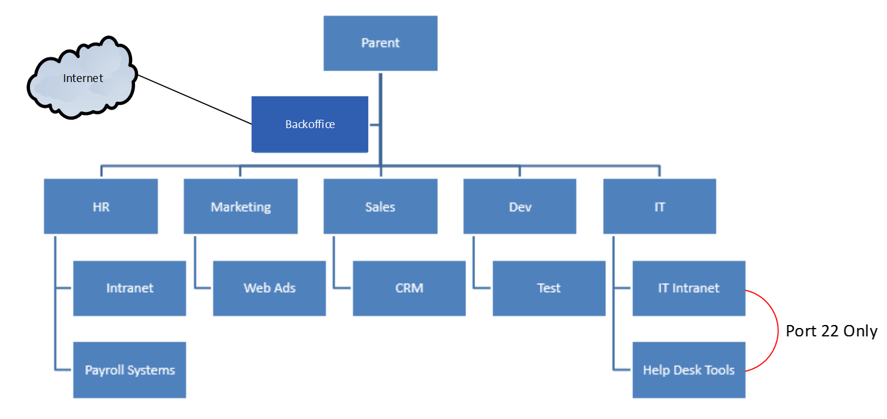

{{{
  "title": "Best Practices for Account Hierarchy Management",
  "date": "3-31-2015",
  "author": "Dave Burkhardt",
  "attachments": [],
  "contentIsHTML": false
}}}

### Overview
CenturyLink Cloud’s (CLC) Account Hierarchy management features allows customers granular enablement and demarcation of: users, systems, groups, networks,
billing, reporting, and/or sub-accounts that reside within the CLC platform. Customers with administrator access can create and manage these attributes
within the CLC Control Portal. It is strongly recommended organizations should consider the following factors, limitations, and best practices before they
embark on leveraging the aforementioned features.

### Factors that Influence Account Configuration
There are many factors that influence how a customer or reseller will configure their accounts:
* User Access Controls (control who can access which resources)
* Invoice Separation (each account/sub-account will either get its own invoice
  or be grouped by account)
* Network Access Controls (network data flow to/from Sub Accounts)
* Reporting (report based on hierarchy)

* Partner: Custom pricing (inherited based on hierarchy)
* Partner: “Branding” (inherited based on hierarchy)

* Resource Governing (limit the number of resources consumed)
* Operations and Management (policies are inherited, Blueprints can be run
  against a group)

### Limitations
* Accounts can’t be moved in their hierarchies

* There is no “read-only” mode for users, role cascades.  Need to be careful about allowing access
* Billing data out of Savvis/CenturyLink does not go down to server level only Account/Group
* Additional detail on current spend can be found in the portal or through the API, but API data for invoices is not guaranteed to be aligned with Savvis/CenturyLink data (e.g. no tax)
* No self-service ability to set custom pricing in the control portal

### Best Practices
Design your account hierarchy before you start adding users or provisioning resources, and here are some aspects to consider with your design:
* Do you have a need to create sub accounts for creating administrative boundaries and/or isolating costs for charge backs / reselling of services? If so, designing your account hierarchy to meet your business goals is a critical first step

* Does if it matter which data center will be your primary location?  We typically see customers deploy servers in their default data center, and may forget to consider other locations
* Will there be any specific data center locations you would like to prevent your users from being able to deploy resources?
* Do you need to allow certain users to only have access to specific accounts? If so, you may want to consider adding these users to child/sub account
* Does your org wish to mark-up CLC’s services to other departments or customers (e.g., reseller)? This can be accomplished by adding a child account to your parent account and working with our noc to mark-up the child accounts
* Do you have a need to block or enable network access between accounts and/or do you need to consider specific data flows between separate accounts? You should consider running an end to end process test with the data you have/need to make sure the solution will work. For example, the account hierarchy listed below could be designed as follows:
    * All VLANs/accounts can reach the backoffice account since it has the Active Directory, DNS, etc
    * Only the backoffice account will be able to access the Internet, and customer’s org will set policies restricting Internet access direct from all other accounts/VLANs
    * Load Balancers can be placed on the backoffice account/vlans, and the web servers in the Market account/vlan will need to use these LBs for their web app
    * The IT Intranet and Help Desk accounts/VLANs will be restricted to only access each other.
  

### For additional information please see the following articles:
https://www.ctl.io/knowledge-base/accounts-&-users/account-hierarchy-user-network-and-firewall-policy-primer/
https://www.ctl.io/knowledge-base/accounts-&-users/creating-a-sub-account/
