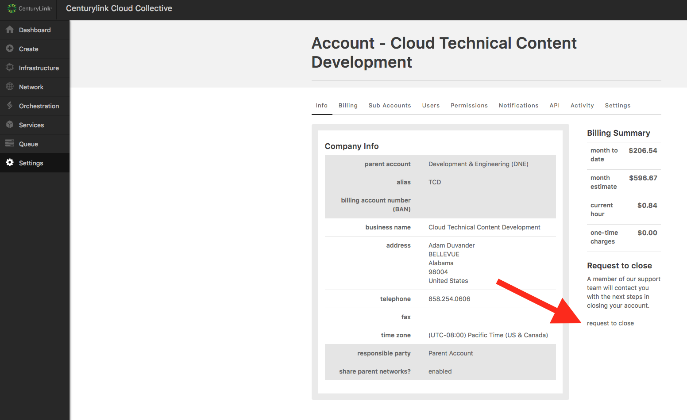

{{{
  "title": "Closing Your Account",
  "date": "11-04-2015",
  "author": "Richard Seroter",
  "keywords": ["terminate", "account"],
  "attachments": [],
  "contentIsHTML": false,
  "sticky": true
}}}

### Overview
We're sorry to see you go, but we want to make sure your off-boarding experience is as easy as possible. Follow the steps below to ensure that your account closure goes off without a hitch. Please be aware that it's not possible to recover an account or the associated assets after the account is deleted. Proceed cautiously to ensure you've recovered all data before proceeding to deletion.

### Exceptions
- Cloud Term Commitment Customers: If you have a cloud term commitment, please contract your sales representative to execute a terminate service order.

### Steps for Closing Your Account
1. Determine all the services you have created on your account. Viewing your [Usage History][1] can help with this.
2. Retrieve the data from those services. If you need help extracting a virtual machine or other data, you can request a billable [Service Task][2].
3. Use the [API][3] or Control Portal to delete any actively billed resources.
    - Resources not deleted may accrue further charges before an account is completely deleted. Confirmation of account closure doesn't necessarily mean that no further charges will be accumulate, so you should make sure you've deleted all your services _before_ requesting account closure.
    - The network in your account's default data center, which your account's OpenVPN server uses, is not charged to you and therefore doesn't need to be deleted before requesting account closure.
4. Submit the account closure request. Navigate to the [Account Profile/Info page][4] and click the "request to close" link.
    - This link immediately generates a ticket (without an additional confirmation prompt) to the CenturyLink Cloud team who will then close your account. __If, after 1 hour, you don't receive a confirmation by a member of the CenturyLink Cloud team, please email [help@ctl.io][5] or [submit a separate ticket][6] to verify the closure request was sent.__
    - There is no guarantee that any server data or configurations can be retrieved after this point.

#### Final Invoice
After the close of the current month, you'll receive your final invoice from CenturyLink.

[1]: https://control.ctl.io/Organization/payment/ledger
[2]: https://www.ctl.io/service-tasks
[3]: https://www.ctl.io/api-docs
[4]: https://control.ctl.io/organization/account
[5]: mailto:help@ctl.io
[6]: https://www.ctl.io/knowledge-base/support/using-the-help-desk-web-ui
