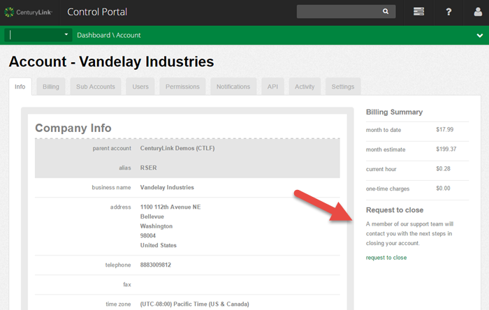

{{{
  "title": "Closing your Account",
  "date": "11-04-2015",
  "author": "Richard Seroter",
  "keywords": ["terminate", "account"],
  "attachments": [],
  "contentIsHTML": false,
  "sticky": true
}}}

### Overview

We're sorry to see you go, but we want to make sure your off-boarding experience is as easy as possible. Follow the steps below to ensure that your account closure goes off without a hitch.

### Exceptions

* Cloud Term Commitment Customers: If you have a cloud term commitment, please contract your sales representative to execute a terminate service order.

### Steps for closing your account

1. __Retrieve your data from your cloud servers.__ Log into your virtual (or Bare Metal) servers and transfer your data to an on-premises or alternative location. If you need help extracting a virtual machine or data, request a for-pay [Service Task](https://www.ctl.io/service-tasks/) and we'll deliver it to you.
2. __Delete your running, stopped, and archived servers.__ While we will delete these resources for you upon successful verification of your account closure request, there could be time in between when you're still incurring costs. To prevent that, use the API or Control Portal to clean up your servers.
3. __Delete services with an hourly/monthly charge.__ Like mentioned above, there may be a few hours or days between your initial request to close an account, and verification of that user. To avoid accruing any charges during that period, remove any for-pay services such as: virtual networks, public IP addresses, site to site VPNs, load balancer pools, Object Storage buckets, and AppFog applications.
4. __Click the "Request to close" link found under Account --> Info.__ This link immediately triggers a request (without an additional confirmation prompt) to the CenturyLink team, who will reach out to you to confirm your identity (via [your user PIN](https://www.ctl.io/knowledge-base/support/pin-authentication-for-support-requests/)).  
  
5. __CenturyLink Customer Care will reach out to you via email and ask you to confirm your user PIN.__ Once we receive the PIN value, your account will be put into a "deleted" state and all remaining resources will be deleted. There is no guarantee that any servers or configurations can retrieved after this point.
6. __Customer receives their final invoice.__ After the close of the current month, you will receive your final invoice from CenturyLink.
