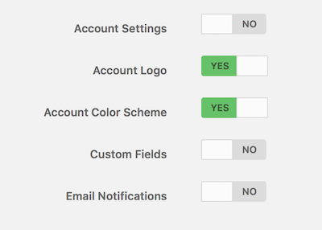

{{{
"title": "Creating a Sub Account",
"date": "11-5-2014",
"author": "Jon McClary",
"attachments": [],
"contentIsHTML": false
}}}

Lumen Cloud supports the ability to create Sub accounts, which fall under a Parent account. Sub accounts have many advantages:

* They are hierarchal - user account permissions flow from Parent account to Sub account, not up nor sideways 
* They may be billed separately or to the Parent account 
* They may share private networks from the Parent account or have their own 
* Settings are inherited

### Creating a Sub Account

* On the left hand side of Lumen Cloud’s Control Portal, select Settings -> Sub Accounts.
* Click the `+ create new account` button

### Organization Info

Select the desired Parent account. For example, if you want this account to be a Sub account of a Sub account, you would need to select the Sub account you would like to have the new account nest under.

Fill in the appropriate Business name, etc.

Input an Account Alias of your choice. This is a required field. This is a string of 2-4 alphanumeric characters which is used to identify your account and relate servers to that account by naming convention. They have to be globally unique so no duplicate aliases are allowed. Note that an account alias cannot be reused, even after deletion of the original account with that alias.

Full Address and Phone fields are required.

Further down in the page you wil see this section:

You may input a Default Primary DNS and a Default Secondary DNS IP address. This will be the DNS servers used when building a server in the platform.  Input IPv4 IP addresses into these fields. You may list your own environment's DNS servers, preferred public DNS servers, or the default Lumen Cloud datacenter DNS servers (172.17.1.26, 172.17.1.27). If you leave it blank, it will default to using the Lumen Cloud Datacenter DNS servers, which do allow for external DNS lookup.

Bill to: Each Sub account generates an invoice. You have the option of submitting the invoice to the Parent account, or bill the Sub account directly.

Payment Type: Input the payment type for the Sub account.

Share Parent Networks: This allows the Sub account to use the networks present in its Parent account. If this is set to "NO", the Sub account will receive unique IP ranges when deploying servers and/or networks.

### Settings

All settings will be inherited from the Parent. Selecting "Yes" to any of the settings in this section will make that section visible in the Sub account. The users in that Sub account will then be able to override inherited settings. Leaving the sections set to "No" will hide the menu for that section in the Sub account, preventing the settings from being overridden. In our example Sub account, users will be able to change the Account Logo and Account Color Scheme from what was inherited. All other menus will be hidden.

### Data Center

Select the home datacenter for the new Sub account. This selection does not limit your ability to build in any other datacenter. Your VPN server will be created in this datacenter so you may wish to pick a datacenter close to you. You will not be able to hide or change the Primary datacenter after the Sub account has been created.

Click the "Create Sub Account" button to create the Sub account as configured. If you get any errors (i.e. the alias is in use, or missed any required fields), correct the errors and click the "Create" button again.

Once the account is created successfully, you will be returned to the Parent account (the one you were logged into). You can navigate to the new Sub account using the account drop-down. Click on your account's name and alias located at the top left hand corner of the Control Portal screen.  This will open a dropdown list containing all of your Sub accounts.  Select the Sub account desired and it will change the account context to that Sub account.

**Edit Settings:**

After the Sub Account is created, you can edit the Sub account's settings. Any of these settings may be modified in the future by logging into the Parent Account, then navigating to Settings -> Sub accounts page and selecting the Sub account for which you wish to edit settings. You will be sent to the “Sub Account Settings” page.

Edit settings from the Parent account after the Sub account has been created.

Menus are hidden to the Sub account.

You can click any of these settings and toggle them between disabled (not visible) and enabled (visible and therefore editable).

### Adding Users/Permissions

To add new users to the sub account:

1. In the drop-down in the top left, select the Sub account for which you would like to add a user.

2. Go to Settings -> Users and click the “+ New User” button.

3. Fill in required information.

4. Permissions can then be administered via Settings -> Permissions.

5. Note that user permissions are hierarchical, so a user may access the account to which they are assigned, and that account’s Sub accounts, but not a Parent account nor any other Sub account on the same level.

### FAQ

**I just created my sub account. Why do I get a permission denied error when I try to access it?**

Allow a few minutes for the new account to fully replicate and try again.

**I don’t need this sub account any longer, how do I delete it?**

Settings -> Info. Click on “Request to close” link at bottom right corner of the page.

**I disabled a sub account, but still see it in my sub accounts list.**

A disabled Sub account still appears in the list, so you have the option to re-enable it. Entering the Sub account via the drop-down at the top left, and going to Settings -> info and clicking the “Request to close” link will start the process to remove the account.
