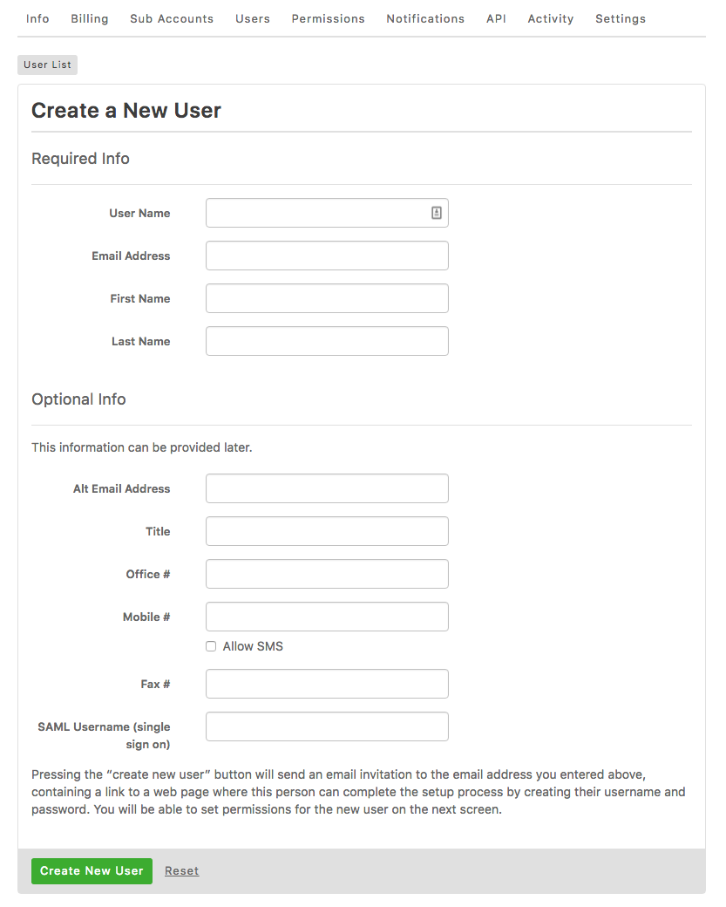

{{{
  "title": "Creating Users",
  "date": "10-26-2017",
  "author": "Lumen Cloud Customer Care",
  "attachments": [],
  "contentIsHTML": false
}}}

Users can be configured for both the Control Portal and the API.

### Control Portal Users

You can manage users on your account by going to the Control Portal > Settings > Users.

**Important Notes:** 
* Permissions must be configured for a user after they are created in order to have access within the control. Learn more about [User Permissions](user-permissions.md).

* A Control account username must be globally unique in the platform and cannot be reused, or otherwise reissued/migrated into a different Control account. If the user account is deleted, it cannot be reinstated or repurposed for another user. This constraint is currently an intentional design specification built into the Lumen Cloud Control platform.

**Creating Users**
1. Click the "Create New User" button.

2. Fill in all required fields. The entered email address must be unique as it will also be the username.

    

3. Optionally fill in additional information

4. Once a user is created an email containing the required information for logging in will be sent to the email address you created.

**Disabling Users**
1. From the Users list, click the user you wish to delete.

2. Click the "Status" field in the User Profile box

3. Click to change the "enabled" switch from 'Yes' to 'No'

4. Click "Save"

**Deleting Users:**
1. From the Users list, click the user you wish to delete.

2. Click the Delete User button to the right of the User Profile box.

### API Users

You can manage users for version 1 of the API on your account by going to the Control Portal > Settings > API.

**Important Notes:** 
* API users have full permission to account resources, and as such do not need permissions configured.

* API v2 user control portal users rather than an API specific user.

* API users cannot be disabled; to remove access, they must be completely deleted 

**Creating Users:**
1. Click on the "Create API User" button.
2. Enter an email address. The entered email address must be unique.

**Deleting Users:**
1. From the list of API Users, click the red "X" to the right of the user to be deleted.
