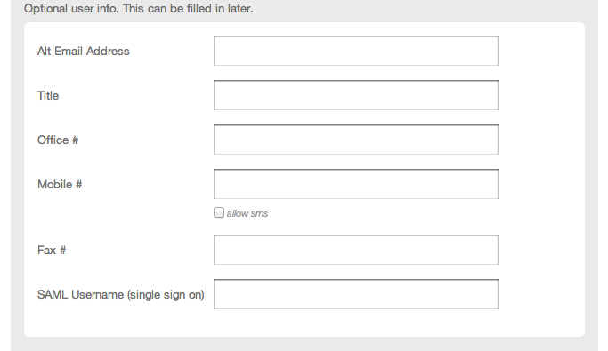
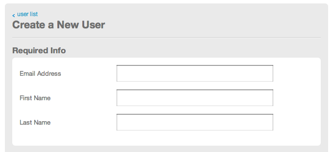

{{{
  "title": "Creating Users",
  "date": "10-16-2014",
  "author": "Troy Schneringer",
  "attachments": [],
  "contentIsHTML": false
}}}

Users can be configured for both the Control Portal and the API.

### Control Portal Users

You can manage users on your account by going to the Control Portal &gt; Account &gt; Users.

NOTE: Permissions must be configured for a user after they are created in order to have access within the control. Learn more about [User Permissions](user-permissions.md).

1. Click the "Create New User" button
2. Fill in all required fields. The entered email address must be unique as it will also be the username.

  
3. Optionally fill in additional information

  
4. Once a user is created an email will be sent to the email address supplied with the required information for logging in.

### API Users

You can manage users for version 1 of the API on your account by going to the Control Portal &gt; Account &gt; API.

1. Click on the "Create API User" button.
2. Enter an email address. The entered email address must be unique.

  NOTE: API users have full permission to account resources, and as such do not need permissions configured.

  NOTE: API v2 users control portal users rather than an API specific user.
