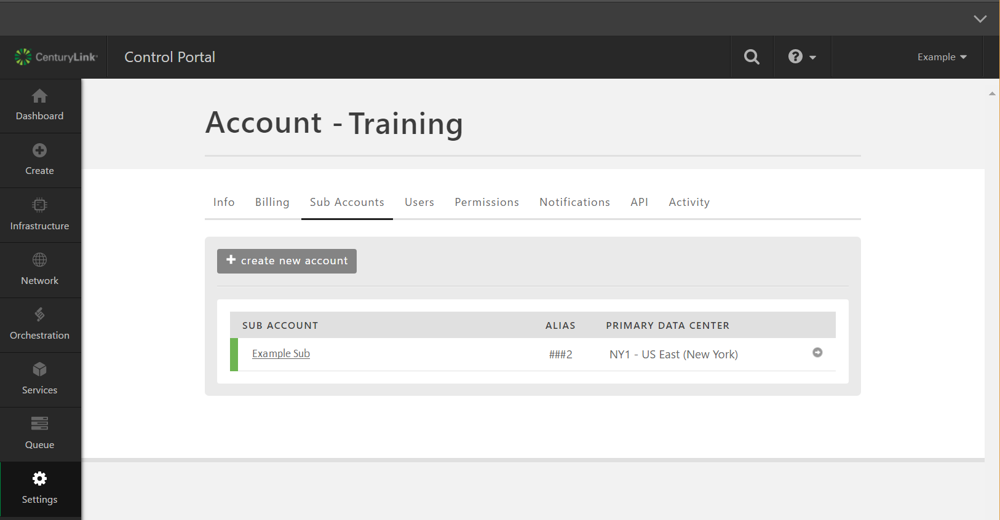
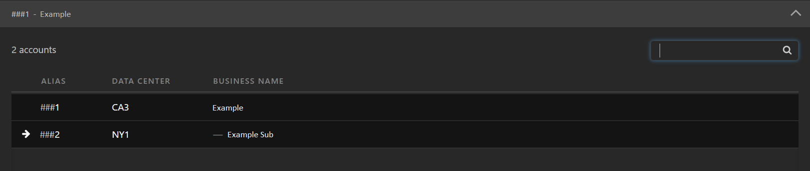

{{{
  "title": "Managing Sub Account Resources",
  "date": "6-24-2017",
  "author": "Jeremy Peters",
  "attachments": [],
  "contentIsHTML": false,
  "sticky": true
}}}

### Overview

Customers with [sub-accounts](https://www.ctl.io/knowledge-base/accounts-&-users/creating-a-sub-account/) may want to manage existing or create new resources under that account. Follow these steps to change the account focus/context in Control for managing multiple accounts.

### Changing your focus to another account

* From your parent account in Control, click the down-arrow at the top-right corner of the page.

  

* From the drop-down screen presented, you can either type in the account alias (e.g. ###2 presented here) for the account you wish to search to, or click on the sub account if it is listed.

  
