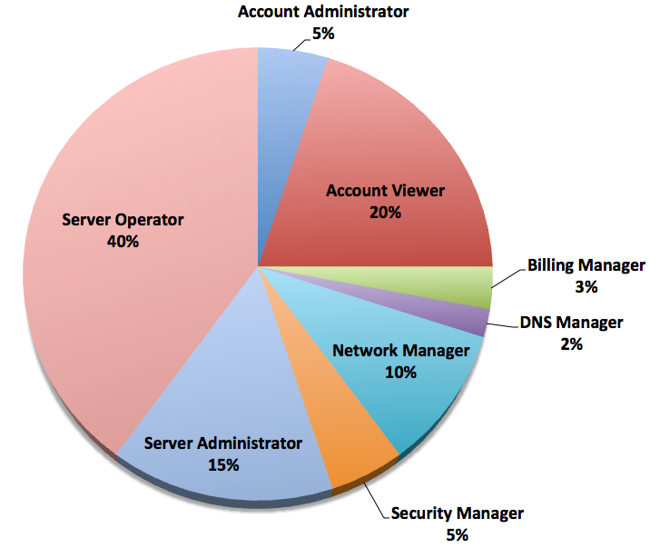
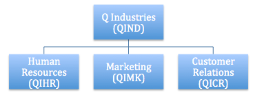
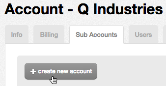
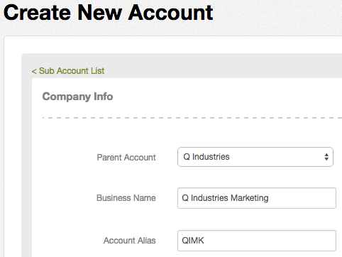
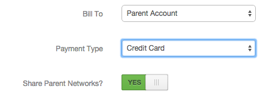
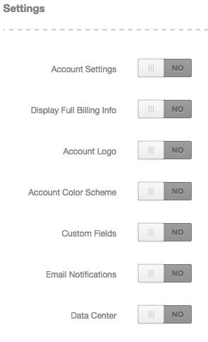

{{{
  "title": "Practical Guide for Using Roles",
  "date": "12-15-2014",
  "author": "Bryan Friedman",
  "attachments": [],
  "contentIsHTML": true
}}}

<h3>Description</h3>

CenturyLink Cloud currently offers eight roles that are available to assign users to. A brief description of each role is available on the <a href="../Accounts & Users/user-permissions.md">User Permissions</a> page, and a complete list of actions that can be performed by each role can be found in the <a href="../Accounts & Users/role-permissions-matrix.md">Role Permissions Matrix</a>. These roles were designed to align with job functions that are frequently found in many organizations, but they may not perfectly match up with the specific use cases or job titles found in your organization. This article will give some examples and guidelines for using roles and account hierarchies for managing security and access in the Control Portal.

<h3>Example Organizational Role Breakdown</h3>

Not surprisingly, servers and groups typically make up the majority of accessed resources in Control Portal. As such, Server Administrators and Server Operators who manage servers and groups within an account, will likely make up more than half of your users. While Server Operator permissions will probably be enough for most, Server Administrators do have a few extra privileges, allowing them to add public IPs to servers, configure load balancers, change server administrator/root passwords, create and update alert and autoscale policies, and manage Blueprints for orchestrating complex server build-outs.

Next on the list will probably be Account Viewers who have read-only access across all resources. These will tend to be folks like managers and directors, business analysts,  project managers, and others who need visibility into what cloud resources are being used, but should not have any permissions to modify anything. Some organizations will include security teams on this list, while others may prefer to utilize the Security Manager role which will give similar read-only access across the account while also allowing the security user to make certain changes to network configuration and users or authentication settings.

Many organizations will likely have an IT team who is responsible for managing the network topology and integrating the company network with that of the cloud. These users may be Account Administrators in some cases, but they may also be a member of the Network Manager role, which will give them full access to the network configuration in the cloud without having direct access to servers or other account resources.

Finally, there will of course be some Account Administrators who have access to perform all functions within the context of the account, and there may also be a few users who have specialized functions like accountants who manage billing (Billing Manager) or domain name managers who may be separate from a networking team (DNS Manager).

Below is a pie chart detailing one suggested breakdown of roles for an organization that generally follows these principles.

<h3>Example Use Case</h3>

In this example, we will use a fictional organization called <em>Q Industries </em>headquartered in Chicago with 7,000 employees across the US at sites in Seattle, DC, and New York. They have been piloting the cloud in their internal IT organization,
  but are now planning on using it to manage applications in three more of their business units: Human Resources, Marketing, and Customer Relations. 

From the pilot, they already have an account set up with three users as follows:

<table>
  <tbody>
    <tr>
      <td><strong>Account</strong>
      </td>
      <td><strong>User</strong>
      </td>
      <td><strong>Role</strong>
      </td>
    </tr>
    <tr>
      <td>QIND</td>
      <td>James Smith</td>
      <td>Account Administrator</td>
    </tr>
    <tr>
      <td>QIND</td>
      <td>Michelle Johnson</td>
      <td>Account Administrator</td>
    </tr>
    <tr>
      <td>QIND</td>
      <td>Joseph Dollar</td>
      <td>Billing Manager</td>
    </tr>
  </tbody>
</table>

As Account Administrators, James and Michelle use the Control Portal to manage all the resources they are using in the cloud, from servers and groups, to networks, firewall rules, DNS settings, load balancers, Blueprints, and all account settings. As
  the Billing Manager, Joseph only has access to the billing details and usage and is responsible for working with the accounting department on getting the services paid for. 

Now that the usage is expanding beyond just IT, James and Michelle have to decide how to set up the new business units in the account hierarchy and what roles to give the users who will manage the resources there.

<h4><strong>Account Hierarchy</strong></h4>

James and Michelle don't want each business unit to be able to see or change resources that belong to another business unit, but they also know that they will now have to give more visibility across all company resources to some of the IT managers and
  security staff. They have already branded the Control Portal with the company logo and colors and want this branding to apply to all business units in the company. They also want to centrally manage custom fields and email notifications so that IT maintains
  control over these aspects of the platform to ensure some consistent governance processes are followed. Finally, they need to make sure that the networks they've created in the QIND account for IT applications are accessible by all company users.

All of these things than can be controlled by setting up an account hierarchy appropriately. In this case, James and Michelle will use the QIND account as the parent account for all areas of the company, and will create sub accounts for each individual
  business unit. This way, users who are created in each sub account will only have access to the resources that exist there, but users in the parent account will have access in that context and be able to view/interact with all resources in the sub accounts
  as well. So the account hierarchy will look like this:

The steps below will walk through setting up one of these accounts to meet the requirements described above.

<ol>
  <li>From the Account page on the Sub Accounts tab, click the "create new account" button.
     
  </li>
  <li>Enter the desired account name and alias (along with all the required address information and default DNS information if desired).
     
     
     
  </li>
  <li>In this example, we specified that we want to bill the parent account and make the parent networks accessible, so we will set these options here as well, but they should be set per your specific use case:
     
  </li>
  <li>Finally, we specified above that we want to prevent sub account users from changing custom fields, e-mail templates, and branding information. The Settings area is where we determine this, so we will leave all account settings as disabled so the settings
    will not even show up for these sub account users. (These can also be enabled/disabled after the fact in the Sub Accounts settings tab.)
     
     We could have decided to leave Data Center set to YES so that sub accounts can choose which DCs to allow servers to be deployed to, but here we've left it off as well. We can also change the primary DC if desired.</li>
  <li>Clicking the final "create" button will create the sub account with the settings specified. Users who should only have access to that account's resources should be created within the sub account itself, as described below.</li>
</ol>
<h4>Role Assignment</h4>

Now that the account hierarchy is configured to allow for the correct separation of resources across business units, we need to create users and assign roles accordingly. We can see from the pie chart above that it's suggested to have mostly Server Operators
  and Server Administrators, which makes sense here as well because the majority of resources specific to each business unit will be servers and groups to house the organization's applications. In the case of Q Industries, since most of the account settings
  and the billing will continue to happen only at the parent account level per the settings above, they believe they can get away with just one Billing Manager and the two Account Administrators at the parent account level. As they expand to
  other business units, though, they may need to increase the number of users in these roles and possibly delegate some to sub accounts. They have set up the following users in their accounts:

<table>
  <tbody>
    <tr>
      <td><strong>Account</strong>
      </td>
      <td><strong>User</strong>
      </td>
      <td><strong>Role</strong>
      </td>
    </tr>
    <tr>
      <td>QIND</td>
      <td>James Smith</td>
      <td>Account Administrator</td>
    </tr>
    <tr>
      <td>QIND</td>
      <td>Michelle Johnson</td>
      <td>Account Administrator</td>
    </tr>
    <tr>
      <td>QIND</td>
      <td>Joseph Dollar</td>
      <td>Billing Manager</td>
    </tr>
    <tr>
      <td>QIND</td>
      <td>Michael Stern</td>
      <td>Security Manager</td>
    </tr>
    <tr>
      <td>QIND</td>
      <td>Isaac Reading</td>
      <td>Account Viewer</td>
    </tr>
    <tr>
      <td>QIND</td>
      <td>Eric See</td>
      <td>Account Viewer</td>
    </tr>
    <tr>
      <td>QIND</td>
      <td>Jonathan Sight</td>
      <td>Account Viewer</td>
    </tr>
    <tr>
      <td>QIND</td>
      <td>Diana Keen</td>
      <td>Account Viewer</td>
    </tr>
    <tr>
      <td>QIND</td>
      <td>Arthur Cable</td>
      <td>Network Manager</td>
    </tr>
    <tr>
      <td>QIND</td>
      <td>Catherine Five</td>
      <td>Network Manager</td>
    </tr>
    <tr>
      <td>QIND</td>
      <td>Dorothy Com</td>
      <td>DNS Manager</td>
    </tr>
    <tr>
      <td>QIHR</td>
      <td>Dean Elliott</td>
      <td>Server Administrator</td>
    </tr>
    <tr>
      <td>QIHR</td>
      <td>George Masters</td>
      <td>Server Administrator</td>
    </tr>
    <tr>
      <td>QIHR</td>
      <td>Stuart Jackman</td>
      <td>Server Operator</td>
    </tr>
    <tr>
      <td>QIHR</td>
      <td>Lindsay Quinn </td>
      <td>Server Operator</td>
    </tr>
    <tr>
      <td>QIHR</td>
      <td>Randy Leslie</td>
      <td>Server Operator</td>
    </tr>
    <tr>
      <td>QIMK</td>
      <td>Henry Jansen</td>
      <td>Server Administrator</td>
    </tr>
    <tr>
      <td>QIMK</td>
      <td>Casey Avery</td>
      <td>Server Operator</td>
    </tr>
    <tr>
      <td>QIMK</td>
      <td>Steven Majors</td>
      <td>Server Operator</td>
    </tr>
    <tr>
      <td>QIMK</td>
      <td>Stacy Sanderson</td>
      <td>Server Operator</td>
    </tr>
    <tr>
      <td>QIMK</td>
      <td>Theodore Glass</td>
      <td>Account Viewer</td>
    </tr>
    <tr>
      <td>QICR</td>
      <td>Nathan Snyder</td>
      <td>Server Administrator</td>
    </tr>
    <tr>
      <td>QICR</td>
      <td>Lauren Wells</td>
      <td>Server Operator</td>
    </tr>
    <tr>
      <td>QICR</td>
      <td>Jerry Archer</td>
      <td>Server Operator</td>
    </tr>
    <tr>
      <td>QICR</td>
      <td>Taylor Jones</td>
      <td>Server Operator</td>
    </tr>
    <tr>
      <td>QICR</td>
      <td>Gail Simmons</td>
      <td>Server Operator</td>
    </tr>
    <tr>
      <td>QICR</td>
      <td>Phillip Fibers</td>
      <td>Network Manager</td>
    </tr>
  </tbody>
</table>

Most of their Account Viewers and the Security Manager will be at the parent account level so they can have access to everything across the company, but there is one Marketing director who has the Account Viewer role only in the QIMK account. Two primary network managers are added at the parent account level, along with a DNS manager. Customer Relations has some special network requirements and a different governance process, so they have also have a separate Network Manager in the Customer Relations account. Most of the rest of the users at the sub account levels are Server Operators, with a few Server Administrators here and there (at least one in each BU).

The following few examples run through how the above users might interact with each other and the business to perform the necessary operations in Control. (Note: These examples do not detail all the specifics of the process, leaving out some best practices like change control and testing. However, they are designed to give a high-level overview of how the above roles might be applied in a real world scenario.)

<h4>Provisioning Servers</h4>

The Human Resources team will be deploying a new timekeeping application for Chicago users. They need five application servers behind a load balancer in the IL1 data center. George, a Server Administrator for the HR department, receives a request for these servers and proceeds to create the five that are needed. He also configures a load balancer on the front end to point each of the five servers. (He may even decide to consult with the application architect and opt for using a <a href="../Autoscale/creating-and-applying-autoscale-policies.md">Horizontal Autoscale policy</a> instead of keeping all five servers powered on all the time.) Now George enters a request to the DNS Manager, Dorothy, to create a domain to associate with the frontside IP address of the load balancer. Finally, George hands off the servers to Lindsay, the Server Operator designated to this particular HR user group, who will work with the developers of the application to get it deployed on the new servers. A few weeks later, Stuart and Randy, two other Server Operators responsible for Q Industries HR servers, receive word that there is a patch that needs to be applied to the software. They schedule a maintenance window for Friday night and stay late to patch the servers.

Over in Customer Relations, a group in the DC office have been working on a new reporting tool they would like to launch in the VA1 data center. They enter a request for one application server and one database server. Nathan, CR's resident Server Administrator, receives the request and creates both servers. He also works with Phillip, the Network Manager for CR, to configure a domain name for the application, as well as other CR-specific network settings that Phillip is aware of. Soon after the application is released, two of the Server Operators for CR, Lauren and Jerry, notice from some alerts that there seems to be a memory leak. After conferring with the application owner, they decide to create a scheduled task to reboot the application server once a week on Thursday evenings.

<h4>Network Configuration</h4>

James and Michelle have already worked with Arthur to set up a Site-to-Site VPN to connect the company's Chicago intranet to the primary network in IL1 in the QIND account, enabling users on the intranet to connect directly to this network without the need for an OpenVPN connection. 

Now Marketing has set up a brand new application in NY1 that needs to be able to interface with the Customer Relations reporting application in VA1. Henry, the Marketing department's Server Administrator who provisioned the application servers, opens a request with Catherine, one of the central IT Network Managers, to enable this. Catherine is able to get this working by creating a cross-DC firewall policy as well as adding some additional DNS configurations.

<h4>Security Review/Audit</h4>

Upon a quarterly security review, Michael, the Security Manager and director of Information Security for Q Industries, determines that there is a risk of data leakage from the database server for the Customer Relations application. A number of other servers have been provisioned on the same network, but no one else should be able to connect to this database directly as it has special confidential information stored there. Since Michael has access to update firewall policies, he creates an intra-DC firewall rule that limits access to the database server so that it can only be reached from the related application server. If Q Industries instead used the Account Viewer role for security reviews, the user may have been required to work with an Account Administrator or Network Manager to set this configuration up.

In preparation for an annual report to her leadership team, Diana, an Executive Director of IT for Q Industries, wants to put together some information on the progress of cloud adoption. Since she has Account Viewer access at the parent account level, she logs in and can see on the dashboard the number of servers in each DC, as well as other useful account information.

