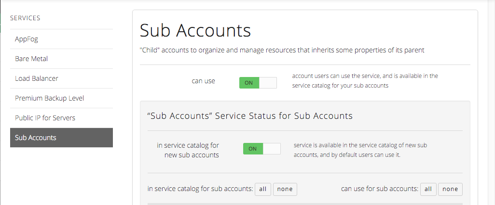

{{{
  "title": "Enabling Sub-Accounts for Self-Sign Up Customers",
  "date": "10-27-2015",
  "author": "Jared Ruckle",
  "attachments": [],
  "contentIsHTML": false,
  "sticky": true
}}}

### Overview

Customers that have created an account via www.ctl.io by default will not have the capability to create, view, or manage [sub-accounts](https://www.ctl.io/account-management/#UseCases).

### How do I enable the sub-account feature?

Simply email [help@ctl.io](mailto:help@ctl.io) and request that the sub-account feature be "enabled" for your account. Once approved, this capability will then appear in your [Service Catalog](../General/CenturyLinkCloud/getting-started-with-the-service-catalog.md).

  
