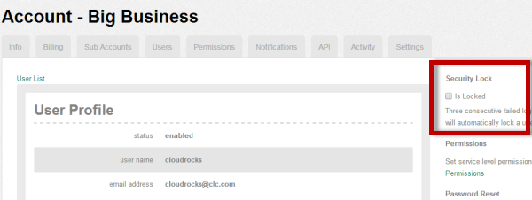

{{{
  "title": "Unlocking a User Record",
  "date": "10-13-2014",
  "author": "Richard Seroter",
  "attachments": [],
  "contentIsHTML": false
}}}

### Description

CenturyLink Cloud users are locked out of their account after 4 failed login attempts. To unlock the user, an Account Administrator must view the user's record in the Control Portal and choose to unlock the user. That Account Administrator may be someone in the customer account, or a NOC Engineer.

### Prerequisites

* User unlocking the record must have Account Administrator privileges

### Detailed Steps

* Four consecutive log in failures (incorrect password or username)
* The user receives a message that their user account is locked out.
* An Account Administrator is contacted and views the user's record.
* The Account Administrator unchecks the "Is Locked" checkbox. If the user contacts the CenturyLink Cloud NOC, then the user's password will also be reset as part of the unlock procedure.

The user is now able to log into the Control Portal.
