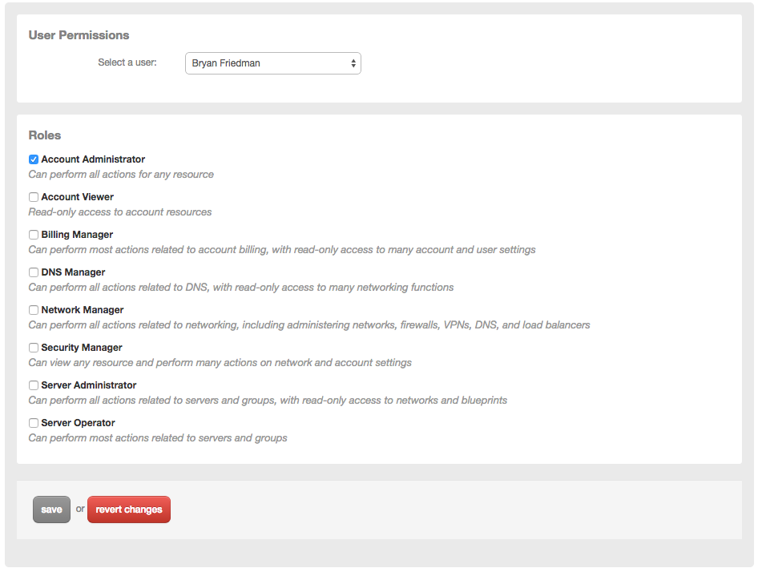

{{{
  "title": "User Permissions",
  "date": "9-16-2016",
  "author": "Troy Schneringer",
  "attachments": [],
  "contentIsHTML": false
}}}

Control Portal permissions are controlled by adding users to one or more roles. Roles are simply a collection of actions that a user is allowed to perform for areas within the Control Portal. You can configure roles for a user by going to Control Portal > Settings > Permissions and following the steps below.

The permissions settings page includes a list of roles and their respective descriptions (shown below). For a complete matrix of roles and the specific functions they can perform, reference the [Role Permissions Matrix](../Accounts & Users/role-permissions-matrix.md) for details.

### Steps

To view or edit permissions go to Control Portal > Settings > Permissions.

1. Select the user for whom you would like to view or edit permissions
2. If you want to make a change, set roles

  

3. Click the save button
