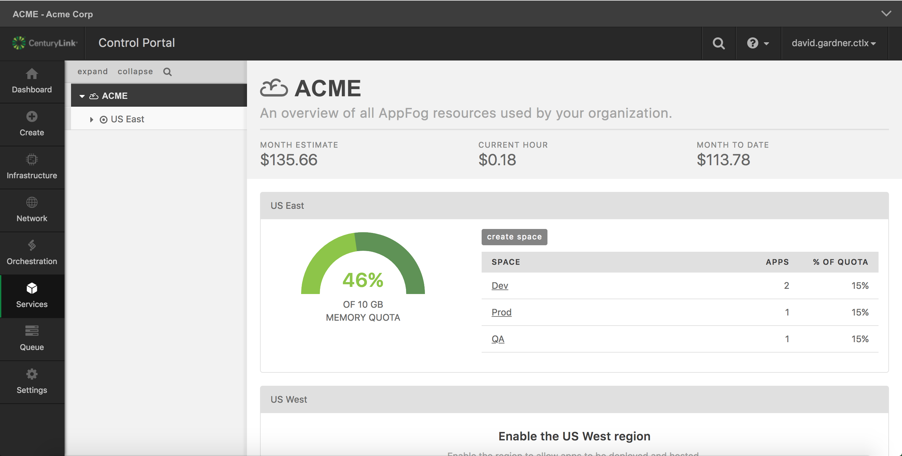

{{{
  "title": "AppFog Retirement Quick Reference Guide",
  "date": "03-26-2018",
  "author": "David Gardner",
  "attachments": [],
  "related-products" : [],
  "contentIsHTML": false
}}}

### Audience

AppFog Users

### Overview

This article provides helpful information regarding the AppFog product retirement scheduled for June 1, 2018 at 12:00 AM US Pacific Time (UTC-8:00). (Effectively, midnight on May 31, 2018).

#### Does my account have any active applications and/or services running on AppFog?  

Login to AppFog [https://appfog.ctl.io/](https://appfog.ctl.io/) to determine which applications and/or services are active. After logging in, the AppFog dashboard displays a overview of all AppFog resources and charges used by your organization (e.g. account). If the *Current Hour* charges are greater than $0/hour, than you have active apps/services and must _migrate_ to another Cloud provider or _terminate_ before June 1, 2018. If the *Current Hour* charges are equal to $0/hour, than no further action is required.



#### Migration/Discontinuation Incentives

AppFog users who complete migration and/or discontinue using AppFog by the dates listed below will receive a CenturyLink Cloud account credit.

| Date   | Incentive |
|--------|-----------|
| May 11, 2018 | CLC account credit worth 2x Feb AppFog usage |
| May 18, 2018 | CLC account credit worth 1x Feb AppFog usage |
| June 1, 2018 | none |

For example, if an CLC account with $125 in Feb 2018 AppFog usage _stops_ all AppFog applications and services by May 11, 2018, it will receive an account credit for $250. However, if the AppFog applications and services are not _stopped_ until May 18, 2018, than it will receive an account credit for $125.    

#### What will happen to my AppFog applications and services on June 1, 2018?

Any applications or service instances still running on AppFog as of June 1, 2018 will no longer be available. This includes Relational DB database instances created via the Cloud Foundry CLI using the `cf create-service` command. You are responsible for migrating your applications and data. CenturyLink is not responsible for any loss of data or loss of access to data after AppFog is retired.

#### Where should I migrate my AppFog applications and services?

We recommend migrating to one of several [Certified Cloud Foundry platforms](https://www.cloudfoundry.org/certified-platforms/). All certified platforms use the same core Cloud Foundry software and ensure application and skill portability across providers. Two (2) popular Cloud Foundry platforms are the [Pivotal Application Service](https://run.pivotal.io/) and [IBM Bluemix](https://console.bluemix.net/registration/), but there are several other providers as well.

#### What are the migration steps?

After creating an account on target Cloud Foundry platform, the steps below are a generalized migration guide. As with any application migration, first deploy and test the application in the target environment before rerouting traffic to the migrated application. You will also need to use the [Cloud Foundry CLI](https://docs.cloudfoundry.org/cf-cli/install-go-cli.html) tool to perform these steps.

_Note: This is not a comprehensive migration guide. Your specific migration steps may vary from those outlined below._

**General Migration Steps:**

1) Connect to the AppFog Region where your application and/or services are hosted. See the [Login to AppFog using the Cloud Foundry CLI](https://www.ctl.io/knowledge-base/appfog/login-using-cf-cli/) KB article for instructions.

2) Identify any database services your app is using. From the CLI command line, use `cf services | grep <APP_NAME>` (`<APP_NAME>` is the name of your application). You will need to migrate each RelationalDB service your application is using.

3) Recreate the services on the target (new) Cloud Foundry platform. Login to the target Cloud Foundry region (see [KB article](https://www.ctl.io/knowledge-base/appfog/login-using-cf-cli/) from Step 1).

4) Migrate the data from the existing AppFog service to the target service. The [Migrating a Database in Cloud Foundry](https://docs.cloudfoundry.org/devguide/services/migrate-db.html) guide is excellent.

5) Deploy your app to the target (new) Cloud Foundry region. If you have a `manifest.yml` file, simply run the `cf push` command. Refer to this article on [Using a Manifest File](http://docs.cloudfoundry.org/devguide/deploy-apps/manifest.html). If you don't have a `manifest.yml` file, execute the following commands:

```
cf push <APP_NAME> --no-start
cf bind <APP_NAME> <SERVICE_NAME>
cf start <APP_NAME>
```

(For a comprehensive list of Cloud Foundry CLI commands, see [this KB article](https://www.ctl.io/knowledge-base/appfog/using-cloud-foundry-cli-tool/)).

6) Finally, redirect traffic from your old app to your new app by configuring the "route" to your new app. This [Cloud Foundry article](https://docs.cloudfoundry.org/devguide/deploy-apps/routes-domains.html) is a great overview for configuring "routes".

Don't forget, `cf help` command will list all available commands.

#### Additional Migration Help

[Deploy an Application](https://docs.cloudfoundry.org/devguide/deploy-apps/deploy-app.html)

[Migrate your app between Bluemix Regions](https://www.ibm.com/blogs/bluemix/2015/12/migrate-your-app-between-bluemix-regions/)

[Migrate your app between Bluemix Regions ( Video)](https://www.ibm.com/blogs/bluemix/2016/01/migrate-your-app-between-bluemix-regions-video/)

[The Forklifted Application](https://content.pivotal.io/blog/the-forklifted-application)
