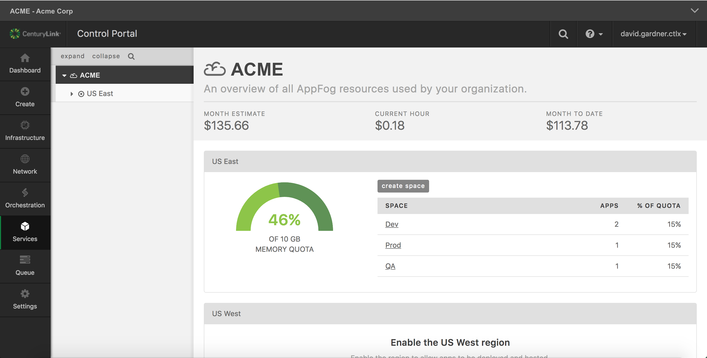

{{{
  "title": "AppFog Retirement Guide",
  "date": "04-26-2018",
  "author": "David Gardner",
  "attachments": [],
  "related-products" : [],
  "contentIsHTML": false
}}}

### Audience

AppFog Users

### Overview

> This article provides helpful information regarding the *AppFog Product Retirement* scheduled for *Friday, June 29  2018 at 12:00 AM US Pacific Time (UTC-8)*. (Effectively Midnight on Thursday, June 28).

#### Does my AppFog account have any active applications and/or services running on AppFog?  

To determine whether any applications and/or services are running, you must login to your AppFog account here: [https://appfog.ctl.io/](https://appfog.ctl.io/). After logging in, the AppFog dashboard displays a overview of all AppFog resource usage and charges to your account.

If the *Current Hour* charges are greater than $0/hour, than the running application and/or service instances must be _deleted_ or _migrated_ to another Cloud provider *before* June 29, 2018. If the *Current Hour* charges are equal to $0/hour, no further action is required.



#### What will happen to my AppFog applications and services on June 29, 2018?

Any application or service instances hosted on AppFog will no longer be available on June 29, 2018, including Relational DB database instances created via the Cloud Foundry CLI using the `cf create-service` command. You are responsible for migrating your applications and data. CenturyLink is not responsible for any loss of data or loss of access to data after AppFog is retired.

#### Where should I migrate my AppFog applications and services?

We recommend migrating to a [Certified Cloud Foundry platform](https://www.cloudfoundry.org/certified-platforms/). Certified Cloud Foundry platforms use the same core Cloud Foundry software to ensure application and skill portability across providers.

Two (2) popular Cloud Foundry platforms are listed below, but other options are listed on the [certified platforms list](https://www.cloudfoundry.org/certified-platforms/).

* [Pivotal Application Service](https://run.pivotal.io/)
* [IBM Bluemix](https://console.bluemix.net/registration/)

#### How do I migrate my applications and data?

_Note: This is not a comprehensive migration guide. Your specific migration steps may vary from those outlined below._

Once you have created an account your target (destination) Cloud Foundry platform, follow the steps below as high-level migration outline. As with any migration, first deploy and test the application in the target environment before re-directing inbound traffic to the migrated application. The [Cloud Foundry CLI](https://docs.cloudfoundry.org/cf-cli/install-go-cli.html) is required to perform the steps below.

**General Migration Steps:**

1. Connect to the AppFog region where your application and/or services are currently hosted (source). See the [Login to AppFog using the Cloud Foundry CLI](https://www.ctl.io/knowledge-base/appfog/login-using-cf-cli/) KB article for instructions.

2. Identify any database services your app is using. From the CLI command line, use `cf services | grep <APP_NAME>` (where <APP_NAME> is the name of your application). You will need to migrate each database used by your application.

3. Recreate the database services on the target (destination) Cloud Foundry platform. Login to the target Cloud Foundry region (see the [Login Using CLI](https://www.ctl.io/knowledge-base/appfog/login-using-cf-cli/) KB article from Step 1).

4. Migrate the data from the existing (source) AppFog database to the target (destination) database. The [Migrating a Database in Cloud Foundry](https://docs.cloudfoundry.org/devguide/services/migrate-db.html) guide is helpful.

5. Deploy your app to the target (destination) Cloud Foundry region.
   * If you have a `manifest.yml` file, simply run the `cf push` command. Refer to this article on [Using a Manifest File](http://docs.cloudfoundry.org/devguide/deploy-apps/manifest.html).
   * If you don't have a `manifest.yml` file, execute the following commands:

   ```
   cf push <APP_NAME> --no-start
   cf bind <APP_NAME> <SERVICE_NAME>
   cf start <APP_NAME>
   ```

6. After you have migrated your application(s) and database(s), you should test thoroughly to confirm they work as expected.

7. Finally, after your testing is complete, redirect traffic from your original (source) app to your target (destination) app by updating your CNAME records and configure the "route" to your target app. This [Cloud Foundry article](https://docs.cloudfoundry.org/devguide/deploy-apps/routes-domains.html) is a good overview for configuring "routes".

_Note: `cf help` will list all available Cloud Foundry CLI commands. For more information, see the [Using Cloud Foundry CLI Tool](https://www.ctl.io/knowledge-base/appfog/using-cloud-foundry-cli-tool/) KB article._

#### Can I get assistance with migrating my AppFog applications and services?

The CenturyLink Support team can not assist with outbound migrations, but will assist with any questions/issues relating to applications or databases hosted on AppFog.

You can submit support tickets via [CenturyLink Cloud support](https://support.ctl.io/) or by emailing [help@ctl.io](mailto:help@ctl.io). The response SLA is based on the [support option](https://www.ctl.io/support/) for your account. Keep in mind, most Developer Support plans have an eight (8) hour response SLA.

### Additional Migration Help

[Deploy an Application](https://docs.cloudfoundry.org/devguide/deploy-apps/deploy-app.html)

[Migrate your app between Bluemix Regions](https://www.ibm.com/blogs/bluemix/2015/12/migrate-your-app-between-bluemix-regions/)

[Migrate your app between Bluemix Regions ( Video)](https://www.ibm.com/blogs/bluemix/2016/01/migrate-your-app-between-bluemix-regions-video/)

[The Forklifted Application](https://content.pivotal.io/blog/the-forklifted-application)
