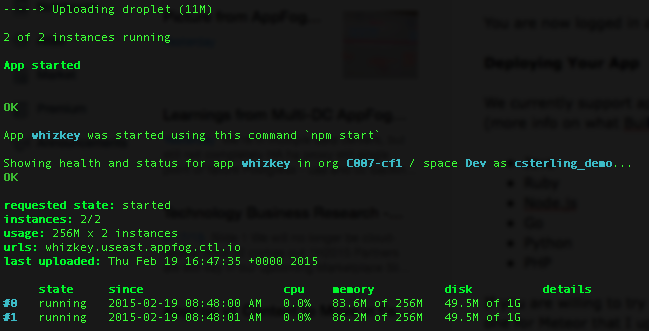

{{{
  "title": "Deploying an Application",
  "date": "04-21-2015",
  "author": "Chris Sterling",
  "attachments": [],
  "related-products" : [],
  "contentIsHTML": false
}}}

<strong>The AppFog service will be retired as of June 29, 2018. Beginning on this date, the AppFog Platform-as-a-Service will no longer be available, including all source code, env vars, and database information.</strong>

### Audience

Application developers

### Overview

We currently support applications using the following application runtimes in AppFog by default:

* [Java](deploy-java-application.md)
* [Node.js](deploy-nodejs-application.md)
* [Ruby](deploy-ruby-application.md)
* [PHP](deploy-php-application.md)
* [Python](deploy-python-application.md)
* Go
* [Static websites](deploy-static-website.md)

### Deploy Application

Once you have an application to deploy that is based on one of the supported application runtimes, you can deploy that application using the Cloud Foundry CLI or [from the Control Portal](deploy-applicaton-from-ui.md).

Here are the steps for deploying your application in the CLI:

* Go to the directory where your application source code is located
* Run the command `cf push [name of app]` to deploy it into AppFog (NOTE: [name of app] must be unique so be clever with name such as “theultimateapp-100”)
* After the process has finished you should see something similar to the following:

* Copy the URL from “urls” line and open that URL in a browser

You should now see your application running!
