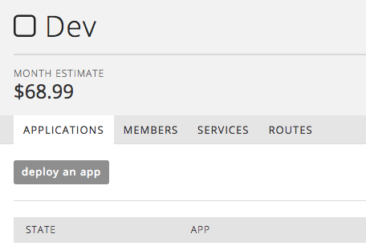
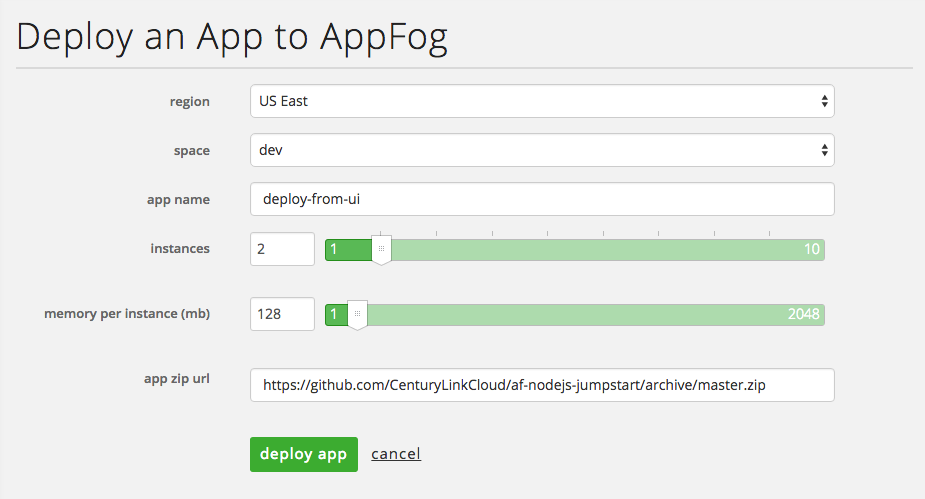
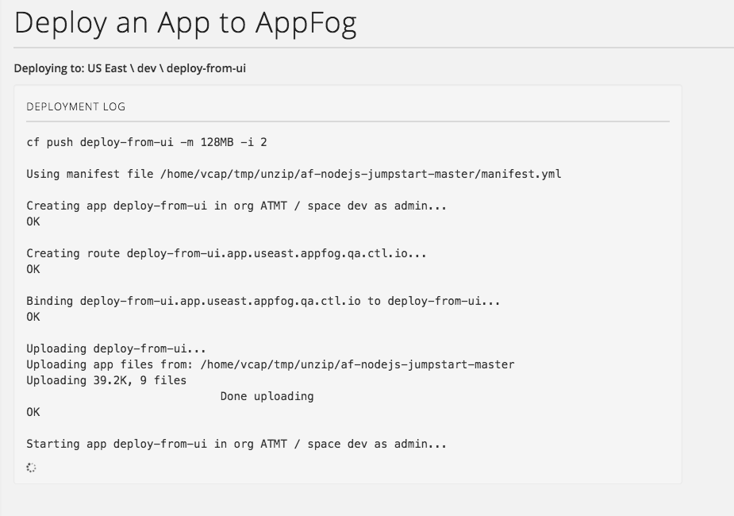

{{{
  "title": "Deploy an Appfog Application from the Control Portal",
  "date": "11-23-2015",
  "author": "Matt Cholick",
  "attachments": [],
  "related-products" : [],
  "contentIsHTML": false
}}}

<strong>The AppFog service will be retired as of June 29, 2018. Beginning on this date, the AppFog Platform-as-a-Service will no longer be available, including all source code, env vars, and database information.</strong>

### Audience

Application developers

### Overview

Users can deploy apps to AppFog v2 directly from the Control Portal. Provide a link to a public ZIP archive of your app, configure, and deploy.

### Deploy to AppFog from the Control Portal

From an individual space page, there's a button "deploy an app".

Which will take you to a configuration page for you application:

- `region`
- `space`
- `app name` - a short name unique to the space. Avoid characters that are inconvenient to use on the command line
- `instances` - a minimum of two instances are recommended to ensure your application stays available
- `memory per instance`
- `app zip url` - if you're deploying from a public Github repository, right-click on the "Download ZIP" to get the link to the repository's contents and use that

Once configured, click `deploy app` to begin the process. Logs will beging to stream shortly just as if you had used a `cf push` command.

This feature supports many buildpacks such as Ruby, Node.js and other dynamic languages as well as compiled languages that perform compilation as part of the buildpack. It doesn't support build packs that require a pre-compilation step, like the Java buildpack used with a `Dist ZIP`
