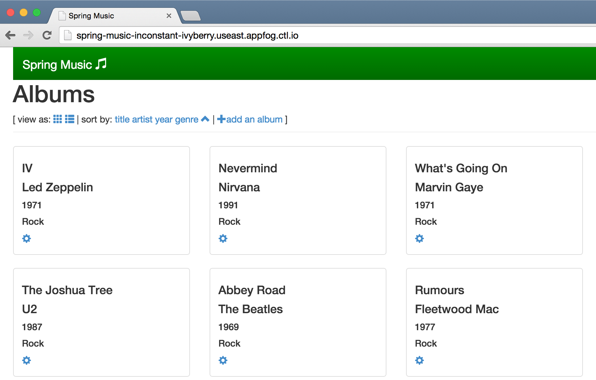

{{{
  "title": "Deploying a Java Application",
  "date": "06-02-2015",
  "author": "Chris Sterling",
  "attachments": [],
  "related-products" : [],
  "contentIsHTML": false
}}}

### Audience

Application developers

### Overview

AppFog includes the [Cloud Foundry Java buildpack](https://github.com/cloudfoundry/java-buildpack) by default. This enables the deployment of Java applications using many JVM-based languages and frameworks. To learn more about the extent of this support, please read more details on the [Cloud Foundry Java buildpack README](https://github.com/cloudfoundry/java-buildpack).

This article is going to focus on deploying a Cloud Foundry sample application called [Spring Music](https://github.com/cloudfoundry-samples/spring-music). This application is based on [Spring Framework](http://spring.io/), a JVM-based application framework. [Gradle](https://gradle.org/) is used for building the deployment artifact, a WAR file.

### Build Deployment Artifact

To deploy the Spring Music application you must first download the code. One way to download the code is using [Git](https://git-scm.com/). There are many ways to install Git so please check for the appropriate client on the [Git downloads](https://git-scm.com/downloads) page. Once you have a Git client installed, you can clone the Spring Music repository with the following command:

```
$ cd [directory to clone Spring Music code into]
$ git clone https://github.com/cloudfoundry-samples/spring-music.git
```

Once the code is cloned into a local directory you can go into the spring-music directory and build the WAR file to be used as the deployment artifact into AppFog:

```
$ cd spring-music
$ ./gradlew assemble
```

This may take some time since it has to download many dependencies before executing the build steps. Once it has completed there should be a WAR file created:

```
$ ls -l build/libs/spring-music.war
```

### Deploy Java Application

Now that we have a deployment artifact we can push the application to AppFog using the [Cloud Foundry CLI](login-using-cf-cli.md). The Spring Music application includes a manifest.yml file that defines metadata to tell AppFog how to deploy the application. Here is the manifest.yml contents:

```
---
applications:
- name: spring-music
  memory: 512M
  instances: 1
  host: spring-music-${random-word}
  path: build/libs/spring-music.war
```

This manifest.yml file tells AppFog that:

* The `name` of the application is spring-music
* Each application instance needs 512 MB of `memory` reserved to run
* Launch a single instance
* The URL route should be `spring-music-` with a random word added to the end. This is a less known feature that attempts to give each push of a Spring Music application a unique route.
* The `path` to the deployment artifact

To deploy the Spring Music application run the following:

```
$ cf push
```

The output may end with console logs that look something like the following:

```
...
0 of 1 instances running, 1 down
0 of 1 instances running, 1 starting
1 of 1 instances running

App started


OK

App spring-music was started using this command `JAVA_HOME=$PWD/.java-buildpack/open_jdk_jre JAVA_OPTS="-Djava.io.tmpdir=$TMPDIR -XX:OnOutOfMemoryError=$PWD/.java-buildpack/open_jdk_jre/bin/killjava.sh -Xmx382293K -Xms382293K -XX:MaxMetaspaceSize=64M -XX:MetaspaceSize=64M -Xss995K -Daccess.logging.enabled=false -Dhttp.port=$PORT" $PWD/.java-buildpack/tomcat/bin/catalina.sh run`

Showing health and status for app spring-music in org DEMO / space Dev as demo_user...
OK

requested state: started
instances: 1/1
usage: 512M x 1 instances
urls: spring-music-inconstant-ivyberry.useast.appfog.ctl.io
last uploaded: Wed Jun 3 01:41:07 UTC 2015

     state     since                    cpu    memory           disk           details   
#0   running   2015-06-02 06:42:43 PM   0.0%   467.8M of 512M   150.5M of 1G
```

Once the application has successfully started then you can go to the given URL route provided as the value for `urls` in the console log. The example URL route above is `spring-music-inconstant-ivyberry.useast.appfog.ctl.io`. Take this URL and go to a browser to see the running application.

