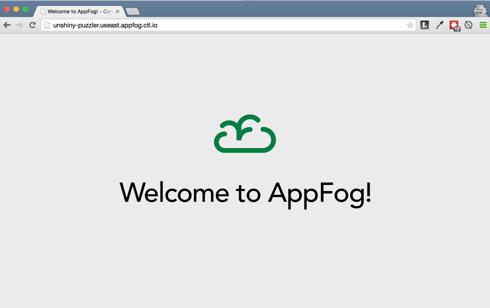

{{{
  "title": "Deploying a Ruby Application",
  "date": "07-27-2015",
  "author": "Chris Sterling",
  "attachments": [],
  "related-products" : [],
  "contentIsHTML": false
}}}

### Audience

Application developers

### Overview

AppFog includes the [Cloud Foundry Ruby buildpack](https://github.com/cloudfoundry/ruby-buildpack) by default. This enables the deployment of [Ruby](https://www.ruby-lang.org/) applications using any of multiple runtime versions and including Rails support. To learn more, please read the [Cloud Foundry Ruby buildpack README](https://github.com/cloudfoundry/ruby-buildpack/blob/master/README.md).

This article is going to focus on deploying a Cloud Foundry sample application found in the publicly available [CenturyLink Cloud af-ruby-sinatra-jumpstart Github repository](https://github.com/CenturyLinkCloud/af-ruby-sinatra-jumpstart). This sample application uses the popular [Sinatra](http://www.sinatrarb.com/) framework for creating web applications in Ruby.

### Pre-requisites

#### Installing Ruby

To develop using Ruby you must have the Ruby runtime interpreter installed in your development environment. Our team recommends using [rbenv](https://github.com/sstephenson/rbenv) to manage Ruby versions in your development environment. Please follow the [rbenv documentation](https://github.com/sstephenson/rbenv/blob/master/README.md) to setup your local Ruby development environment.

#### Cloning Simple Example Code

The sample application used in this article is from the public [AppFog Ruby+Sinatra Github repository](https://github.com/CenturyLinkCloud/af-ruby-sinatra-jumpstart). The Ruby version used for the sample application can be found in the [project's Gemfile](https://github.com/CenturyLinkCloud/af-ruby-sinatra-jumpstart/blob/master/Gemfile).

#### Log into AppFog from Command Line

One last note, you must [log into AppFog from command line](login-using-cf-cli.md) to deploy Ruby applications.

### Running the Simple Example Application Locally

After cloning the [Github repo](https://github.com/CenturyLinkCloud/af-ruby-sinatra-jumpstart) locally you must install the 'bundle' gem and run bundle install .

```
$ gem install bundle
$ bundle install
```

Once all of the dependent libraries are downloaded and installed you can start up the simple example application.

```
$ thin start -R config.ru
```

This will start the application at [http://localhost:3000](http://localhost:3000).

### Deploying to AppFog

To deploy the simple example application to AppFog, just push the application using the [Cloud Foundry CLI](login-using-cf-cli.md).

```
$ cf push
Using manifest file /Users/demo/projects//af-ruby-sinatra-jumpstart/manifest.yml

Creating app raging-badger in org DEMO / space Dev as Demouser...
OK

Using route raging-badger.useast.appfog.ctl.io
Binding raging-badger.useast.appfog.ctl.io to raging-badger...
OK

Uploading raging-badger...
Uploading app files from: /Users/demo/projects//af-ruby-sinatra-jumpstart
Uploading 13.4K, 8 files
Done uploading               
OK

Starting app raging-badger in org DEMO / space Dev as Demouser...
...
-----> Uploading droplet (18M)

1 of 1 instances running

App started

OK

App raging-badger was started using this command `bundle exec thin start -p $VCAP_APP_PORT -R config.ru`

Showing health and status for app raging-badger in org DEMO / space Dev as Demouser...
OK

requested state: started
instances: 1/1
usage: 128M x 1 instances
urls: raging-badger.useast.appfog.ctl.io
last uploaded: Thu Jun 11 20:03:27 UTC 2015

     state     since                    cpu    memory          disk          details   
#0   running   2015-06-11 05:04:10 PM   0.0%   48.3M of 128M   72.4M of 1G
```

Once the application is running, copy the value from `urls`, in the case above `raging-badger.useast.appfog.ctl.io`, and go to that URL in a browser. You should see a page that looks like:



### Ruby Version Support

The [Ruby buildpack](https://github.com/cloudfoundry/ruby-buildpack) officially supports Ruby version 2.0.0+ including security patch updates. We recommend using the most recent version of Ruby for applications deployed to AppFog.

### Rails Version Support

The [Ruby buildpack](https://github.com/cloudfoundry/ruby-buildpack) officially supports Rails versions 2.x to 4.x.
