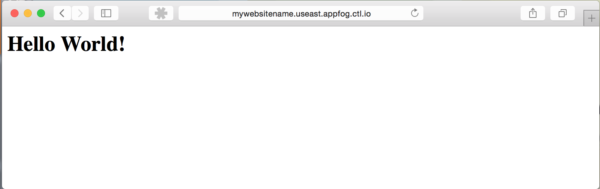

{{{
  "title": "Deploying a Static Website",
  "date": "05-08-2015",
  "author": "Chris Sterling",
  "attachments": [],
  "related-products" : [],
  "contentIsHTML": false
}}}

### Audience

Application developers

### Overview

AppFog includes the [Cloud Foundry Static File buildpack](https://github.com/cloudfoundry/staticfile-buildpack) by default. This enables the deployment of static websites to AppFog. The Static File buildpack will serve up files using [Nginx](http://nginx.com/). Given that Nginx only needs about 20 MB of memory to run, you are able to run using much lower memory than the default of 1 GB that AppFog allocates to an application. This will mean that your memory usage will be lower and this will reflect in lower cost to run a static website. We recommend 64 MB as the amount of memory to reserve for most static websites.

### Deploying a Static Website

To make AppFog automatically use the Static File buildpack for your application when you deploy, create an empty file named `Staticfile` in your top-level website directory. Now you can create an index.html file that will become your entry point into the website.

```
<html>
<head><title>My Page</title></head>
<body><h1>Hello World!</h1></body>
</html>
```

Once you have your index.html you can deploy the website to AppFog by running the following command from a terminal:

```
$ cf push mywebsitename -m 64M
```

The `-m 64M` tells AppFog that it should only allocate 64 MB of memory to run this website. Once it is deployed AppFog will return a URL where you can access the website in your browser:

```
Creating app mywebsitename in org DEMO / space Dev as mydemoaccount...
OK

Creating route mywebsitename.useast.appfog.ctl.io...
OK

Binding mywebsitename.useast.appfog.ctl.io to mywebsitename...
OK

Uploading mywebsitename...
Uploading app files from: .../mysite
Uploading 333K, 11 files
Done uploading               
OK

Starting app mywebsitename in org DEMO / space Dev as mydemoaccount...
-----> Downloaded app package (696K)
-----> Using root folder
-----> Copying project files into public/
-----> Setting up nginx

-----> Uploading droplet (4.4M)

1 of 1 instances running

App started


OK

App mywebsitename was started using this command `sh boot.sh`

Showing health and status for app mywebsitename in org DEMO / space Dev as mydemoaccount...
OK

requested state: started
instances: 1/1
usage: 64M x 1 instances
urls: mywebsitename.useast.appfog.ctl.io
last uploaded: Fri May 8 21:09:05 UTC 2015
stack: lucid64

     state     since                    cpu    memory        disk         details   
#0   running   2015-05-08 02:09:19 PM   0.0%   4.9M of 64M   9.5M of 1G      
```

Use the URL from the `urls:` value and place into the location bar of a web browser. In this case it is `http://mywebsitename.useast.appfog.ctl.io`:


