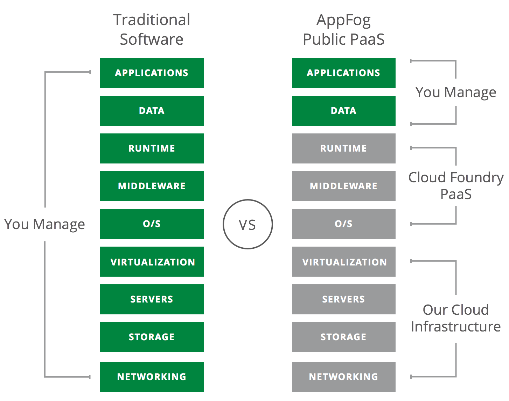
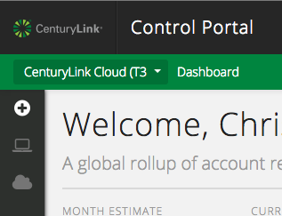
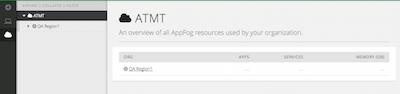

{{{
  "title": "Getting Started with AppFog",
  "date": "04-10-2015",
  "author": "Chris Sterling",
  "attachments": [],
  "related-products" : [],
  "contentIsHTML": false
}}}

# IMPORTANT NOTE

AppFog v2, the upcoming CenturyLink Cloud integrated public Platform-as-a-Service (PaaS), is not available to all customers at this time. We are current in a Limited Beta program with specific customers. AppFog v2 will be available in Open Beta later in 2015.

The current AppFog service at [http://www.appfog.com/](http://www.appfog.com/) is still available and will continue to be in service even after AppFog v2 is made generally available. Please feel free to sign up for the current AppFog service [here](https://console.appfog.com/signup).

# Audience

Currently, this article is to support customers in the Limited Beta program.

# AppFog Overview

AppFog is a public Platform-as-a-Service (PaaS) that makes deploying scalable, robust, high performing [cloud-ready applications](http://12factor.net) fast and easy for developers. AppFog enables developers to focus on writing great applications without having to worry about managing the underlying infrastructure. The result is increased agility and productivity, more efficient use of resources, and a simplified deployment and management experience.

AppFog supports the followng common application runtimes: Java, Node.js, PHP, Python, Go, Ruby, and Static Websites. Integrating with services such as databases, messaging middleware, load balancing, monitoring and more are easily provisioned through the AppFog Marketplace.

# Enable AppFog in Control Portal

*NOTE: The following steps will only work for customers with CenturyLink Control Portal accounts enabled for the Limited Beta program.*

Go to https://control.ctl.io, login, and see “AppFog" listed in the drop down navigation bar:

You may also navigate to AppFog via the icon on the left-side vertical navigation bar:

Navigate to AppFog using either navigation approach and now it is time to create an AppFog Organization unless someone else has done so for your Control Portal account. You will know that an AppFog Organization has been created for your account if there is no “create org” button and instead it looks something like the following:

If the AppFog Organization has not been created for your account, then click the "create org" button:

