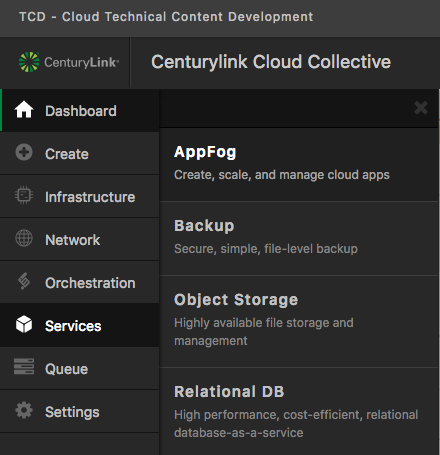
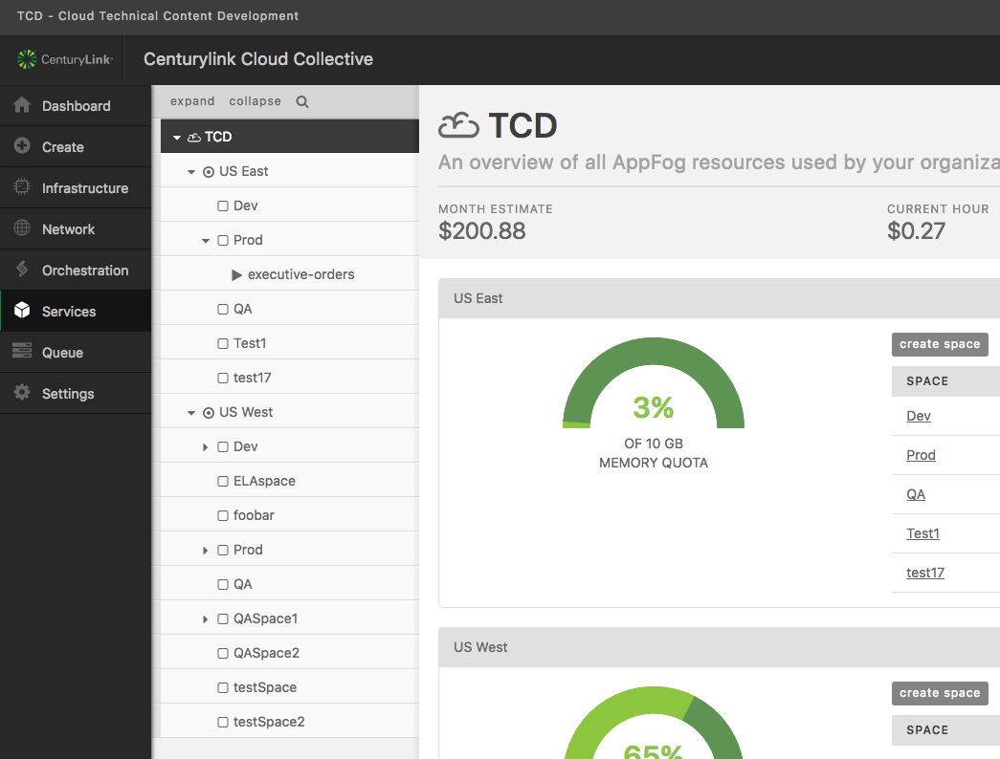

{{{
  "title": "Getting Started with AppFog",
  "date": "04-10-2015",
  "author": "Chris Sterling",
  "attachments": [],
  "related-products" : [],
  "contentIsHTML": false,
  "sticky": true
}}}

<strong>The AppFog service will be retired as of June 29, 2018. Beginning on this date, the AppFog Platform-as-a-Service will no longer be available, including all source code, env vars, and database information.</strong>

### Audience

Application developers

### AppFog Overview

AppFog is a public Platform-as-a-Service (PaaS) that makes deploying scalable, robust, high performing [cloud-ready applications](http://12factor.net) fast and easy for developers. AppFog enables developers to focus on writing great applications without having to worry about managing the underlying infrastructure. The result is increased agility and productivity, more efficient use of resources, and a simplified deployment and management experience.

AppFog supports the following common application runtimes: Java, Node.js, PHP, Python, Go, Ruby, and Static Websites. Integrating with services such as databases, messaging middleware, load balancing, monitoring and more are easily provisioned through the AppFog Marketplace.

### Enable AppFog in Control Portal

Go to https://control.ctl.io, login, and navigate to Services > AppFog on the left-side vertical navigation bar:

Now it is time to enable deployment to AppFog regions, US East and/or US West. Each region has its own "add region" button to enable it in your AppFog:

If the region has already been enabled then a link will appear to send you to the region overview page and no "add region" button will be displayed on the region row.

### Where to Go From Here?

Now that you have AppFog enabled on your account you can manage membership to regions and spaces, login from  terminal and deploy an application.

* [Manage AppFog Region and Space Membership](manage-appfog-membership.md)
* [Login to AppFog using Cloud Foundry CLI](login-using-cf-cli.md)
* [Deploy an Application to AppFog](deploy-an-application.md)
