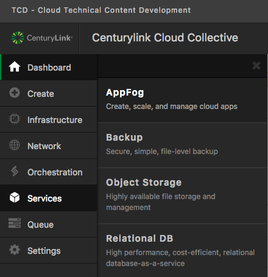
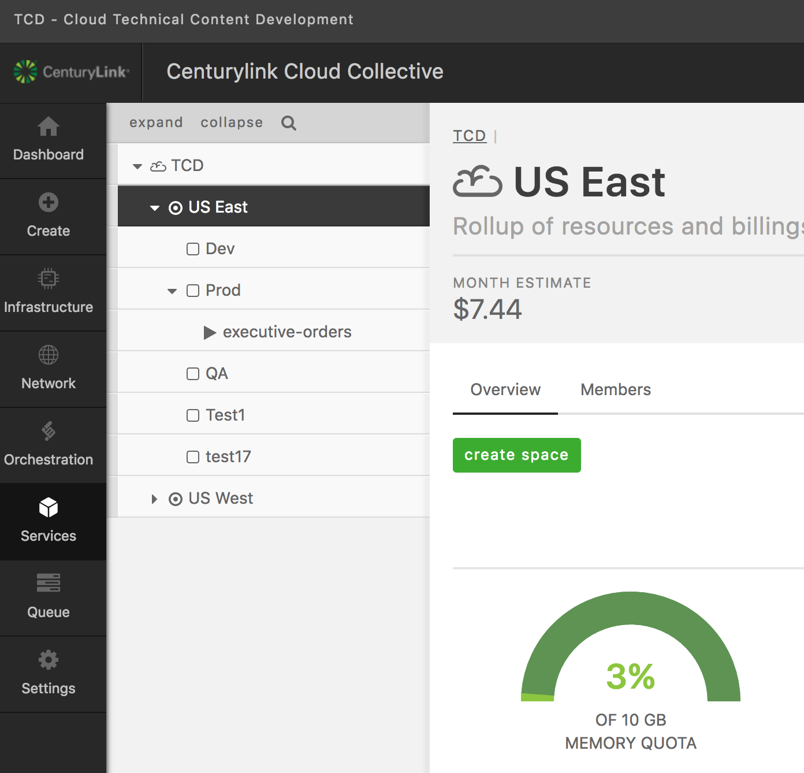
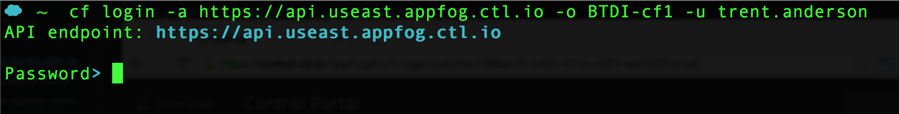
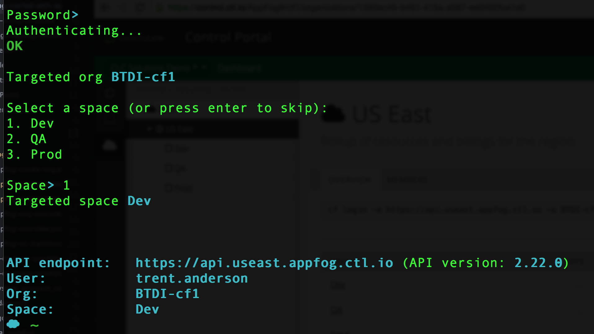

{{{
  "title": "Login to AppFog using the Cloud Foundry CLI",
  "date": "04-10-2015",
  "author": "Chris Sterling",
  "attachments": [],
  "related-products" : [],
  "contentIsHTML": false,
  "sticky": true
}}}

<strong>The AppFog service will be retired as of June 29, 2018. Beginning on this date, the AppFog Platform-as-a-Service will no longer be available, including all source code, env vars, and database information.</strong>

### Audience

Application developers

### Overview

In this article we will install the [Cloud Foundry Command Line Interface (CLI)](https://github.com/cloudfoundry/cli/) so that we can login to AppFog from the command line. This article will focus on authenticating to AppFog using your CenturyLink Control Portal credentials. Other articles will go into detail on how to use other Cloud Foundry CLI commands to interact with AppFog capabilities.

### Install Cloud Foundry CLI

Download the appropriate [binary distribution of the Cloud Foundry CLI](https://github.com/cloudfoundry/cli/blob/master/README.md#downloads). Install the downloaded binary distribution of Cloud Foundry CLI. To verify Cloud Foundry CLI is installed run the following command from a terminal shell:

```
$ cf -v
cf version 6.11.0-bba7fcf-2015-04-14T16:45:03+00:00
```

**NOTE:** The Ruby Gem based Cloud Foundry CLI is no longer supported and will not work with AppFog. Please make sure that you use the appropriate binary distribution from:

[https://github.com/cloudfoundry/cli/blob/master/README.md#downloads](https://github.com/cloudfoundry/cli/blob/master/README.md#downloads)

### Login to AppFog

Now that we have the Cloud Foundry CLI installed, lets login to AppFog. Go to the AppFog overview page in the Control Portal by navigating to Services > AppFog on the left-side vertical navigation bar:



Now navigate to the "US East" AppFog region from the left-side navigation tree:



Copy the full `cf login` shell command from the "Overview" tab. The command should look similar to:

```
cf login -a https://api.useast.appfog.ctl.io -o C007 -u csterling_demo
```

Now paste the `cf login` command into a terminal shell and run it. You should be prompted for your CenturyLink Cloud Control Portal password.



Please type in your password and hit enter. After successfully authenticating with your credentials, you should be prompted for which AppFog Space to target for application deployments:



Choose Space number 1 "Dev" as shown in the image above. You are now logged in and ready to learn more about AppFog capabilities.
