{{{
  "title": "Creating and Applying Autoscale Policies",
  "date": "12-22-2014",
  "author": "Richard Seroter",
  "attachments": [],
  "contentIsHTML": false
}}}

### Description

The CenturyLink Cloud platform now supports both Vertical Autoscale of CPU capacity for servers as well as Horizontal Autoscale of servers. This makes it possible to scale servers up and down (vertical) or out and in (horizontal) based on utilization, ensuring optimal deployment of resources for cloud environments under a variety of conditions. How does Autoscale work? For vertical Autoscale, servers that exceed a user-defined CPU utilization threshold will instantly scale up, and servers that go below a user-defined CPU utilization threshold will scale down (and reboot) during a user-defined window. In the case of horizontal Autoscale, groups of servers that exceed a user-defined CPU/RAM utilization threshold will scale out by powering on one or more additional servers in the group, and groups of servers that go below a user-defined CPU/RAM utilization threshold will scale in by powering off one or more servers in the group.

For example, consider a vertical Autoscale policy that sets a range of 4 to 6 CPUs for a server. The server is set to scale up by 2 CPUs if the server is running at 90% utilization for longer than 15 minutes. If the server is at 15% CPU utilization for longer than 15 minutes, then the policy will scale the server down IF this event occurs during the user-defined scale down window. (A similar story would apply for horizontal Autoscale using number of servers instead of number of CPUs.)

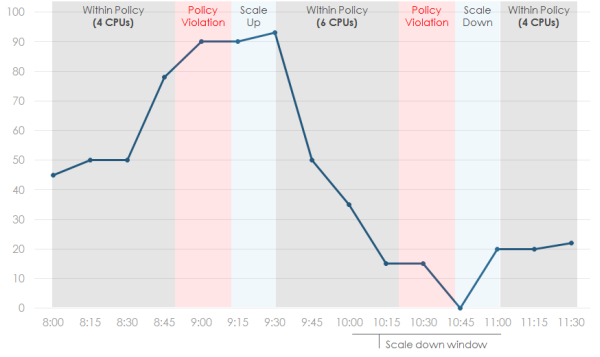

This KB article describes all of the steps for creating, applying, and testing both vertical and horizontal Autoscale policies.

#### Audience

* CenturyLink Cloud customers (operations staff)

#### Prerequisites

* Must be logged into the system</li>
* Must have a running server to apply an Autoscale policy to

### Vertical Autoscale

<ol>
  <li>Navigate to the <strong>Servers</strong> menu item and choose <strong>Policies</strong> from the menu. This takes you to the page where you can create and manage new policies that can later be applied to servers.
     
  </li>
  <li>On the left side of the screen you will see a number of policy types that you are able to define. Click <strong>Vertical Autoscale </strong>to be directed to the page where you can manage all vertical Autoscale policies.
     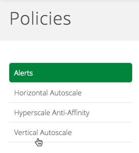
  </li>
  <li>This page shows all the existing vertical Autoscale policies, the details of each, and which servers have been assigned to them. Click the <strong>Create Autoscale Policy </strong>button.
     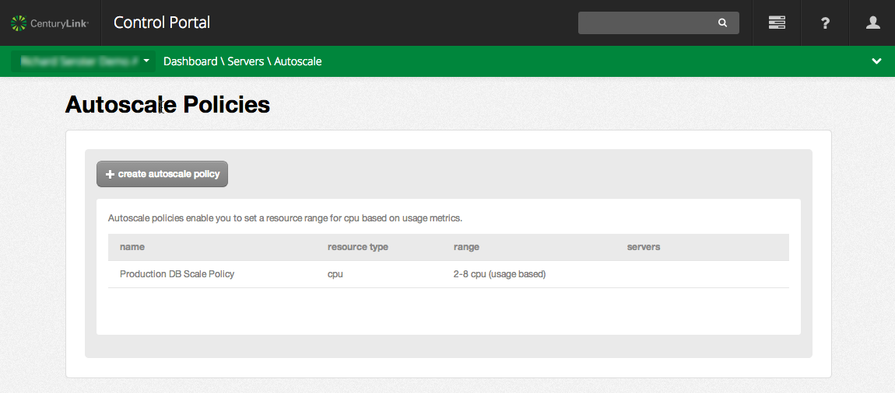
  </li>
  <li>Define the general policy characteristics. Provide a friendly name for the policy. Choose the <strong>CPU Range</strong> which defines the allowable minimum and maximum number of CPUs for the server attached to the policy. Specify a range
    that makes sense for the type of servers you plan to use with this policy. This range will be used for each server that the policy is applied to. (So if you have three servers each using the same policy, they will each have the capability to utilize
    the maximum number of CPUs.) Next, set the <strong>Threshold Period </strong>(5 minutes, 10 minutes, 15 minutes, 30 minutes) which defines how long a server must be at the minimum or maximum usage before an Autoscale action occurs. If a
    server is likely to have temporary spikes that don't warrant a scaling event, choose a longer period. Identify the <strong>Cool Down Period</strong> (15 minutes, 20 minutes, 30 minutes) which tells the Autoscale engine how long to wait after
    performing one Autoscale event before considering another. This setting helps prevent a rapid fire set of Autoscale events before the server has a chance to recognize the positive effects from the initial scale event.
     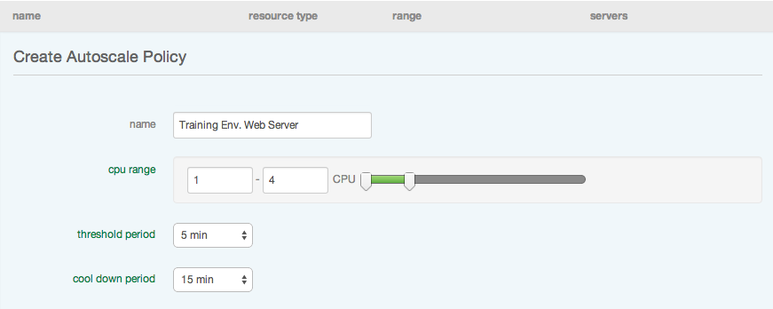
  </li>
  <li>Set the policy's scale up characteristics. The first value defines the upper limit of CPU utilization. <strong>When a server is at the upper limit for a single threshold period, a scale up event occurs (unless it occurs within a cool down period).</strong> Also
    set the <strong>Scale Up Increment </strong>which lets you choose how many CPUs to add (1, 2, 4) during a particular scaling event
     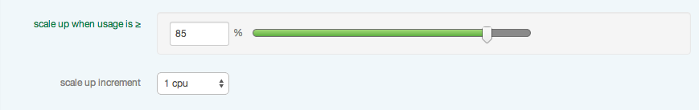
  </li>
  <li>Set the policy's scale down characteristics. The first value determines the lower limit of CPU utilization. <strong>When a server is at the lower limit for a single threshold period within the scale down window, a scale down event occurs. </strong>The <strong>Scale Down Window</strong> is
    a UTC time that you can tolerate a reboot of the system to reduce the CPU allocation (for example when most users may be offline).  Choose a small window if a reboot will be particularly disruptive to the system. However, make sure
    that the window is wide enough to catch periods of low utilization.
     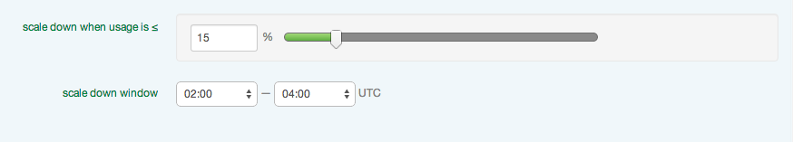
  </li>
  <li>Review the notice at the bottom of the policy creation page, and then click <strong>Create. </strong>The notice tells you that if you apply a policy to a server that is outside the bounds of the policy's CPU range (e.g., a policy with a maximum
    CPU count of 6 is applied to a server that is currently using 10 CPUs), then no scale up events will occur until the first scale down event pulls the server within the policy's range.
     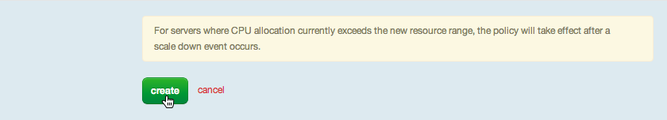
  </li>
  <li>See that your policy is now part of the list of vertical Autoscale policies.
     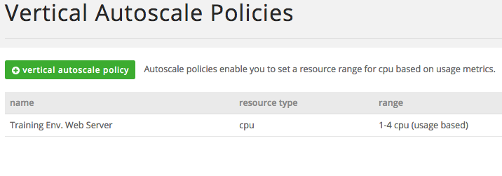
  </li>
  <li>Vertical Autoscale policies can be added to existing servers or during the server creation process. These steps will show how to apply to an existing server (but similar steps below are followed after setting the "cpu autoscale" option to
    "on" when creating a server.) Locate a Windows Server 2012 Datacenter Edition, Red Hat Enterprise Linux 5/6/7, or Ubuntu 10/12/14 x64 server to apply a vertical Autoscale policy to. (If you attempt to add a vertical Autoscale policy to a server that
    isn't based on one of the previously mentioned OSes, you will see no option available to do so. Bug in platform right now - new UI does not do this.) From the server settings page, mouseover the CPU utilization chart and click the <strong>EDIT </strong>button that appears.
     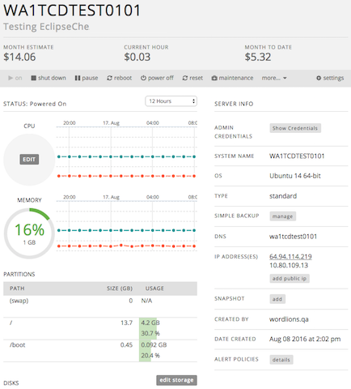
  </li>
  <li>This will display the Edit CPU panel.
     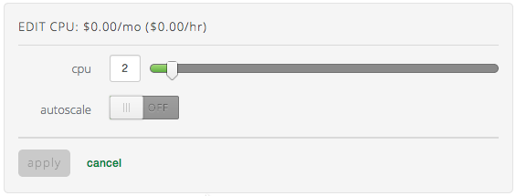
  </li>
  <li>Flip the Autoscale slider to <strong>On</strong> and choose an Autoscale policy. (If you flip this switch from the Create Server page, you will see a preview of all the details of the policy after you select it. From the server settings page
    as shown here, only the policy name is displayed.) <strong>Please read any notices next to the apply button, as if your server has not already been set up to add resources without a reboot, then the first time you assign an Autoscale policy, the server will be rebooted.</strong>
     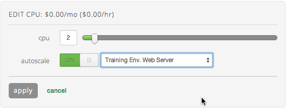
  </li>
  <li>After clicking <strong>apply </strong>to save the updated server settings, return to the Autoscale overview page and see that your server is now listed next to the associated policy.
     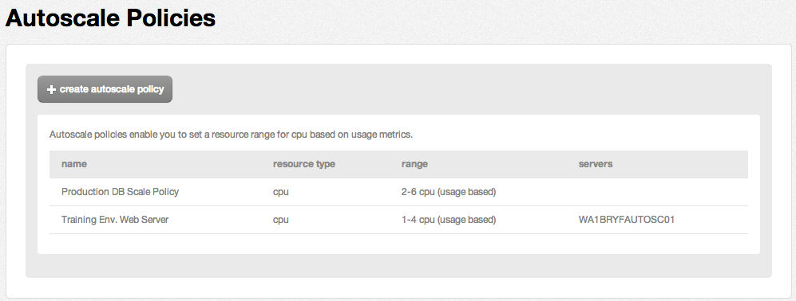
  </li>
  <li>Create a significant amount of load on the server in order to exceed the upper threshold for a sustained period of time. In the example below, see that the CPU utilization is consistently above 88%.
     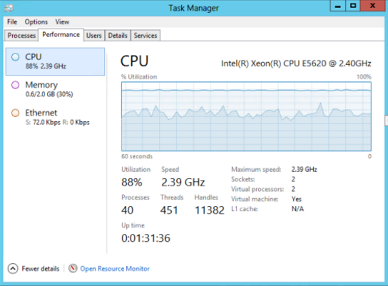
  </li>
  <li>After the threshold period has passed, note that the server has a new CPU (without rebooting) and an entry was added to the activity history. The activity history entry shows the average CPU amount that triggered the Autoscale, how long the threshold
    period was, and how many CPUs the server has now.
     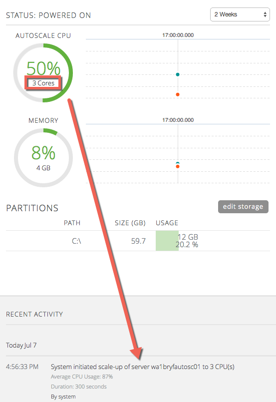
  </li>
  <li>To test the scale down experience, visit your Autoscale policy and broaden the scale down time window. This ensures that the period of low usage will coincide with the window where scale down is allowed.
     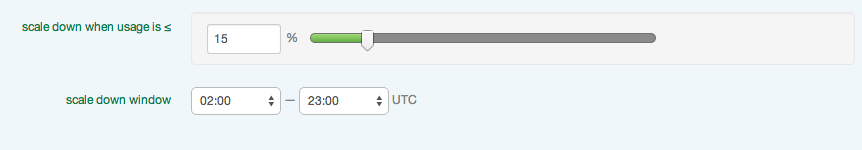
  </li>
  <li>Wait until the cool down period has passed, and watch for a scale down (and reboot) to occur. <strong>Note that a scale down event takes the server back to the minimum number of CPUs defined in the Autoscale policy. </strong>The activity history
    entry shows the average CPU amount that triggered the Autoscale, how long the threshold period was, and how many CPUs the server has now. In this scenario, see that the server has a single CPU allocated after the scale down occurs.
     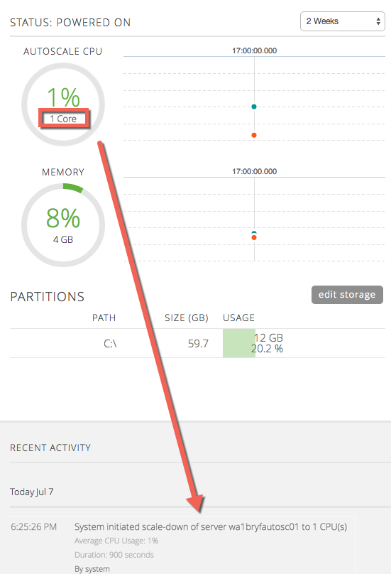
  </li>
  <li>Autoscale policies can be changed at any time and those changes are instantly reflected on the related servers. In addition, at any point you can remove the policy from a server, and go back to manually changing CPU capacity.</li>
</ol>

### Horizontal Autoscale

1. Navigate to the <strong>Servers</strong> menu item and choose <strong>Policies</strong> from the menu. This takes you to the place to create and manage new policies that can later be applied to servers.

  
2. On the left side of the screen you will see a number of policy types that you are able to define. Click **Horizontal Autoscale** to display the area where you can manage all horizontal Autoscale policies.

  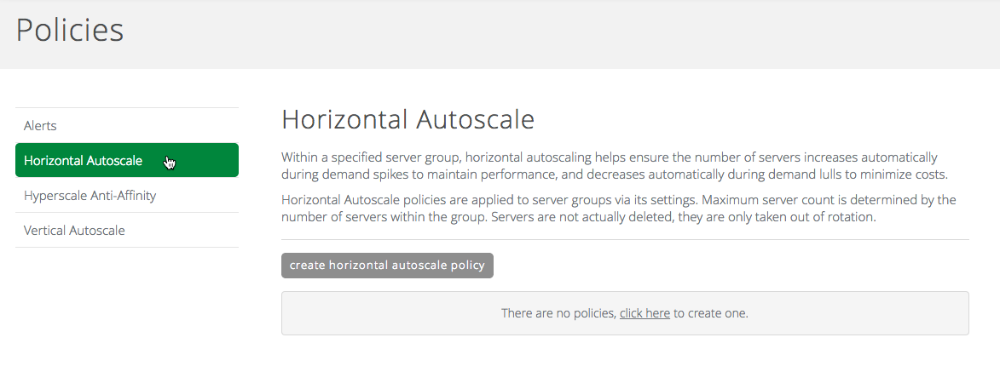
3. Click <strong>Create Horizontal Autoscale Policy</strong> to create the policy. First, define the general policy characteristics. Provide a friendly name for the policy. Enter the <strong>Minimum Servers</strong> which defines the minimum number of for the servers to remain on at all times. The maximum number is determined by the number of provisioned servers with the group that the policy is applied to. Choose which <strong>metrics</strong> to include in the threshold, CPU and/or memory. This will determine what metrics the threshold can be set on when defining the scale out and scale in triggers.

  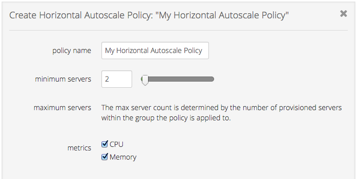
4. Set the policy's scale out characteristics. First, set the **Scale Out Increment** which lets you choose how many servers to turn on (1, 2, 4) during a particular scaling event. The next values define the upper limit of utilization. You will see percentage fields for each of the metrics you set (<strong>CPU</strong> and/or <strong>RAM</strong>) and if you selected both, you will have the <strong>operator</strong> option to select whether both thresholds must
    be reached or just one of them. <strong>When a server is at the upper limit as defined for a single threshold period, a scale out event occurs (unless it occurs within a cool down period).</strong>

  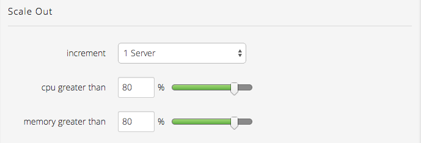
5. Set the policy's scale in characteristics. First, set the <strong>Scale In Decrement </strong>which lets you choose how many servers to turn off (1, 2, 4) during a particular scaling event. The next values define the lower limit of utilization. You will see percentage fields for each of the metrics you set (<strong>CPU</strong> and/or <strong>RAM</strong>) and if you selected both, you will have the <strong>operator</strong> option to select whether both thresholds must be reached or just one of them.  <strong>When a server is at the lower limit as defined for a single threshold period within the scale down window, a scale down event occurs.

  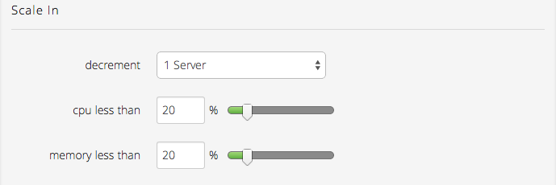</strong>
6. Set the <strong>Threshold Period </strong>(5 minutes, 10 minutes, 15 minutes, 30 minutes) which defines how long a server must be at the minimum or maximum usage before an Autoscale action occurs. If a server is likely to have temporary spikes that don't warrant a scaling event, choose a longer period. Identify the <strong>Cool Down Period</strong> (15 minutes, 20 minutes, 30 minutes) which tells the Autoscale engine how long to wait after performing one Autoscale event before considering another. This setting helps prevent a rapid fire set of Autoscale events before the server has a chance to recognize the positive effects from the initial scale event.

  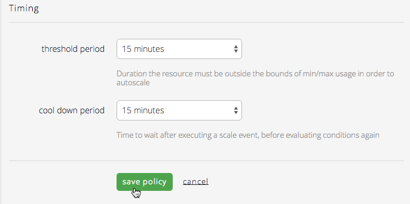
7. Click <strong>Save Policy</strong> to complete the creation of the policy and see that your policy is now part of the list of horizontal Autoscale policies.

  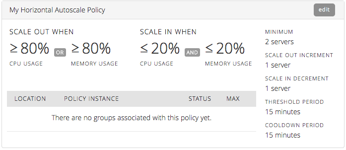

8. Note: You will need to have a load balancer group created and a pool configured in order to move on to the next step. Please follow the instructions for [creating and configuring a load balancer](../Network/modifying-a-self-service-load-balancing-configuration.md) before moving on to the next step. Ideally, you should configure the load balancer with all the IP addresses (and ports) of the servers in the group you plan on applying the autoscale policy to. If you don't do this, the autoscale policy will take care of it for you, but it could take up to five minutes before the load balancer configuration is updated after the autoscale policy is applied to the group. Once you have a load balancer group and pool created and ready to use, continue on to the next steps.

9. Horizontal Autoscale policies are added to existing server groups and not during the group creation process. Go to the Group Settings page for the group where you want to apply an Autoscale policy. (This group should have at least two identically configured servers in it. See the Autoscale FAQ for more information on how to manage horizontal Autoscale groups of servers.)

  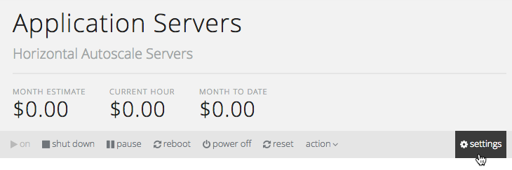

10. Select the <strong>Horizontal Autoscale </strong>tab and click <strong>select a horizontal autoscale policy</strong> to show the available policies to select.

  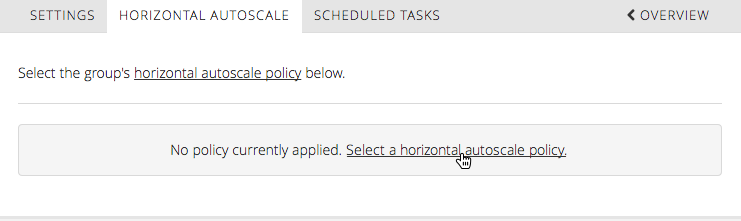

11. Select the name of the policy you created in the above steps and choose the load balancer you created in step 8 along with the port on the servers that the load balancer should route traffic to (or optionally select "none" if you do not need load balancing). Click <strong>save policy</strong> to apply the policy immediately.

  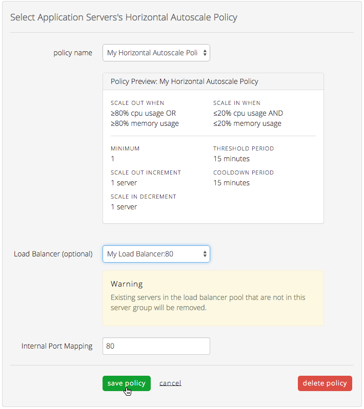

  You may want to read the Autoscale FAQ for more information on how the load balancer options here are used and other additional information.

12. Now you will see the details of your policy listed to show you that it has been applied to the group.

  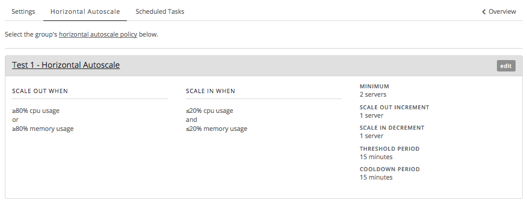

13. To test your policy, start by creating a significant amount of load on the powered on servers in the group in order to exceed the upper threshold for a sustained period of time. In the example below, see that only two of four servers are currently powered on and we are using the <strong>stress</strong> tool in Linux to simulate very high CPU utilization on the servers.

  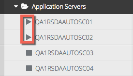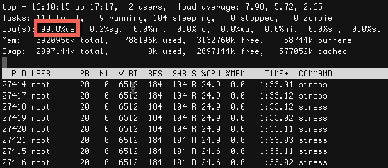

14. After the threshold period has passed, note that there is an additional server in the group that is now powered on and an entry was added to the activity history. The activity history entry shows the average utilization amount that triggered the Autoscale and which servers were affected.

  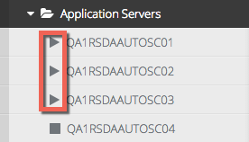

  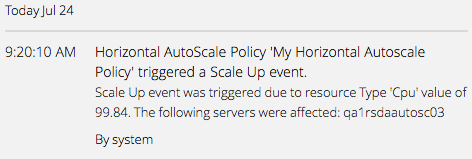
15. After the peak usage has dropped below the lower threshold, wait until the cool down period has passed, and watch for a scale in to occur.

  

  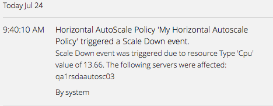

16. Autoscale policies can be changed at any time and those changes are instantly reflected on the related servers. In addition, at any point you can remove the policy from a group, and all the servers will remain in the group and in the load balancer pool, but none will be powered on/off automatically.
