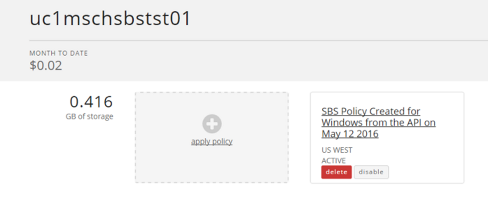

{{{
  "title": "Automating Your Rollout of the Simple Backup Service with the Lumen Cloud API",
  "date": "05-16-2016",
  "author": "Matt Schwabenbauer",
  "keywords": ["api", "backup", "clc", "cloud", "portal", "powershell", "sbs", "storage", "vm"],
  "attachments": [],
  "related-products" : [],
  "contentIsHTML": false,
  "sticky": false
}}}

Earlier this year, Lumen Cloud introduced the [Simple Backup Service (SBS)](//www.ctl.io/simple-backup-service/). A fully-integrated component of the Lumen Cloud Platform, the SBS enables customers to have complete control over the retention policies, file paths, and off-site storage locations of file-level backup protection for their public cloud virtual machines (VM).

Much like our other product offerings, you can create and apply SBS retention policies directly from the Lumen Cloud Control Portal UI. While the UI is great for simple tasks like creating a retention policy or applying a policy to one or two servers, having to run through an entire Lumen Cloud footprint isn’t the best option for some of our larger customers. So, we have also integrated SBS into the Lumen Cloud V2 API. By leveraging our RESTful API, you can 'programmatically' create or modify retention policies for your organization, discover the policies assigned to a server or set of servers, and quickly assign retention policies in bulk.

The following powershell script will iterate through each of the servers in the specified account alias and create the appropriate SBS policies based on the storage paths being used on the VMs. The correct operating system (OS) policies will be created for Windows and Linux respectively. The script will then iterate through the servers again and apply the appropriate policy based on the OS.

There are a number of variables at the beginning of the script that you can manually edit before you execute the script. These are the account alias, the number of days the data will be retained, the backup frequency of the policy, and the storage region where the backups will be stored. These variables begin on line 44. The account alias has to be modified, the other variables are optional. If you don't modify the account alias, the script will prompt you to do so before it executes. If you don't edit the other variables within the script, they can be changed later in the Portal UI. An output file with results of the operation will be stored in: C:\users\public\CLC\SBSDeployment.

### Using the Powershell Script

1. First, open a Windows PowerShell ISE window. Copy and paste the block of code at the end of this article into the editor.  

    **Note:** If you don’t want to edit any of the code prior to execution, you can download the script from the [github repo](//github.com/MattSchwabbyCLC/CLCSBSDeployment) and run the .ps1 file as is.

2. Navigate to line 44. Find the comment `# Variables to be modified`. The next four lines are variables that you may want to modify before running the script. Your window should look something like this:  

    

    **Note:** The unedited script will create backup policies with seven days of retention at a 12-hour interval, pointing to the **US West** storage location. If you would like different settings for your backup policies, modify these variables accordingly.

3. Change the `$accountAlias` variable on line 48. This variable tells the script what account alias to apply the SBS policies to. It is currently set to "XXXX". If you run the script without changing this variable, it will prompt you to enter an account alias before it executes.

4. Click **Run Script** in the toolbar at the top of the Windows PowerShell ISE window. This is identified by a green arrow pointing to the right. Alternatively, you can press the F5 function key.

5. A prompt will appear. Log in to the prompt with your Lumen Cloud Control Portal credentials. As the prompt implies, these are the same credentials you use to log in to the Control Portal UI, or to make Lumen Cloud V2 API calls.

    

    **Note:** If the credentials you entered are correct, the script will continue. If not, the operation will terminate.

6. If you did not modify the $accountAlias variable, enter an account alias in the PowerShell console window. If you modified the $accountAlias variable on line 48, you will see a confirmation of the backup policy.

    

7. Confirm the details of the SBS policy that will be created. If this information looks correct, type Y and press enter. If you do not want to apply an SBS policy with these settings, type N and press enter to terminate the script.

    

8. If you confirm the prompt, the main operation begins. You will see information about the policies that are created scroll by in the PowerShell console window. You can view the output to see how the script is applying the Windows-specific policy to Windows machines, and the Linux-specific policy to Linux machines.

    

    **Note:** The script programmatically detects the Windows paths that are in use and creates a backup policy which contains all of them, but for Linux it only backs up the root path "/". This is because SBS will reject any backup policies with redundant storage paths, such as "/" and "/boot". Since "/boot" is a sub-path of "/", backing it up would be redundant, as it is being backed up when "/" is being backed up. In order to ensure we aren’t repeatedly backing up the same data, the script will automatically default to "/" as the Linux path that it backs up.

9. The operation completes with a message similar to this:

    

10. Your specific message will vary based on your account alias and date. Navigate to the listed folder: C:\Users\Public\CLC\SBSDeployment\
to confirm the script and access the .txt output file. The file contains the logging that was captured during the operation.

    

11. You can also check the Control Portal to see the policies that were created. Navigate to the [Control Portal](https://control.ctl.io) and login with your Lumen Cloud account credentials.

12. From the Navigation Menu, click **Infrastructure > Policies**. On the Policies page, click **Simple Backup Service**.

    

13. The SBS policies that you create appear here.

    

14. Click one of the policies to see the servers that it applies to, as well as its settings.

    

15. If you want to remove an SBS policy from a server, just click the server's name on this page and then click **delete**.

    

### Powershell Script

```
<#
Script to create and apply a Simple Backup Service retention policy to all Lumen Cloud servers in a given account
Author: Matt Schwabenbauer
Created: April 20, 2016
Matt.Schwabenbauer@ctl.io
This script will iterate through every server in a given account alias, detect which storage paths are being used, and create SBS policies for the associated OS for those paths.
Separate policies will be created for Windows and Linux, and the storage paths will be appropriately assigned to each.
There are a number of variables you may want to change before running this script. These variables begin on line 44.
If you do not modify the account alias before running the script, you will be prompted for an alias before execution.
Before any changes are made, you will be notified of the backup policy settings and the account they will be applied to. You will be prompted to continue execution.
An output file with results of the operation will be stored in C:\users\public\CLC\SBSDeployment.
#>

# Instruct PowerShell to use TLS version 1.2
[System.Net.ServicePointManager]::SecurityProtocol = [System.Net.SecurityProtocolType]::Tls12

# Tell the user about this script
Write-Verbose -message "This script will iterate through Virtual Machines in a given Lumen Cloud account alias and apply a Simple Backup Service policy to them." -verbose

# Create directory to store .txt file with results of the operation
New-Item -ItemType Directory -Force -Path C:\Users\Public\CLC\SBSDeployment

# API V2 Login: Creates $HeaderValue for Passing Auth. Displays $error variable if the login fails, and exits the script.
Write-Verbose "Logging in to Lumen Cloud v2 API." -Verbose
try
{
$global:CLCV2cred = Get-Credential -message "Please enter your Lumen Cloud Control Portal credentials." -ErrorAction Stop
$body = @{username = $CLCV2cred.UserName; password = $CLCV2cred.GetNetworkCredential().password} | ConvertTo-Json
$global:resttoken = Invoke-RestMethod -uri "https://api.ctl.io/v2/authentication/login" -ContentType "Application/JSON" -Body $body -Method Post
$HeaderValue = @{Authorization = "Bearer " + $resttoken.bearerToken}
}
catch
{
Write-Verbose "Login information is incorrect. Terminating operation."
$error[0]
exit
}

# Variables to be modified
$retentionDays = 7 # The number of days backup data will be retained
$backupIntervalHours = 12 # The backup frequency of the Policy specified in hours
$storageRegion = "US WEST" # Region where backups are stored, can be "US EAST", "US WEST", "CANADA", "GREAT BRITAIN", "GERMANY", "APAC"
$accountAlias = "XXXX" # The account alias that the Policy and Servers belong to

if ($accountAlias -eq "XXXX")
{
    $accountAlias = Read-Host "Please enter the account alias you would like to apply a Simple Backup Service policy to"
}
else
{
    # Do nothing
}

$continue = Read-Host "Applying a $retentionDays day backup retention policy with $backupIntervalHours hour intervals storing data in $storageRegion to account alias $accountAlias. Confirm? (Y/N)"

if ($continue -eq "Y")
{
    # Do nothing
}
else
{
    Write-Verbose "Operation terminated."
    exit
}

# Session scope variables that should not be modified
$body = $null
$myServers = @()
$paths = @()
$server = $null
$myServer = $null
$dataCenter = $null
$dataCenters = $null
$serverDetails = @()
$winPaths = @()
$linPaths = @()
$thispath = $null
$OSes = @("Windows";"Linux") # The script will automatically assign the appropriate OS based policy for the system
$month = get-date -Uformat %b
$day = get-date -Uformat %d
$year = get-date -Uformat %Y
$timestamp = Get-Date
$todaysDate = "$month $day $year"
$SBSName = "SBS Policy Created for $OS from the API on $todaysDate"
$winPolicy = @()
$linPolicy = @()
$filename = "C:\Users\Public\CLC\SBSDeployment\$accountAlias-$month-$day-$year-SBSDeploymentResults.txt" # Variable to store the filename of the output file for the results of this operation

Write-Verbose -message "Beginning main operation. The results will be stored in an output file located at $filename." -verbose

# Function to get details about a given server in a given account alias
function getServer
{
    $server = $args[0]
    $url = "https://api.ctl.io/v2/servers/$accountAlias/$server"
    $result = Invoke-RestMethod -Uri $url -ContentType "Application/JSON" -Headers $HeaderValue -Method Get
    return $result
} # end getServer

# Function to get the available CLC data centers
function getDataCenters
{
    $url = "https://api.backup.ctl.io/clc-backup-api/api/datacenters"
    $result = Invoke-RestMethod -Uri $url -ContentType "Application/JSON" -Headers $HeaderValue -Method Get
    return $result
} # end getDataCenters

# Function to get the available servers in a given data center
function getMyServers
{
    $dataCenter = $args[0]
    $url = "https://api.backup.ctl.io/clc-backup-api/api/datacenters/$dataCenter/servers"
    $result = Invoke-RestMethod -Uri $url -ContentType "Application/JSON" -Headers $HeaderValue -Method Get
    return $result
} # end getMyServers

# Function to create Simple Backup policies
function createPolicy
{
    if ($OS -eq "Windows")
    {
        $paths = [array]$winPaths
        $SBSName = "SBS Policy Created for Windows from the API on $todaysDate"
    } # end if
    else
    {
        $paths = [array]"/" # Since Linux file paths roll up to /, backing up / will backup the entire file system of any Linux machine
        $SBSName = "SBS Policy Created for Linux from the API on $todaysDate"
    } # end else
    $url = "https://api.backup.ctl.io/clc-backup-api/api/accountPolicies"
    $body = @{backupIntervalHours = $backupIntervalHours; clcAccountAlias = $accountAlias; name = $SBSName; osType = $OS; paths = $paths; retentionDays =  $retentionDays } | ConvertTo-Json
    $result = Invoke-RestMethod -Uri $url -ContentType "Application/JSON" -Headers $HeaderValue -body $body -Method Post
    $result
    Add-Content $filename "$timestamp $OS SBS Policy created for Account Alias: $accountAlias."
    Add-Content $filename "Policy Details: $result"
    if ($OS -eq "Windows")
    {
        Set-Variable -Name winPolicy -Value ($result.policyId) -scope Global
        "$OS policy id is"
        $winPolicy
    } # end if
    else
    {
        Set-Variable -Name linPolicy -Value ($result.policyId) -scope Global
        "$OS policy id is"
        $linPolicy
    } # end else
} # end createPolicy

# Function to apply a given SBS policy to a given Server ID
function applyPolicy
{
    $policy = $args[0]
    "Applying SBS policy $policy to $thisid"
    $url = "https://api.backup.ctl.io/clc-backup-api/api/accountPolicies/$policy/serverPolicies"
    $body = @{clcAccountAlias = $accountAlias; serverId = $thisid; storageRegion = $storageRegion} | ConvertTo-Json
    $result = Invoke-RestMethod -Uri $url -ContentType "Application/JSON" -Headers $HeaderValue -body $body -Method Post
    $result
    Add-Content $filename "$timestamp SBS Policy $policy applied to server $thisid."
    Add-Content $filename "Policy Details: $result"
} # end applyPolicy


<# Begin Main Script #>

# Create a variable to hold the list of available data centers by calling getDataCenters
$dataCenters = getDataCenters

# Create a variable containing all of our existing servers
forEach ($dataCenter in $dataCenters)
{
    $myServers += getMyServers($dataCenter)
} # end forEach

# Display the getServer details for each server
forEach ($myServer in $myServers)
{
    $serverDetails += getserver($myServer)
} # end forEach

#store the details of the available storage paths
forEach ($serverDetail in $serverDetails)
{

    $thesePaths = $serverDetail.details.partitions.path
    forEach ($thisPath in $thesePaths)
    {
        if ($thispath.startsWith("/"))
        {
            # Do nothing for Linux paths
        } # end if
        elseif ($thispath.startsWith("(swap)")) # Remove Linux swap paths as SBS will not back these up
        {
            # Do nothing for swap paths
        } # end elseif
        else
        {
            $winPaths += $thisPath
        } # end else
    } # end forEach
} # end forEach

# Remove duplicate paths in the $winPaths array
$winPaths = $winPaths | select-object -unique

"Linux path that will be backed up is /"
"Windows paths that will be backed up are $winpaths"

# Create Simple Backup Policies
forEach ($OS in $OSes)
{
    "Creating policy for $OS."
    createPolicy
} # end forEach

# Apply policies to servers
forEach ($Server in $serverDetails)
{
    $thisOS = $Server.ostype
    $thisid = $Server.id
    if ($thisOS.startsWith("Windows"))
    {
        "$thisid is a $thisOS server"
        applyPolicy($winPolicy)
    } # end if
    else
    {
        "$thisid is a $thisOS server"
        applyPolicy($linPolicy)
    } # end else
} # end forEach

 Write-Verbose -message "Operation complete. An output file with results will be stored at $filename." -verbose
```

### Want to Know More About the Simple Backup Service?

Check out our SBS product page [here](//www.ctl.io/simple-backup-service/). The Lumen [Knowledge Base](../Backup) also has a number of articles on backup, including [Getting Started with Simple Backup](getting-started-with-simple-backup.md) and [Simple Backup How It Works](simple-backup-service-how-it-works.md).
