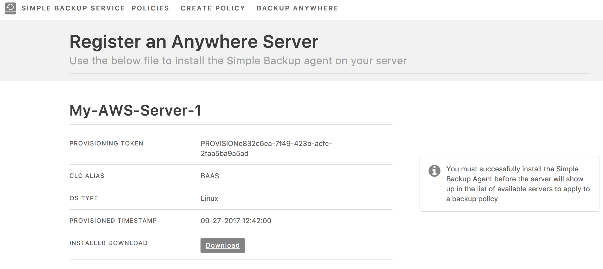

{{{
  "title": "Simple Backup Anywhere",
  "date": "9-24-2017",
  "author": "John Gerger",
  "attachments": [],
  "related-products" : [],
  "contentIsHTML": false,
  "sticky": false
}}}

### Simple Backup Anywhere

[Simple Backup Service](https://www.ctl.io/simple-backup-service/) provides file and folder level backups and restores. The service is integrated with the [Control Portal](https://control.ctl.io/) and is [API accessible](https://www.ctl.io/api-docs/v2/#simple-backup). That gives you flexibility and ease of use to configure and customize backup policies.

Simple Backup Anywhere extends Simple Backup outside of CenturyLink Cloud to allow users to backup and protect their workloads virtually anywhere outbound internet connectivity is available. Simple Backup Anywhere is currently available to all the versions of [supported operating systems on CenturyLink Cloud](../Support/supported-operating-systems.md), as well as AWS AMI Linux servers.

### Getting Started with Backup Anywhere

There are 2 methods available to install the Simple Backup agent on your non-CenturyLink Cloud servers. The easiest way to get started with backup anywhere is covered in this article and is administered through the [Simple Backup UI](http://backup.ctl.io) and is intended to install the agent on a single server at a time. An advanced/manual installation is available and covered in the [manual install guide](backup-anywhere-manual-install.md).

* To get started with Backup Anywhere, simply select the Backup Anywhere heading in the [Simple Backup UI](http://backup.ctl.io).

* In the Backup Anywhere section enter the server name, and select the operating system type and click the "Register Anywhere Server" button at the bottom

* You will then be presented with a download link for the agent installer and unique information about the installer file. This information is not needed for the installation; it is for information purposes only. Simply click the link to download the installer script.

* After downloading the script, move it to your server and execute the script to start the installation of the Simple Backup agent.

 

* Once the agent has been installed you can add the server into a backup policy. This is done by navigating to the policy you want to add the server to, and selecting the Anywhere Servers.

* You will then be presented with a list of all servers outside of CenturyLink Cloud that have the backup agent installed on them. Select the desired server to add to the policy and the storage region you would like to backup to

* For more information on setting up backup policies please see our [getting started guide](getting-started-with-simple-backup.md)
