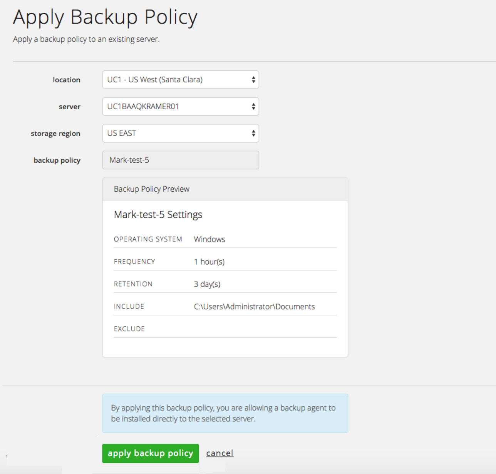
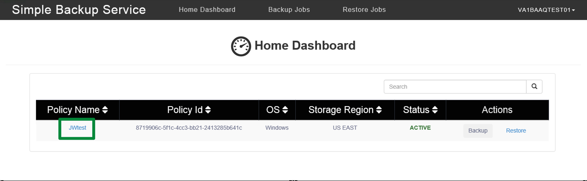

{{{
  "title": "Getting Started With Simple Backup",
  "date": "01-06-2016",
  "author": "Mark Lee, Justing Withington, John Gerger",
  "attachments": [],
  "related-products" : [],
  "contentIsHTML": false,
  "sticky": true
}}}

Simple Backup Service – Beta Customer – Getting Started Guide
=============================================================

Thank you for being a Beta Customer!
------------------------------------

This guide is intended for Beta Customers in relation to getting started with Simple Backup Service.

Simple Backup Service (SBS) provides file level backups. This beta version of the UI allows users to quickly setup backups as well as perform other backup related activities. Additionally, there is no need to stand-up any additional infrastructure (servers, network, storage) because this is all part of the service. An agent will be automatically installed on the server during provisioning. Servers must have connectivity to the internet and restores for CLC VMs. Users choose which servers and data that require being backed up, as well as the frequency of the backups and retention periods.

For additional information, please visit our [FAQ section](./simple-backup-service-faqs.md) or additional [Knowledge Base](//www.ctl.io/knowledge-base/backup/#1) articles.

The following provides steps to get started:
--------------------------------------------

1.  From your Server Details page, click “manage” in the Backup Level section.

  

2.  Click “create a backup policy”. Please note that the below screenshot shows existing backup polices (eg policy “tim-test-qa-2”) for this account. If the account does not have any policies, the area below the gray bar will be blank.

  

3.  Complete the backup configuration inputs and click “create backup policy”. Please note that paths entered on this screen are not validated against your server’s file system paths.

  

4.  Within seconds, the backup policy is created and set to Active. You will see the new policy in the list of policies, or it will be the first policy if none previously existed. From here, you can either:
    - click on “create a backup policy” to create another backup policy with a different configuration.
    - Or click on an existing policy to view details and/or add a server to the policy.

    

5.  Per the above screen, when clicking into a backup policy, you can view the details and/or add a server to the backup policy. Click “apply to server” to add a server to the backup policy.

  

6.  Selecting the “location” of the CLC VM will populate the choices for the “server” dropdown. Select the storage region, then click “apply backup policy”.

  

7.  The agent is now installed on the server. The server & region are provisioned to the policy and backups will execute in as little as 1 hour.

  

8.  Accessing the agent on your server will allow you to view details, execute a backup, or execute a restore. To access the agent directly, connect to your CLC server, launch a browser, and navigate to `http://localhost:15915`. Alternatively, you can also connect to the agent from your local computers browser if you have a VPN configured to connect into your CLC servers; the address would be `http://<your servers IP address>:15915` (e.g. `http://10.11.12.13:15915`).

9.  From the Agent Home Dashboard, you can view policy details by clicking the Policy name.

  

10.  In the Policy Details screen, click on “Restore” to view a list a restore points.

  

11.  Select a timestamp to execute a restore. Each restore point represents a backup.

  

12.  Enter a destination folder for the restore, then click on “Restore”. Please note, if the folder does not exist, it will be created automatically. Once the restore is complete, the user can do as they wish with the files.

  
