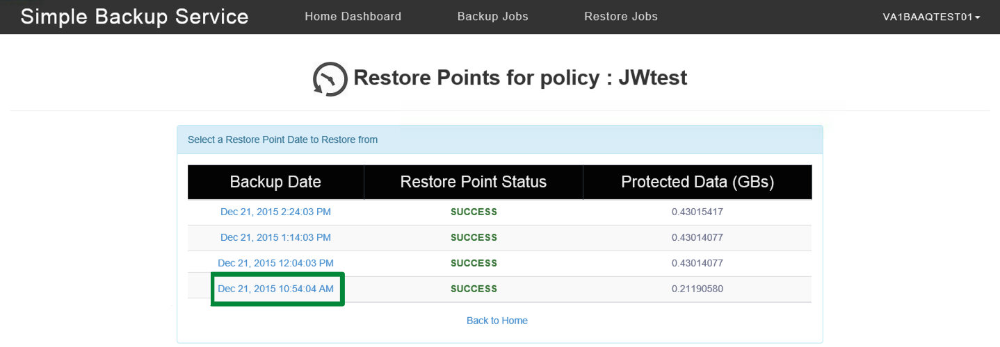

{{{
  "title": "Simple Backup Service – Getting Started Guide",
  "date": "2-27-2019",
  "author": "John Gerger",
  "keywords": ["api", "backup", "clc", "cloud", "portal", "sbs", "storage"],
  "attachments": [],
  "related-products" : [],
  "contentIsHTML": false,
  "sticky": true
}}}


Simple Backup Service (SBS) provides file level backups. This version of the UI allows users to quickly setup backups as well as perform other backup related activities. Additionally, there is no need to stand-up any additional infrastructure (servers, network, storage) because this is all part of the service. An agent will be automatically installed on the server during provisioning. Servers must have connectivity to the internet for installation of the agent, and backup functionality. Users choose which servers and data to back up, as well as the frequency of the backups and retention periods.

For additional information, please visit our [FAQ section](simple-backup-service-faqs.md) or additional [Knowledge Base](../Backup) articles.

The following provides steps to get started:
--------------------------------------------

1. From your Server Details page, click **manage** in the Simple Backup section.

  

2. Click **create a backup policy**.
   * You can view all existing backup policies for this account.
   * If the account does not have any policies, the area below the policy header is blank.

3. Complete the backup configuration inputs and click **create backup policy**.
   * Paths entered here are not validated against your server’s file system paths.

   

4. The backup policy is created and the status is set to Active. You can view the new policy in the list of policies. From here, you can either:
   * Click **create a backup policy** to create another backup policy with a different configuration.
   * Click an existing policy to view details and/or add a server to the policy.

   

5. Per the above screen, when clicking into a backup policy, you can view the details and/or add a server to the backup policy. Click **apply to server** to add a server to the backup policy.

   

6. Selecting the location of the VM will populate the list of choices for the “server” drop-down. Select the storage region, then click **apply backup policy**.

   

7. The agent is now installed on the server. The server & region are provisioned to the policy and backups will execute in as little as 1 hour.

   

8. Restores can now be performed directly from the control portal. Please see our [restore documentation](./restores.md) for detailed documentation, or below for the agent based restore process.

9. Accessing the agent on your server allows you to view details, execute a backup, or execute a restore.
   * To access the agent directly, connect to your server, launch a browser, navigate to `http://localhost:15915`, and view the [Agent Security KB](sbs-agent-security.md) to obtain credentials.
   * Alternatively, you can also [configure the agent for remote access](sbs-agent-security.md) and connect to the agent from your local computer browser if you have a VPN configured to connect into your servers; the address would be `http://<your servers IP address>:15915` (e.g., `http://10.11.12.13:15915`).
   * [Installing RDP for Linux](linux-rdp.md) also enables agent access.
   * For Linux, a local firewall may need to be opened. That should be able to be accomplished by executing the following commands:

   ```
   firewall-cmd --permanent --add-port=15915/tcp
   firewall-cmd --reload
   ```

10. From the Agent Home Dashboard, you can view policy details by clicking the Policy name.
   

11. In the Policy Details screen, click **Restore** to view a list a restore points.
   

12. Select a timestamp to execute a restore. Each restore point represents a backup.
   

13. Enter a destination folder for the restore, then click **Restore**. Note that if the folder does not exist, it will be created automatically. Once the restore is complete, the user can do as they wish with the files.
   

### Restore Using API
To use an API call to restore, follow the steps in the previous section up to the point of selecting Restore. Use the details in step 12 to complete the following API template. *Note: The fields in **BOLD** type should be replaced with customer specific information.*

For a Full Restore:

> curl -u **SBS_USERNAME**:**PASSWORD_HERE** -X POST -H "Content-Type: application/json" -d "{\"restorePointId\": \"**RESTORE_POINT_ID**\", \"policyId\": \"**POLICY_ID**\", \"path\": \"**RESTORE_DESTINATION**\"]}" http://localhost:15915/sbs/restore

For a Selective Restore:

> curl -u **SBS_USERNAME**:**PASSWORD_HERE** -X POST -H "Content-Type: application/json" -d "{\"restorePointId\": \"**RESTORE_POINT_ID**\", \"policyId\": \"**POLICY_ID**\", \"path\": \"**RESTORE_DESTINATION**\", \"selectiveRestorePaths\": [\"**PATH_OF_FILE_TO_RESTORE**"]}" http://localhost:15915/sbs/restore

Here is an example of a Full Restore using the information from step 12 above and the [default credentials](sbs-agent-security.md).  

```
curl -u sbs:backup -X POST -H "Content-Type: application/json" -d "{\"restorePointId\": \"8719906c-5f1c-4cc3-bb21-2413285b641c20151221105404\", \"policyId\": \"8719906c-5f1c-4cc3-bb21-2413285b641c\", \"path\": \"C:\MyRestorePath\"]}" http://localhost:15915/sbs/restore
```
