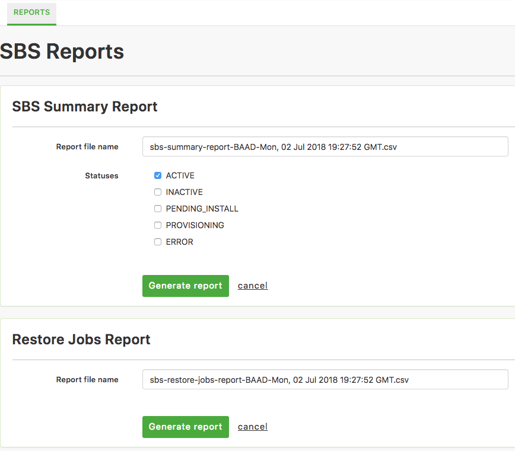

{{{
  "title": "Simple Backup Service Reports",
  "date": "06-29-2018",
  "author": "John Gerger",
  "attachments": [],
  "related-products" : [],
  "contentIsHTML": false,
  "sticky": false
}}}

The Simple Backup Service has reporting functionality to easily enable you to view the statuses of your recent backups and restores. Reports are currently generated in a CSV format for easy consumption.

The SBS summary report provides an overview of all the servers backing up to all your backup policies that in the the given, selectable statuses. Details of the **latest** backup are provided within the summary report. The only input for this report is the status(es) that you would like to report against. Simply select the check boxes for any status you would like to report against and click the "Generate report" button. Your report will be generated and downloaded.

The Restore Jobs Report does not have any inputs needed, and will generate a list of all restore jobs, and the details about those jobs.

Coming soon will be a Restore Points report that will provide a detailed overview of all the backup jobs for a specified server within a specific date range.
