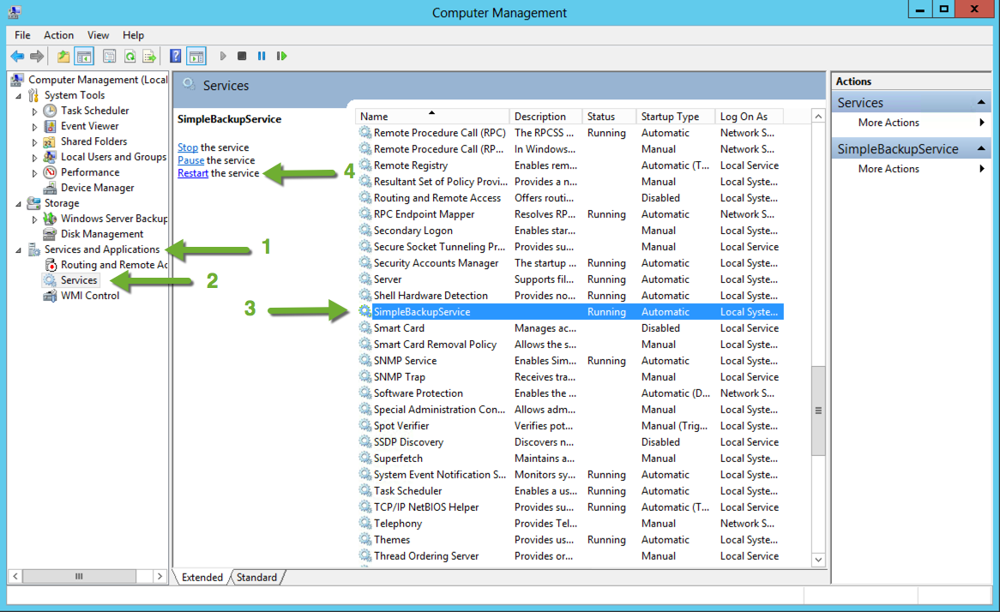

{{{
  "title": "Restarting Simple Backup Service",
  "date": "11-11-2019",
  "author":  "John Gerger",
  "attachments": [],
  "related-products" : [],
  "contentIsHTML": false,
  "sticky": false
}}}

In order to restart Simple Backup Service on your system, please follow the instructions below for Linux and Windows accordingly.

### Linux
Restart the application’s service with the following command:

``service simplebackupservice restart``

### Windows
Restart the 'SimpleBackupService' service in the Microsoft Computer Management Console:

1. Expand the **Services and Applications** section.
2. Click **Services**.
3. Select **SimpleBackupService**.
4. Click **Restart the service**.

