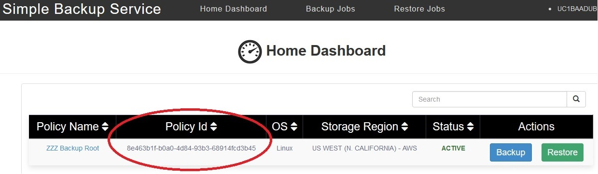
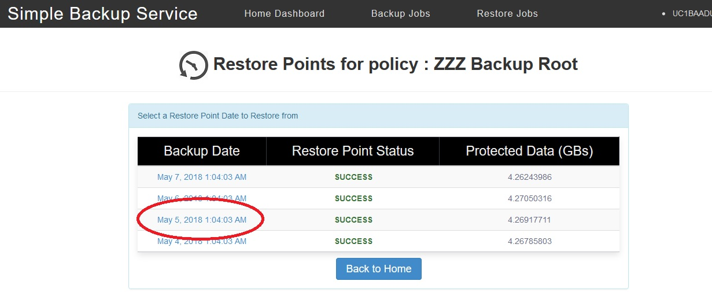
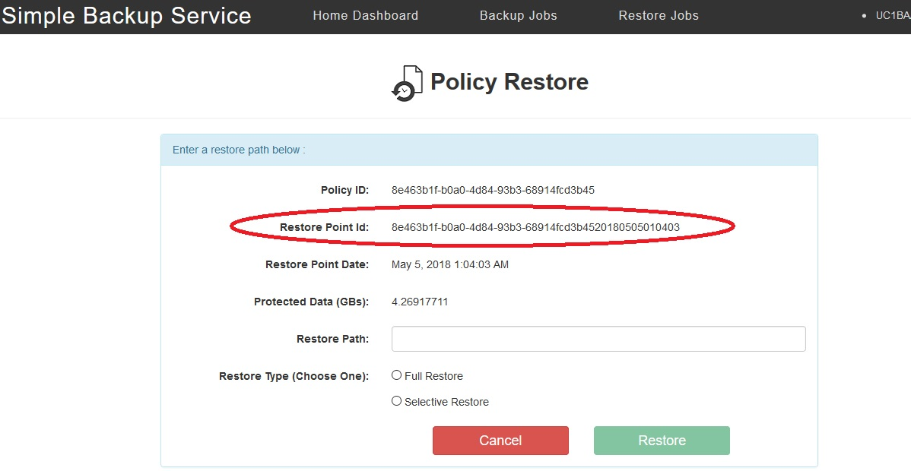
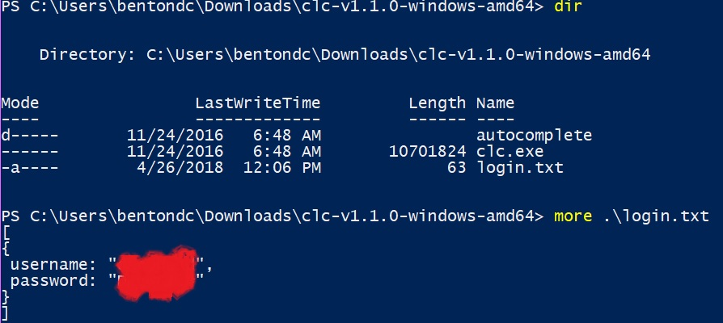

{{{
  "title": "Restore to Alternate Server",
  "date": "08-13-2018",
  "author": "Dan Benton",
  "attachments": [],
  "related-products" : [],
  "contentIsHTML": false,
  "sticky": false
}}}


SBS Glossary of terms used in this document
====

SBS Simple Backup Service.

Server A VM or Server running Windows or Linux.

SBS User Interface The graphical user interface which is on each SBS
Server.

SBS Logs The text log files that SBS generates with information about
SBS, backups, restores, etc.

CLC Command A program supplied by Centurylink Cloud to interact with the
CTL Cloud API directly.

SBS Policy A backup policy defined by the customer that defines backups
for one or more Servers.

SBS ServerPolicy The information that joins a single Server to a SBS
Policy

SBS RestorePoint The meta information about a single backup for a single
server.

Restore Server A VM or Server running the same OS and belonging to the
same SBS Policy as the original Server.

Requirements for SBS to Restore Backups to a Different Server
====

Restore to a different server is not natively part of SBS currently.There is a manual work-around that allows restores to be initiated by a different server. This article will allow users to directly initiate these restores. The important information needed to perform this process are the SBS Policy, SBS ServerPolicy, and the SBS RestorePoint to restore from.

Requirements for the server to restore to:
----

1. It must have internet access to TCP port 443.
2. The Linux instructions require that you are root.
3. The Windows instructions require that you be the administrator.
4. Both accounts must be able to run scripts and programs.
5. Linux must have a curl installed that can use TLS 1.2.
6. Windows must have PowerShell 4.0 or later and can use TLS 1.2. Note Windows 2008 will not work unless the PowerShell is upgraded to 4.0 or later.
7. You must have enough space to restore the files selected.
8. You must have SBS installed and configured to the same policy as the server you want to restore from. SBS for the server to restore to
    must be "Active".


You will need to find the proper SBS ServerPolicy and SBS Restore Point to restore from in order to create a script that is executed on the restore server. There are a few ways to obtain this information, the following details the different options available.

1. The SBS ServerPolicy and SBS Restore Point can be found in the SBS Agent User Interface on each system. Examples will be shown later in
    this article.

1. The SBS logs on the original backup server contain the SBS ServerPolicy and SBS Restore Point. Examples will be shown later in
    this article.

4. If the SBS Agent User Interface and the logs is not available, or if you plan on using SBS to restore files from a system that is not available, then you must use the CTL CLI:  [https://www.ctl.io/knowledge-base/servers/centurylink-cloud-guide-to-cli/](https://www.ctl.io/knowledge-base/servers/centurylink-cloud-guide-to-cli/%20%20)

  * The CTL CLC Downloads: <https://github.com/CenturyLinkCloud/clc-go-cli/releases>
  * How to configure CTL CLC:
    [https://github.com/CenturyLinkCloud/clc-go-cli\#set-up-the-configuration-file](https://github.com/CenturyLinkCloud/clc-go-cli%23set-up-the-configuration-file)
  * If you are using the CTL CLI to restore the SBS team recommends that you set up and test the CLC commands in advance.
  * The CTL CLC is NOT required on the restore server. It is only used to gather the proper SBS ServerPolicy and SBS Restore Point to populate a script that is executed on the server to restore to. Examples with be shown later in this article.

How to find the SBS ServerPolicy and SBS Restore Point using the SBS User Interface
===================================================================================

On the server that you want to restore from you will need to select the SBS ServerPolicy and SBS Restore Point text from the SBS User Interface.

Select the SBS Policy text and save it. In this example we will select "8e463b1f-b0a0-4d84-93b3-68914fcd3b45".



Click on "Restore" to see the restore points available. This policy has four available because it backups up daily and has a retention of three days. Click on the Restore Point you want to restore. This example we are going to select May 5th.



Select the test for the Restore Point ID. In this example we will select "8e463b1f-b0a0-4d84-93b3-68914fcd3b4520180505010403".



*Save the PolicyId and RestorePointId for values for the script to
initiate the restore.*

How to find the SBS ServerPolicy and SBS Restore Point from the SBS Logs
========================================================================

The Windows SBS logs are located in folder **C:\\Windows\\System32\\config\\systemprofile\\AppData\\Local\\simpleBackupService\\**

The Linux SBS logs are located in directory **/var/lib/simple-backup-service**

The current log is named **sbs-agent.log**

In this example using grep on Linux you can find a proper date using a pair of greps:

```
grep -E "restore point" sbs-agent.log | grep "20180505"

2018-05-05T01:04:04,105 INFO thread=pool-1-thread-1 class=com.ctl.clc.agent.backups.BackupServiceImpl - Created restore point: 8e463b1f-b0a0-4d84-93b3-68914f

cd3b4520180505010403 with creationDate: 1525482244020 retentionExpiredDate: 1525827844020
```
You can use notepad/WordPad/notepad++ on windows to open the logs and
search.

The restore point ID is:
**8e463b1f-b0a0-4d84-93b3-68914fcd3b4520180505010403**. The last 14
characters of a restore point ID is the Date and Time. The Server Policy
ID is the restore point ID after removing the Date and Time:
**8e463b1f-b0a0-4d84-93b3-68914fcd3b45**.

*Save the PolicyId and RestorePointId for values for the script to
initiate the restore.*

How to find the SBS ServerPolicy and SBS Restore Point using the CTL CLC CLI API Commands
=========================================================================================

Carefully configure the CLT CLC CLI and verify that it works:

[https://github.com/CenturyLinkCloud/clc-go-cli\#set-up-the-configuration-file](https://github.com/CenturyLinkCloud/clc-go-cli%23set-up-the-configuration-file)

Example use you CTL Cloud username and password:



Windows Configuration:
-----
```
PS C:\\Users\\bentondc\\Downloads\\clc-v1.1.0-windows-amd64\> more
.\\login.txt
[
{
username: "Your CTL Cloud username",
password: "Your CTL Cloud password"
}
]
```
Linux Configuration:
----
```
Linux configuration in ~/.clc/config.yml:
{
user: "Your CTL Cloud username",
password: "Your CTL Cloud password"
}
```
If you are unsure of what specific SBS account policy you want, you can use this command will list them all for an account alias. Replace CTL-Alias with your CTL-Alias:

**.\clc backup get-account-policies --account-alias CTL-Alias --sort-by name --ascending-sort true | more**

Example Output:
```
{
  "Limit": 1000,
  "NextOffset": 0,
  "Offset": 0,
  "Results": [
    {
      "BackupIntervalHours": 0,
      "ClcAccountAlias": "Bxxx",
      "ExcludedDirectoryPaths": [],
      "Name": "22xxxxx",
      "OsType": "Windows",
      "Paths": [
        "C:\textfiles"
      ],
      "PolicyId": "ede64a88-xxxx-xxxx-xxxx-yyyyyyyyyyy",
      "RetentionDays": 3,
      "Status": "ACTIVE"
    },
    {
      "BackupIntervalHours": 1,
      "ClcAccountAlias": "Bxxx",
      "ExcludedDirectoryPaths": [],
      "Name": "Bxxxxxxx-1",
      "OsType": "Linux",
      "Paths": [
        "/opt"
      ],
      "PolicyId": "fae28418-xxxx-xxxx-xxxx-yyyyyyyyyyy",
      "RetentionDays": 45,
      "Status": "ACTIVE"
    }
  ],
    "TotalCount": 2
}
```
If you have more than 100 items in TotalCount you can add the offsetswitch --offset (101,201,etc).

This command will list all your SBS policies for a server named SERVERNAME. You will be able to figure out what SBS Account Policy and SBS Server Policy to use to find the proper Restore Point with:

**.\clc backup get-applied-server-policies --server-id [SERVERNAME]**

Example Output:
```
{
  "AccountPolicyId": "**e629e5af-xxxx-xxxx-xxxx-yyyyyyyyyyy**",
  "AccountPolicyStatus": "ACTIVE",
  "BackupIntervalHours": 24,
  "BackupProvider":  "bakdat",
  "ClcAccountAlias ": "Bxxx",
  "EligibleForBackup": true,
  "Name ":  "Dev-xxxxxx",
  "OsType": "Linux",
  "Paths": [
    "/var/www/xxxxxx"
  ],
  "RetentionDays": 30,
  "ServerId": "SERVERNAME",
  "ServerPolicyId": "**aaaaaaaa-bbbb-cccc-dddd-eeeeeeeeeeee**",
  "ServerPolicyStatus": "ACTIVE",
  "StorageRegion": "US WEST"
}
```

This example command will list all the valid in-retention restore points for a SBS Account Policy and SBS Server Policy ID above. This example uses a date range from 2018-01-01 thru 2018-05-06 using the examples from above:

**.\clc backup get-restore-point-details --account-policy-id e629e5af-xxxx-xxxx-xxxx-yyyyyyyyyyyy --server-policy-id aaaaaaaa-bbbb-cccc-dddd-eeeeeeeeeeee --backup-finished-start-date 2018-01-01 --backup-finished-end-date 2018-05-06 --sort-by retentionExpiredDate --ascending-sort true --in-retention-only true**

As a script:
```
Set-PSDebug -Trace 2

$policyId = "[e629e5af-xxxx-xxxx-xxxx-yyyyyyyyyyyy]"

$serverPolicyId = "[aaaaaaaa-bbbb-cccc-dddd-eeeeeeeeeeee]"

$startDate = "2018-01-01"

$endDate = "2018-05-06"

.\clc backup get-restore-point-details --account-policy-id $policyId --server-policy-id $serverPolicyId --backup-finished-start-date \$startDate --backup-finished-end-date $endDate --sort-by retentionExpiredDate --ascending-sort true --in-retention-only true
```
Example Output from either the command or the script:
```
{

\"Limit\": 100,

\"NextOffset\": 0,

\"Offset\": 0,

\"Results\": \[

{

\"BackupFinishedDate\": \"2018-04-26T23:55:41.373Z\",

\"BackupStartedDate\": \"2018-04-26T23:55:36.753Z\",

\"BytesFailedToTransfer\": 0,

\"BytesInStorageForItemsRemoved\": 17706,

\"BytesTransferredToStorage\": 21849,

\"FilesFailedTransferToStorage\": 0,

\"FilesRemovedFromDisk\": 2,

\"FilesTransferredToStorage\": 3,

\"NumberOfProtectedFiles\": 8700,

\"PolicyId\": \"***e629e5af-xxxx-xxxx-xxxx-yyyyyyyyyyy***\",

\"RestorePointCreationStatus\": \"SUCCESS\",

\"RestorePointId\":
\"***e629e5af-xxxx-xxxx-xxxx-yyyyyyyyyyy*20180426235535**\",

\"RetentionDays\": 30,

\"RetentionExpiredDate\": \"2018-05-27T23:55:36.753Z\",

\"UnchangedBytesInStorage\": 1.81117417e+08,

\"UnchangedFilesNotTransferred\": 8697

},

{

\"BackupFinishedDate\": \"2018-04-28T00:05:41.416Z\",

\"BackupStartedDate\": \"2018-04-28T00:05:36.695Z\",

***\<\<\<SNIP\>\>\>***

\"UnchangedFilesNotTransferred\": 8701

}

\],

\"TotalCount\": 10

}
```
If you have more that 100 items in TotalCount you can add the offset
switch \--offset (101,201,etc).

*Save the PolicyId and RestorePointId for values for the script to
initiate the restore.*

Create the Windows Script to restore on a different server
==========================================================

This is an example of PowerShell script to restore a full backup from
the data above. You will supply the PATH to restore the data to, the
username used by the restore server user interface, and the password
used by the restore server user interface. You run the PowerShell script
on the Windows server you want to restore the data to:

**Set-PSDebug -Trace 2**

**\$restorePointId =
\"e629e5af-xxxx-xxxx-xxxx-yyyyyyyyyyy20180426235535\"**

**\$policyId = \"e629e5af-xxxx-xxxx-xxxx-yyyyyyyyyyy\"**

**\$path = \"C:\\RESTORE\"**

**\$user = \"sbs\"**

**\$passwd = \"backup\"**

**\$URL = \"http://127.0.0.1:15915/sbs/restore\"**

**\$BODY = @{ restorePointId = \"\$restorePointId\"; policyId =
\"\$policyId\"; path = \"\$path\" } **

**\$base64AuthInfo =
\[Convert\]::ToBase64String(\[Text.Encoding\]::ASCII.GetBytes((\"{0}:{1}\"
-f \$user,\$passwd)))**

**Invoke-RestMethod -Headers @{Authorization=(\"Basic {0}\" -f
\$base64AuthInfo)} \$URL -Method POST -ContentType \"application/json\"
-Body (ConvertTo-Json \$BODY) **

The same PowerShell script but with a pair of selective restore paths:

**Set-PSDebug -Trace 2**

**\$restorePointId =
\"e629e5af-xxxx-xxxx-xxxx-yyyyyyyyyyy20180426235535\"**

**\$policyId = \"e629e5af-xxxx-xxxx-xxxx-yyyyyyyyyyy\"**

**\$path = \"C:\\RESTORE\"**

**\$user = \"sbs\"**

**\$passwd = \"backup\"**

**\$URL = \"http://127.0.0.1:15915/sbs/restore\"**

**\$BODY = @{ restorePointId = \"\$restorePointId\"; policyId =
\"\$policyId\"; path = \"\$path\"; selectiveRestorePaths =
@(\"C:\\Program Files\\7-Zip\", \"C:\\Users\") } **

**\$base64AuthInfo =
\[Convert\]::ToBase64String(\[Text.Encoding\]::ASCII.GetBytes((\"{0}:{1}\"
-f \$user,\$passwd)))**

**Invoke-RestMethod -Headers @{Authorization=(\"Basic {0}\" -f
\$base64AuthInfo)} \$URL -Method POST -ContentType \"application/json\"
-Body (ConvertTo-Json \$BODY) **

**\
**

The Linux curl command to restore on a different server
=======================================================

This is an example of a curl command to restore a full backup from the
data above. You will supply the PATH to restore the data to, the
username used by the restore server user interface, and the password
used by the restore server user interface. These commands must be plain
text and not have any CR/NL to work on Linux. Be careful when you
copy/paste. It may be easier to take a curl command below and change it
into a simple one-line shell script. You must run the curl command /
shell script on the Linux server you want to restore the data to:

curl -u sbs:backup -H \'Content-Type: application/json\' -X POST -d
\'{\"restorePointId\":\"**e629e5af-xxxx-xxxx-xxxx-yyyyyyyyyyy20180426235535**\",\"policyId\":\"
**e629e5af-xxxx-xxxx-xxxx-yyyyyyyyyyy**\",\"path\":\"**/RESTORE**\"}\'
<http://localhost:15915/sbs/restore>

The same curl command but with a pair of selective restore paths:

curl -u sbs:backup -H \'Content-Type: application/json\' -X POST -d
\'{\"restorePointId\":\"**e629e5af-xxxx-xxxx-xxxx-yyyyyyyyyyy20180426235535**\",\"policyId\":\"
**e629e5af-xxxx-xxxx-xxxx-yyyyyyyyyyy**\",\"path\":\"**/RESTORE**\",
\"selectiveRestorePaths\":**\[\"/etc/s\",\"/etc/hosts\"\]**}\'
http://localhost:15915/sbs/restore
