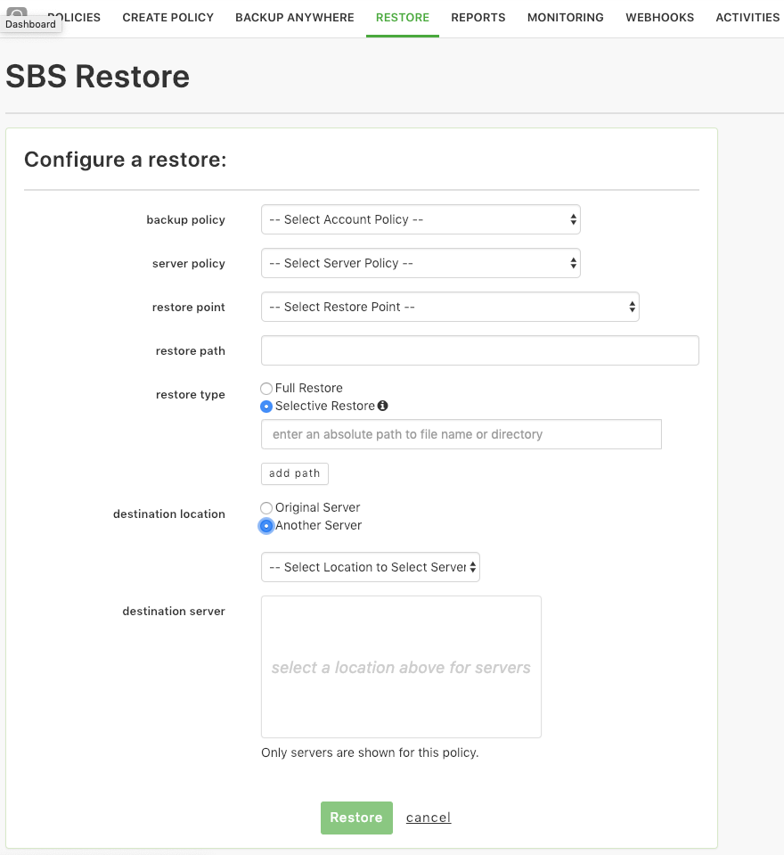

{{{
  "title": "Simple Backup Restores",
  "date": "2-27-2019",
  "author": "John Gerger",
  "keywords": ["backup", "clc", "cloud", "restore", "sbs", "portal"],
  "attachments": [],
  "related-products" : [],
  "contentIsHTML": false,
  "sticky": true
}}}

The Simple Backup Service has integrated the restore functionality directly into the [Simple Backup Lumen Cloud Control Portal page](https://backup.ctl.io). This integration simplifies the backup administration experience. We also added the ability to restore files from one server to any Lumen Cloud server, or registered Backup Anywhere server that has the Simple Backup agent installed on it.

Performing a restore is simple, just navigate over to the new restore tab

* Select the backup policy and server you want to perform a restore from (Backup Policy and Server Policy).
* Select the desired restore point.
* Enter your restore path
* Select if you would like to perform a full restore or selective file restore
* Choose if you want to restore to the original server or another server
  * If you choose another server you will be presented with the server picker list to be able to choose any server that is available to be restored to.

Upon filling out the form and pressing the restore button at the bottom of the page the restore job will be queued and picked up by the backup agent during its next check in (which happens every 10 minutes). You will also be taken to the Activities page where you can see the most recent backup and restore jobs and their statuses. If the target restore server is currently performing a backup, the restore job will not execute until that backup has been completed.
