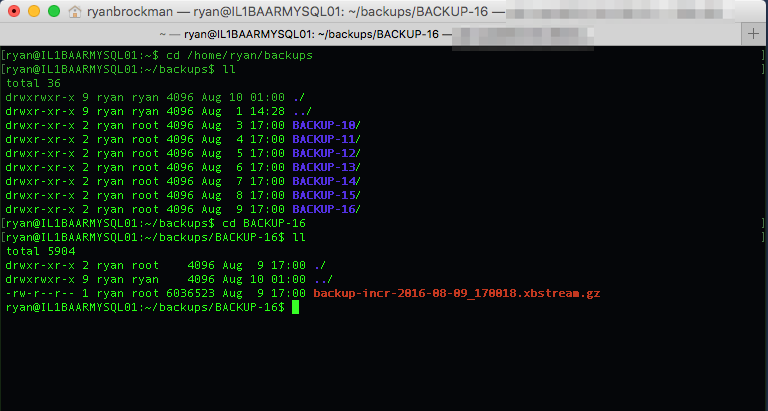

{{{
  "title": "Backing Up Relational Databases With Simple Backup Service",
  "date": "11-12-2019",
  "author": "John Gerger",
  "keywords": ["backup", "clc", "cloud", "sbs", "sql", "mysql", "database"],
  "attachments": [],
  "related-products" : [],
  "contentIsHTML": false,
  "sticky": false
}}}

If you would like to perform a “hot” backup of a relational database running on your Lumen Cloud server and store it offsite using Simple Backup Service(SBS), then there are a few special considerations you’ll need to take to ensure your backups are internally consistent and not missing key data.  

At any given point in time, data which is in the process of being written to the database can reside in the server’s memory or on disk in a primary database file and log (transaction) file that reside on your cloud server.  If you try to back these files up directly using Simple Backup, it will most likely fail because the files are open and locked by the database software.  Additionally, important data could be missed altogether from the backup because it was still residing in memory and thus was not included in the backup.  

In short, Simple Backup Service does not create hot backups.  You’ll need to leverage a database backup utility that does, and then back up the output from that utility with SBS.

1. Use a native database backup utility to create a hot backup of your database.

    Most modern relational database platforms have special backup utilities that are capable of creating a hot backup to avoid the types of problems above.  These utilities inform the database when a backup is going to take place, momentarily freeze all I/O and flush everything to disk, then take a block-level snapshot that ensures everything in the database is captured in a consistent state.  It’s this high level of coordination that ensures an application-consistent backup of the database is achieved.

    If you are running Microsoft SQL Server, you can create application-consistent full, differential, and transaction log backups using SQL Server Management Studio, Transact-SQL, and/or Powershell.  These programs leverage the Volume Shadow Copy Service (VSS) in Window’s Server to take consistent snapshot backups of the database.  

      

    If you are running a MySQL database instead, you can use a utility such as Percona XtraBackup to take a hot backup of the MySQL database.  XtraBackup can make full and incremental hot backups of the database, and supports many popular MySQL flavors such as MySQL, Percona Server, and MariaDB.  

      

2. Create a local staging area on your server where hot backup files will reside.

    As part of configuring the hot backup, you will be asked to choose a destination for the backup files.  We recommend creating a local volume, folder, or even a dedicated file server to serve as a “staging area” where the hot backups can reside.  You only need to retain as many backup files in the local staging area as you’ll need to perform a full database recovery.  

    In the example below, SQL Server hot backups are saved in a new volume (E:) on a Windows server, in a folder (\SQLbackups) dedicated to the backups.  

      

    And below, MySQL hot backups are saved to a dedicated folder (/home/ryan/backups) on the Linux host that is running MySQL.  

      

    One advantage to this approach is that database recoveries can potentially be much faster, since the local backup files will reside closer to the database server, and don’t have to first be copied from the Simple Backup storage region prior to a restore.

3. Configure SBS to back up your local staging area.

    Simple Backup Service can then be configured to back up the new local staging area, for longer term, offsite retention of backup files, as may be required by compliance or other corporate policies.  This offers an added layer of protection from catastrophic failures and outages, as well as a more cost-effective storage option for backups you’ll need to access less frequently.

    Here is an example of how a policy could be configured for Microsoft SQL Server backups:

    

    Here is an example of how a policy could be configured for MySQL backups:

    
