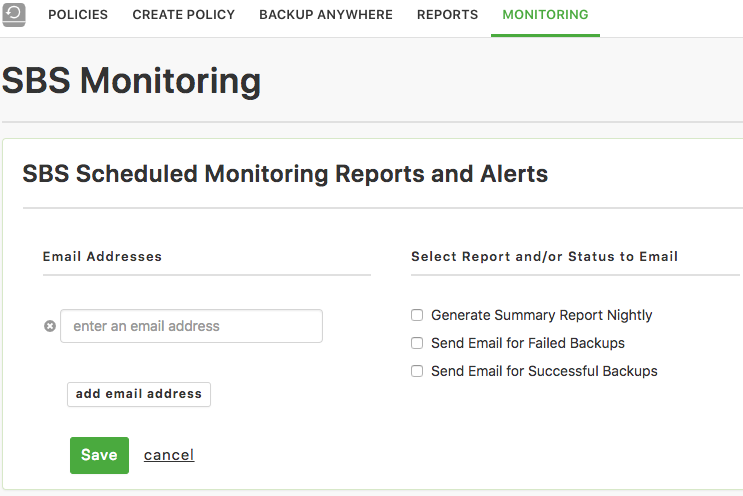

{{{
  "title": "Simple Backup Monitoring",
  "date": "09-24-2018",
  "author": "John Gerger",
  "attachments": [],
  "related-products" : [],
  "contentIsHTML": false,
  "sticky": false
}}}

The Simple Backup Service has monitoring functionality now available through email notifications. Email notifications are available for either failed or successful backups, as well as a nightly backup email report of all activity.

To get started simply navigate to the Monitoring tab in the Simple Backup UI, add an email address to receive the notifications, and check the boxes for the notifications you would like.

We are currently working on monitoring notifications through web-hooks, so keep an eye on our release notes and this article for more information when it becomes available!
