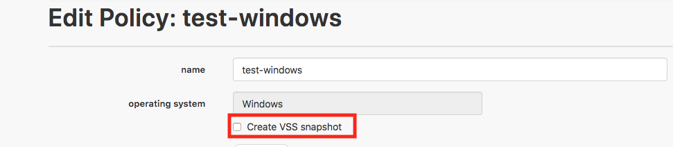

{{{
  "title": "Simple Backup Service FAQs",
  "date": "06-08-2020",
  "author": "John Gerger",
  "keywords": ["backup", "clc", "cloud", "faq", "sbs"],
  "attachments": [],
  "related-products" : [],
  "contentIsHTML": false,
  "sticky": true
}}}

### Table of Contents

* [Requirements](#requirements)
* [Agent](#agent)
* [Backups](#backups)
* [Restores](#restores)
* [Policies](#policies)
* [Frequency](#frequency)
* [Scheduling](#scheduling)
* [Retention](#retention)
* [Inclusions and Exclusions](#inclusions-and-exclusions)
* [Billing](#billing)

### Requirements

**Q: What are the network requirements for Simple Backup Service (SBS), if any?**

A: SSH for Root is required to allow the blueprint to initially install the backup agent on the target server; it may be disabled after the initial instillation as it is not needed for the agent to function. Simple Backup Service also requires outbound internet traffic over port 443. Lumen Cloud VMs allow outbound traffic by default using NAT.

- Alternatively, firewall rules may be configured utilizing the endpoints listed below. Additional endpoints will need to be configured based on the storage region selected as indicated in our [SBS functionality article](simple-backup-service-how-it-works.md).

  ```
  up-va1.backup.ctl.io
  up-de1.backup.ctl.io
  up-ca3.backup.ctl.io
  up-sg1.backup.ctl.io
  up-uc1.backup.ctl.io
  up-gb3.backup.ctl.io
  ```
SBS Requires SFTP to Install Client Packages. Sftp service should be enabled on Linux Servers.

   - To Enable sftp service on LInux Servers, 

1. Edit SSH configuration file /etc/ssh/sshd_config and add the below line
  ```
Subsystem sftp /usr/libexec/openssh/sftp-server
  ```
2. save the file and restart sftp service to the changes take effect.
  ```
service sshd restart
  ```
**Q: What operating systems are supported?**

A: If the server is using one of the [platform-supported operating systems](../Support/supported-operating-systems.md), then SBS may be installed. **NOTE:** Exceptions to this are listed below.

- Debian 6
- imported VMs
- 32-bit operating systems

**Q: How can I use Simple Backup Service on a server that doesn't have internet access?**

A: The service requires consistent internet connectivity to install, update, backup, and restore.

**Q: What happens when my server is paused or loses connectivity?**

A: No further backups occur from the server to storage. If a backup agent is unable to communicate with the SBS infrastructure, stored backup data will not be set to expire. This is to ensure that data is safe and restorable in the case of server failure or internet connectivity issues.

**Q: Is SBS intended to be used for disaster recovery?**

A: No. SBS only provides file-level backup protection, [excluding certain OS files](#inclusions-and-exclusions), and does not provide VM-level snapshot capability. While users can still perform [manual VM snapshots on demand](../Servers/creating-and-managing-server-snapshots.md) and as [scheduled tasks](../Servers/creating-a-scheduled-task.md), these are not considered disaster recovery solutions either. For full disaster recovery, review our [backup solutions introduction article](../Support/introducing-new-options-for-backups.md).

**Q: Does SBS support VM cloning?**

A: No. Currently, SBS does not support cloning. If the agent is installed on a VM that is cloned, there can be data continuity issues between the backups of the source VM and the clone. Before cloning a VM, the SBS agent must be [uninstalled first](removing-simple-backup-service.md), then the agent will need to be separately installed on the clone.

### Agent

**Q: What are the minimum requirements of a VM for the SBS agent to run?**

A: Although the SBS agent will run on VMs with 1 CPU and 1 GB of memory, the overall speed and performance might not be optimal. There could be resource contention on the server during a backup as well, depending on the other processes running on the server at that time.

**Q: What are the login credentials for the backup agent?**

A: Please review the [SBS Agent Security Configurations article](sbs-agent-security.md).

**Q: Can I change the backup agent credentials for all my instances in one place?**

A: Not at this time. Each properties file must be updated individually.

**Q: How can I access my backup agent from a remote machine?**

A: Please review the [SBS Agent Security Configurations article](sbs-agent-security.md).

**Q: Where can I find the backup agent's logs on my machine?**

A: Logs can be viewed at the following locations.

- Linux: /var/lib/simple-backup-service
- Windows: C:\Windows\System32\config\systemprofile\appdata\local\simplebackupservice

**Q: What can I find in the backup agent's logs?**

A: The backup agent's logs have details about the backups that have run on the system. This is helpful if you are trying to identify causes of backup failures as the failed files will be listed in the logs.

**Q: If a new version of the the agent is available, what are the steps to update the agent on my server?**

A: No steps required by the user. The agent automatically updates itself, given that the server is powered on, the agent is running, and the server is connected to the internet.

**Q: If I reboot my server, do I need to restart the agent?**

A: The agent is setup to start on boot at install time.

### Backups

**Q: Where do I configure backups?**

A: The control portal provides backup configuration functionality. Please refer to our [Getting Started guide](getting-started-with-simple-backup.md) for more details. Additionally, the [backup API](//www.ctl.io/api-docs/v2/#simple-backup) may be used for advanced scripting.

**Q: What does an "IN PROGRESS" status backup mean?**

A: This indicates that the data is actively being transferred from the server to the specified storage region associated with the policy.

**Q: How do you handle backing up open files?**

A: It depends on the OS, as listed below.

- Windows: Open-file backups are supported through VSS snapshots for any VSS compliant applications running on the server. You can enable VSS backups on specific backup policies for servers by checking the "Create VSS Snapshot" checkbox. This can be done when creating the policy, or by editing an existing policy.

  

- Linux: Open files will not be backed up, and “Partial Success” will be shown as the restore point status if open files are encountered in the targeted backup path.

**Q: How can I confirm that my backups were successful?**

A: There are multiple ways to check the statuses of your backups. The Lumen Cloud Simple Backup control portal has an activites tab that provides a quick, at-a-glance view of your recent backups. You can also use the [reporting functionality](reports.md) or the [monitoring functionality](sbs-monitoring.md) to provide a deeper view into your backup landscape.

**Q: For a "Failed" or "Partial Success" backup status, can I see which files failed and why?**

A: Yes. See the sbs-backup-files-failed.csv file located on the backup agent's log directory for details. Logs can be viewed at the following locations.

- Linux: /var/lib/simple-backup-service
- Windows: C:\Windows\System32\config\systemprofile\appdata\local\simplebackupservice

**Q: Where are my backups actually stored?**

A: The SBS agent on the server transfers backup data to one of six different backup storage regions, each built on top of object storage. Lumen Cloud sources this storage from a combination of its own cloud platform, as well as 3rd-party cloud providers such as Amazon Web Services. For more information, see our [SBS functionality article](simple-backup-service-how-it-works.md).

**Q: Can I check the status of my backups?**

A: Yes. You can check the activities tab for an at-a-glance view of your most recent jobs, or you can review the [reports documentation](reports.md) for in-depth details of your backup jobs.

### Restores

**Q: What does an "IN PROGRESS" status restore mean?**

A: This indicates that the data is actively being restored from the storage region associated with the policy to the server.


**Q: What would be the most common reason for a "staged" status on a restore Job?**

A: The below are the most common reason for the staged status of the SBS backup restore.

 * Insufficient Disk Space

   * We need to make sure that Target path have enough disk space
     * Example: Error processing restore job! Local agent's jobId: user-31 - Error: com.ctl.clc.agent.filesystem.DiskSpaceDetails$InsufficientSpaceException: Requested              42753833984 but only 22661103616 is usable
 * Disk is in Read only Mode

   * We need to make sure that Target path disk is not in Read Only mode
 * Treating "SBS Anywhere" servers as regular SBS servers when attempting to restore

   * It appears that "SBS Anywhere" servers were treated as regular SBS servers when attempting to restore.
   * Please try again and select the server from the "anywhere servers"
   * Destination Location > Backup Anywhere > Anywhere Servers

**Q: Can I select specific files/folders to restore from a restore point?**

A: Yes. In the restore section, there is an option to perform a full restore or selective-file restore. Using the selective restore option allows you to enter the full path to a file or folder and gives you the option to add multiple paths to restore. While using the selective restore, function you are able to use `*` as a wildcard in the path or filename.

**Q: Can restores be performed to another server?**

A: Yes. Please follow the steps outlined in the [restore documentation](restores.md).

**Q: How is the backup date determined for Restore Points?**

A: This is the point in time that the backup job completed.

**Q: What is the protected data amount for my restore point?**

A: It is not the amount of data backed up for the specified backup instance. Rather, it is the total amount of restorable data for the specified restore point. Essentially, protected data is the consolidation of your full backup and any changes per the specified backup instance.

**Q: Why does my restore point status show as “Partial Success”?**

A: This means that at least one new/changed file was not backed up completely. All other successfully-backed-up files will be available through this restore point. Please note that locked files will not be backed up.

**Q: Why did my restore fail?**

A: Common causes of restore failure as follows.

  - The server lacks internet connectivity over port 443.
  - The restore path is not accessible due to permissions issues.
  - There is insufficient disk space (an error message will display).

**Q: Why can't I see all of my restored files?**

A: Common causes of obscured restore files are as follows.

  - The permissions of the files/folders were restored to what were assigned during the backup execution.
  - There was an invalid path structure provided as a restore path. In this case, the files/folders will be restored to either the C:Windows\System32 folder (Windows) or the SimpleBackupService directory (Linux).

**Q: How do I stop an in-progress restore from completing?**

A: Restarting the Simple Backup service on the server will stop all running restore tasks. See [Restarting Simple Backup Service](restarting-simple-backup-service.md) for steps to restart in Linux and Windows.

**Q: Can I check the status of my restores?**

A: Yes. You can check the activities tab for an at-a-glance view of your most recent jobs, or you can review the [reports documentation](reports.md) for in-depth details of your restore jobs.

### Policies

**Q: Can I adjust the storage region of a server?**

A: No. However, in order to allow redundancy, users may configure a server to back up in multiple regions. A server may be added to the same policy multiple times as long as the region is different.

**Q: Why is my policy status still showing "Pending Install"?**

A: A policy will show this until the SBS agent checks back in with the SBS servers. This could be delayed if the agent is performing a backup/restore or if a system reboot is required.

**Q: What happens when polices are disabled by the user?**

A: When a policy is disabled, backups will stop being performed for the associated server and paths tied to the policy. A countdown of the retention period will begin based on the policy details. For example, if the retention period is 14 days, then the files will be retained in storage for that time before being removed from storage.

**Q: What if an inactive policy is enabled while the current backups are counting down their retention period?**

A: The files in storage will stop their retention period countdown, and all servers associated with the policy will resume their regularly scheduled backups.

**Q: What is the difference between an active/inactive server versus an active/inactive policy?**

A: An inactive policy essentially disables backups for all servers in the policy, while the server status only refers to the specified server. An inactive policy status will override an active server status.

**Q: How can I view the policies applied to a server?**

A: Currently, the most efficient method of viewing all the policies applied to a server is to navigate to the SBS dashboard and select the server in the relevant policy. Steps are detailed below.

1. From your server within control portal, select **manage** in the Simple Backup section to view all policies associated with your account alias.
2. Select a policy, then open the policy details to view all associated servers.
3. Select a server to view all applied policies.

**Q: Can I modify the retention settings for an existing policy?**

A: No. This is intentionally disabled to prevent deletion of data that had been backed up under the longer policy. If you want to reduce retention time, you would have to create a new server policy with the reduced retention time and apply that new policy to the servers. The old data will be around for 30 days unless you delete the 30-day policy.

### Scheduling

**Q: What scheduling configurations are available?**

A: You can configure a backup schedule on an hourly, daily, weekly, monthly or yearly basis.

**Q: Can I set the hour of the day to backup?**

A: Yes. All options, except for hourly, allow you to specify at what hour you want the backup to start.

**Q: Can I specify a time for backups to *not* happen?**

A: No.

### Frequency

**Q: Where has the frequency setting gone when creating a new policy?**

A: We have replaced the frequency method of backing up with a CRON-style scheduling method.

**Q: Will my backup policies, that were setup with frequency, still function?**

A: Yes. We have backwards compatibility for all backup policies that use the frequency method of backing up.

**Q: How do I change my old frequency based policies over to schedule based policies?**

A: Simply select the policy you wish to change, select **edit**, then the desired schedule for the new policy. Once it has been saved, the new schedule will take effect.

**Q: If the backup frequency is every 4 hours, what should I expect?**

A: This depends on how long a backup takes to complete. The frequency timer will not start until the previous backup has completed, so in this example, the next backup will start 4 hours after the previous one has completed.

**Q: Can I manually initiate a backup outside of my regularly scheduled frequency?**

A: Yes. From the backup agent, select the **Backup** button from the home dashboard or the policy details page. This places a request at the top of the backup queue and will be processed as soon possible.

**Q: Can I schedule backups to execute at a specific time in the day?**

A: Yes. This is part of our new scheduling feature; for more details, please see the [getting started guide](getting-started-with-simple-backup.md).

### Retention

**Q: Can I completely delete my backed up files from storage, regardless of the retention period?**

A: No. This is a manual process at this time. A [support request](../Support/how-do-i-report-a-support-issue.md) will need to be opened to have this performed.

**Q: Why do unchanged files not follow retention?**

A: This provides the ability to utilize incremental backups with consistent full-backup protection. By not expiring unchanged files, there is no need to retransfer them to object storage, which minimizes data transfer costs and provides quicker backups. The bottom line is that it provides quicker and cheaper backups for our users.

**Q: What is the maximum retention period for backups?**

A: It's 18,263 days (approximately 50 years).

**Q: Does Simple Backup's storage system respect the native Windows drive-compression settings?**

A: Assuming that this is a virtual access layer provided by the operating system, the SBS agent copies the data it sees it being reported by the OS, which will likely be expanded in size for the backend storage. When the backup is restored to a system using native Windows drive compression, it would be re-compressed by the OS.

**Q: Are there compression settings that can be utilized for both the Windows file system and by SBS?**

A: No. SBS does not have compression settings.

### Inclusions and Exclusions

**Q: Which files/folders are automatically excluded from the backups?**

A: Please refer to the list below.

- **Windows**
  Explicit Path Exclusions: "C:\$Recycle.Bin", "C:\SystemVolume Information", "C:\Windows", "C:\Program Files\BakDatAgent", "C:\Program Files\SimpleBackupService", "C:\ProgramData\Microsoft", "C:\Recovery", "C:\PerfLogs"
  Explicit Files Exclusions: "C:\system.sav", "C:\hiberfil.sys", "C:\pagefile.sys", "C:\swapfile.sys"
  Folder Names Excluded: "\$Recycle.Bin", "System Volume Information"
  File Extensions Excluded: None
  Checked at Runtime by Type: symbolic links, Windows junctions

- **Linux**
  Explicit Path Exclusions: "/tmp", "/temp", "/proc", "/dev", "/devices", "/sys", "/opt/bakdat", "/opt/simplebackupservice", "/run", "/var/run", "/var/lock",  "/media", "/lost+found", "/var/spool/cups", "/var/spool/lpd", "/var/spool/postfix"
  Explicit Files Exclusions: None
  Directory Names Excluded: "lost+found"
  File Extensions Excluded: ".lock", ".lck"
  Checked at Runtime by Type: symbolic links, devices (block & character), pipes, sockets

**Q: Can I opt to backup the files that are automatically excluded from backups?**

A: Not at this time, as the exclusion list overrides the inclusion list. The reason is because SBS is intended to back up the apps and data that are specific and important to your business; SBS is not intended to be a full-server restore. Since OS files are not included, the speed and performance of the backups are increased, while also minimizing backup costs.

**Q: Are wildcard characters supported for inclusion/exclusion backup paths when creating a backup policy?**

A: Wildcard characters are not directly supported at this time. However, all sub-folders and files of an included path will be backed up, unless specifically added to the exclusion list. All sub-folders and files of an exclusion path will be omitted from backup.

### Billing

**Q: How is my bill calculated?**

A: SBS provides a simplified billing model. The cost per GB for backups is calculated on an hourly basis from the actual data stored. The actual data stored varies based on the backup retention, frequency, and your data change rate. After your first initial backup, each subsequent backup will capture and store changes to your data. The restore cost is a flat rate based on the restored amount of data in GBs.

- Backup Cost Calculation Example: 10 GB of data was backed up on the 15th of the month, assuming there are no changes throughout the remaining duration of the month.
  Hourly GB Usage: 3,600 GB (10 GB of backup x 15 days x 24 hours)
  Billable GB Amount: 5 GB (3,600 GB usage / 720 hours in a month)

**Q: Are there any additional costs or hidden fees associated with SBS?**

A: No. For example, there are *no* fees for data transfer, storage, licenses, etc.
