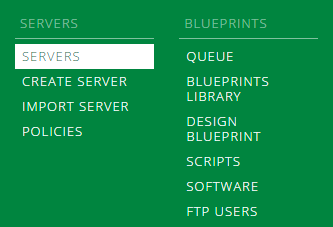
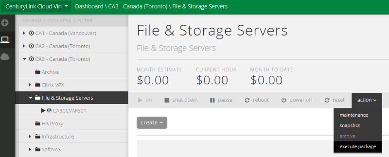
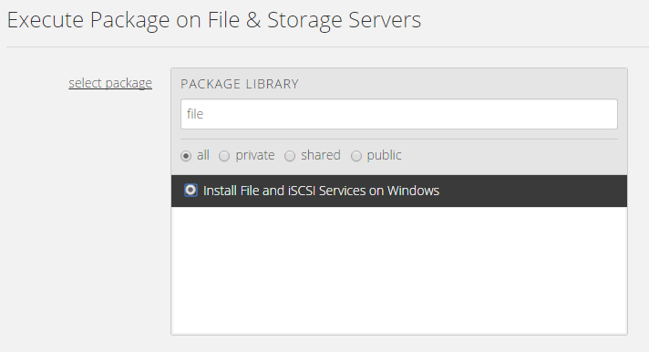
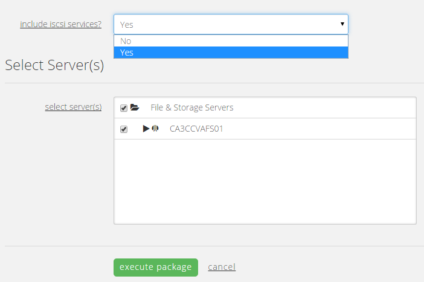
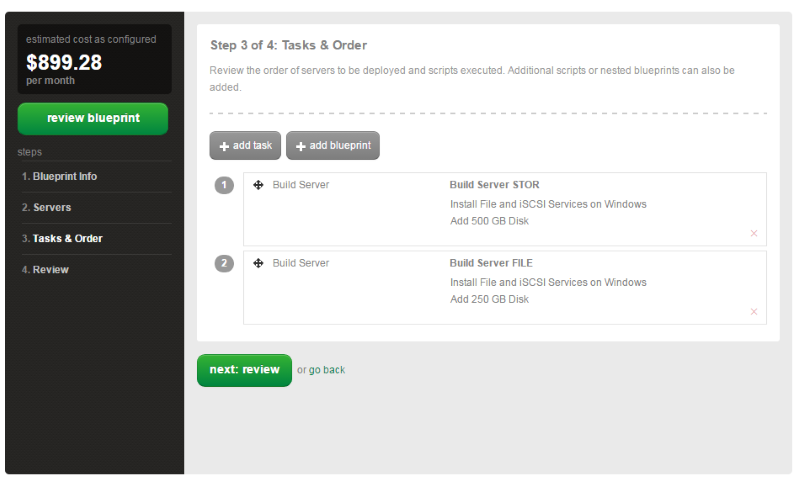
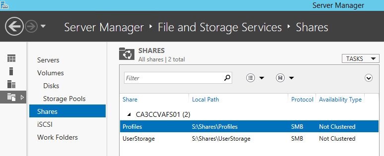
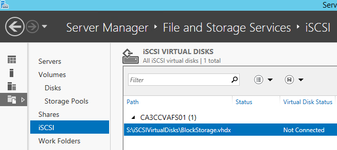

{{{
  "title": "Install File and iSCSI Services on Windows",
  "date": "4-24-2015",
  "author": "Chris Little",
  "attachments": [],
  "contentIsHTML": false
}}}

### Overview

By leveraging [CenturyLink Cloud Public Blueprints](../Blueprints/centurylink-cloud-public-blueprint-packages.md) customers can automate operational tasks.  In using the **Install File and iSCSI Services on Windows** blueprint customers can add the File and iSCSI storage roles on Windows Servers in an automated fashion.

### Prerequisites

* A CenturyLink Cloud Account
* Supported Windows Operating Systems
    * Windows 2012 Datacenter 64-bit
    * Windows 2012 R2 Data Center 64-bit

### Notes

* This packages includes File Server, BranchCache, Data Deduplication, DFS Namespace, DFS Replication, Resource Manager, VSS Agent and Server for NFS roles. Optionally, customers can choose to include iSCSI Storage Services.

### Perform Install File and iSCSI Services on Windows using Group Tasks

1. Navigate to the Servers Menu in Control.

    

2. Browse to the Group that houses the VM(s) you want to Install File and iSCSI services. Select Action, Execute Package.

    

3. Search for **File** and select the **Install File and iSCSI Services on Windows** script.

    

4. Determine if you'd like iSCSI strorage services included with the File Server roles and the VM(s) in the Group you wish to have these features installed upon. Customers can choose an individual VM or multiple. (Quick Tip: Only supported Guest Operating Systems will be shown)

    

### Install File and iSCSI Services on Windows using Blueprints

Customers who are building environments in the CenturyLink Cloud may wish to use Blueprints to build servers and install File and iSCSI Services in an automated fashion. Blueprints provide a tool for customers to build environments for multiple deployments.

To use this approach follow the [How to Build a Blueprint](../Blueprints/how-to-build-a-blueprint.md) knowledge base article and combine the Install File and iSCSI Services on Windows script with Windows Virtual Machine builds.

  

### Validation

Validate the Virtual Machine(s) have File and iSCSI Storage Services installed:

1. Login via RDP. Open Server Manager / File and Storage Services / Shares.  

    

2.  Validate (if installed) the iSCSI Storage features are present and configurable in Server Manager.

    
