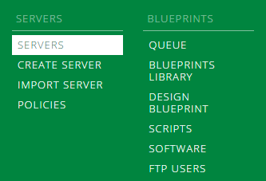
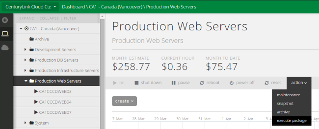
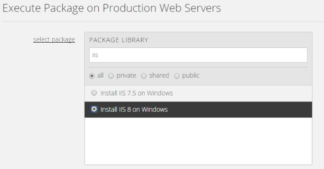
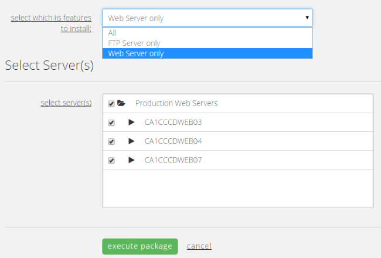
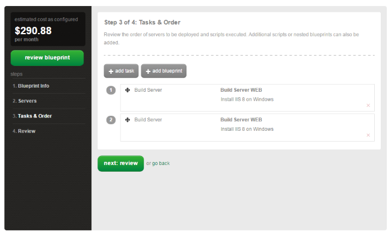
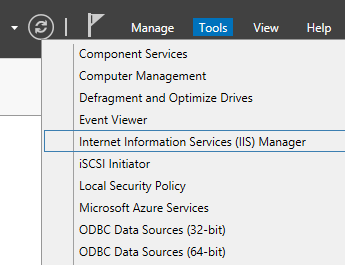
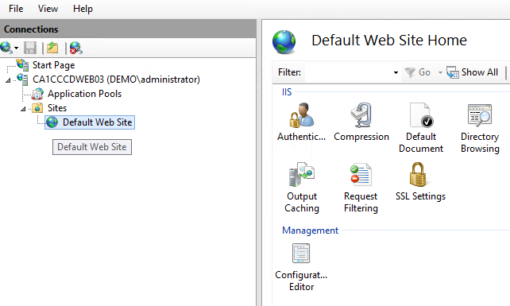

{{{
  "title": "Install IIS on Windows",
  "date": "4-9-2015",
  "author": "Chris Little",
  "attachments": [],
  "contentIsHTML": false
}}}

### Overview

By leveraging [CenturyLink Cloud Public Blueprints](../Blueprints/centurylink-cloud-public-blueprint-packages.md) customers can automate operational tasks.  In using the **Install IIS on Windows** blueprint customers can add the IIS role on Windows Servers in an automated fashion.

### Prerequisites

* A CenturyLink Cloud Account
* Supported Windows Operating Systems for IIS 7.5:
    * Windows 2008 R2 Standard 64-bit
    * Windows 2008 R2 Enterprise 64-bit
    * Windows 2008 R2 Datacenter 64-bit
* Supported Windows Operating Systems for IIS 8:
    * Windows 2012 Datacenter 64-bit
    * Windows 2012 R2 Data Center 64-bit

### EXCEPTIONS

* Customers who wish to leverage Managed Services should use the [Managed Microsoft IIS blueprint.](../Managed Services/getting-started-with-managed-microsoft-iis.md)

### Perform Install IIS on Windows using Group Tasks

1. Navigate to the Servers Menu in Control.

    

2. Browse to the Group that houses the VM(s) you want to Install IIS. Select Action, Execute Package.

    

3. Search for **IIS** and select the **Install IIS 7.5 or 8 on Windows** script.

    

4. Select the IIS features you'd like to install and the VM(s) in the Group you wish to have IIS installed. Customers can choose an individual VM or multiple. (Quick Tip: Only supported Guest Operating Systems will be shown)

    

### Install IIS on Windows using Blueprints

Customers who are building environments in the CenturyLink Cloud may wish to use Blueprints to build servers and install IIS in an automated fashion. Blueprints provide a tool for customers to build environments for multiple deployments.

To use this approach follow the [How to Build a Blueprint](../Blueprints/how-to-build-a-blueprint.md) knowledge base article and combine the Install IIS on Windows script with Windows Virtual Machine builds.

  

### Validation

Validate the Virtual Machine(s) have IIS installed:

1. Login via RDP, open Server Manager and select Internet Information Services (IIS) Manager.

    

2.  Validate the IIS features are present and configurable.

    
