{{{
  "title": "Add Multiple Instances of a Software Package to a Blueprint",
  "date": "8-2-2012",
  "author": "Richard Seroter",
  "attachments": [],
  "contentIsHTML": true
}}}

<strong>Description:</strong>

Users can set unique parameters for each instance of a software package in a blueprint. For instance, if a blueprint author wishes to add Microsoft SQL Server 2012 to two servers but with different credentials for each machine, that is possible within
  the Blueprint Designer. This article walks through the process of creating blueprints with multiple identical software packages and then setting unique parameters when that blueprint is deployed.

<strong>Steps:</strong>

<strong>1a. Create blueprint with multiple servers, software added at “Tasks &amp; Order” phase.</strong>

<ul>
  <li>Locate the “Design Blueprint” option in the Control Portal navigation menu.
     
  </li>
  <li>Provide a name, version number, privacy setting and description for the blueprint.
     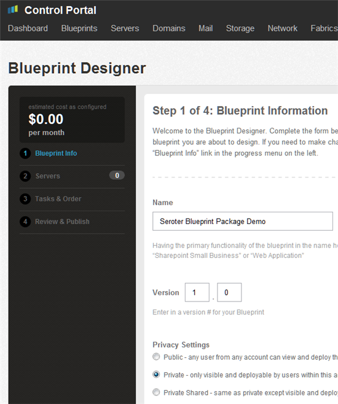
  </li>
  <li>Add a pair of servers to the blueprint. In this example, the servers are Windows Server 2008 R2 machines with default memory and CPU configurations. Note that no software/tasks/scripts are applied at this point.
     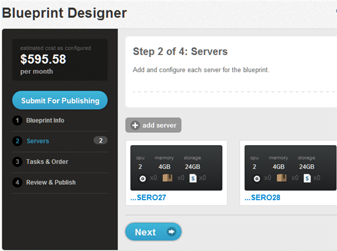
  </li>
  <li>After clicking “Next”, click the “Add Task” button and choose a software package or script that is known to have installation parameters.
     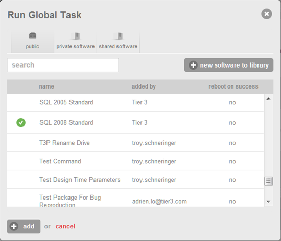
  </li>
  <li>Click the “Add” button and then choose which server that this package applies to. Blueprint authors can select specific servers or choose the “Select During Deployment” option. In this example, the first server is selected.
     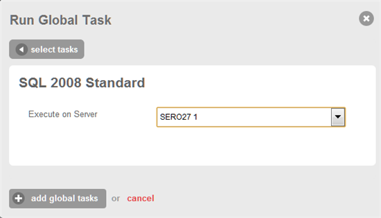
  </li>
  <li>After clicking the “Add Global Tasks” button, repeat this process and add the same software package to the second server in the blueprint. The final result should show two servers and two instances of the software package.
     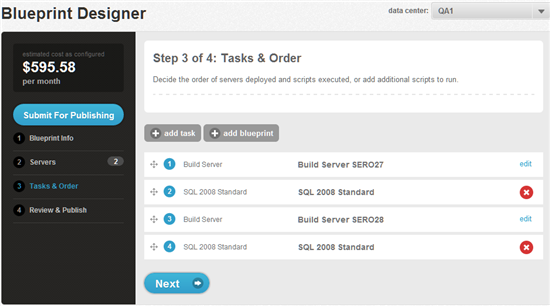
  </li>
  <li>Finish the Blueprint Designer wizard and submit the blueprint for publishing.</li>
</ul>

<strong>1b. Create blueprint with multiple servers, software added as part of each server configuration.</strong>

<ul>
  <li>In this variation of step 1a, the software is selected at the same time as the server is configured. These two methods for installing software produce the same output even though the blueprint engine treats them slightly differently. The technique in
    step 1a is recommended when the server environment already exists and the blueprint is used to provision software onto that environment. The activities outlined here in Step 1b are recommended when building an entirely new environment.</li>
  <li>Locate the “Design Blueprint” option in the Control Portal navigation menu.
     
  </li>
  <li>Provide a name, version number, privacy setting and description for the blueprint.
     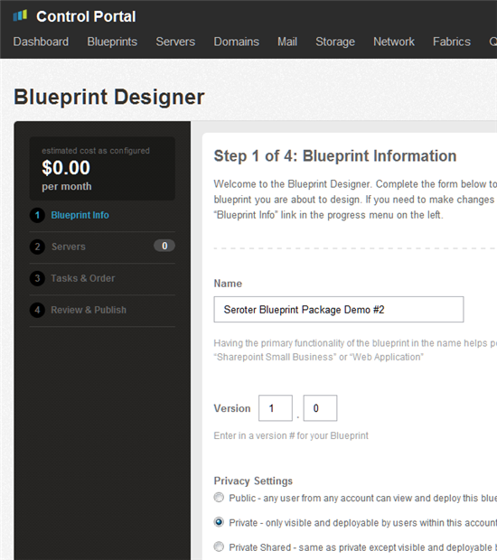
  </li>
  <li>Add a pair of servers to the blueprint. In this example, the servers are Windows Server 2008 R2 machines with default memory and CPU configurations. On the server configuration page, click the “Install Software” button and select a software package.
     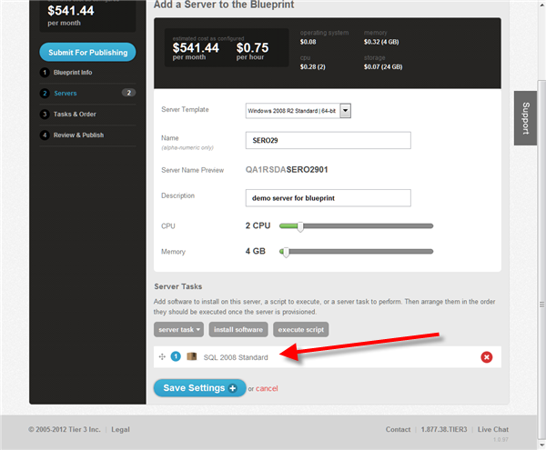
  </li>
  <li>Repeat the process and add a second server that has the same software package selected during the server configuration.</li>
  <li>After saving both server configurations, see the “Task &amp; Order” page where both servers, and their software packages, are listed in a slightly different way than demonstrated in step 1a.
     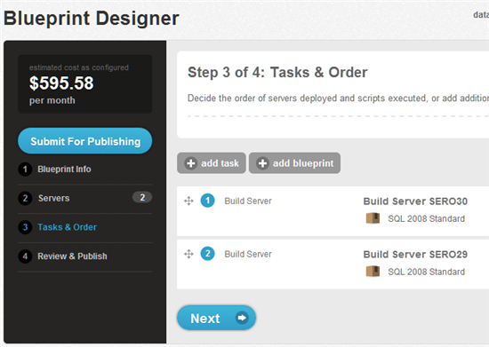
  </li>
  <li>Complete the blueprint and submit it for publishing.</li>
</ul>

<strong>2. Deploy blueprint and set unique software package settings</strong>

<ul>
  <li>Blueprints built using either the technique from Step 1a or 1b will follow the same deployment process.</li>
  <li>Locate the blueprints that have multiple servers with the same software package.
     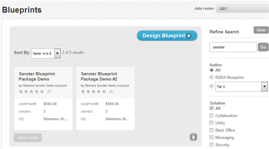
  </li>
  <li>Select a blueprint for deployment.
     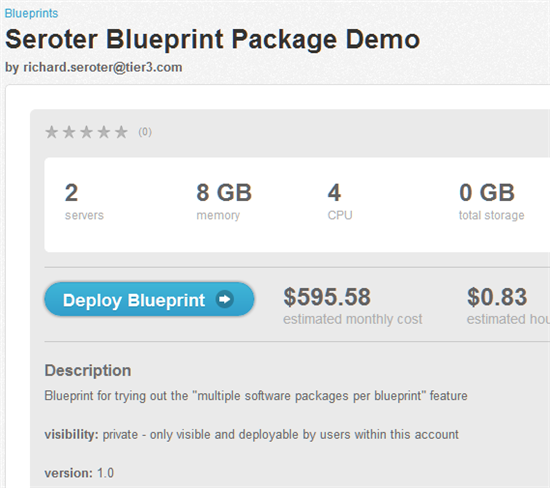
  </li>
  <li>Click “Deploy Blueprint” and see the deployment-level parameters that can be set including server passwords, network, server names and one section for EACH instance of the software package contained in the blueprint. This means that each software package
    could be deployed with parameter that are unique to the server its being installed on.
     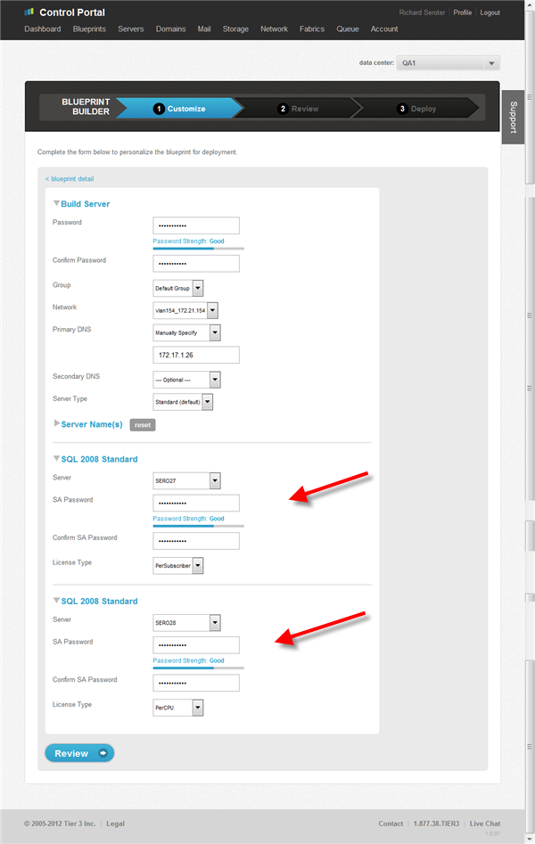
  </li>
  <li>Review the settings of the blueprint and choose to deploy it.</li>
  <li>Upon completion, see that the software was installed on each server per the configured parameters.</li>
</ul>
