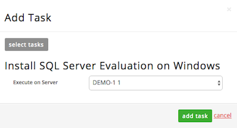

{{{
  "title": "Add Multiple Instances of a Software Package to a Blueprint",
  "date": "10-12-2016",
  "author": "Daniel Morton",
  "attachments": [],
  "contentIsHTML": false
}}}

### Description:
Users can set unique parameters for each instance of a software package in a Blueprint. For instance, if a Blueprint author wishes to add Microsoft SQL Server 2012 to two servers but with different credentials for each machine, that is possible within the Blueprint Designer. This article walks through the process of creating Blueprints with multiple identical software packages and then setting unique parameters when that Blueprint is deployed.

### Steps
1. Log into the [Control Portal](https://control.ctl.io/).

2. From the Navigation Menu, click **Orchestration > Design Blueprint**.

3. In the Blueprint Designer, provide the following information:
   * Name
   * Version Number
   * Privacy Setting
   * Company Size
   * Description of the Blueprint
   * Tag Capabilities

   

4. Click **next:add servers**.

5. Click **+add server** and add a pair of servers to the Blueprint.
   * In this example, the servers are Windows Server 2008 R2 Standard machines with default memory and CPU configurations.
   * **Note:** No software/tasks/scripts are applied at this point.
   

6. Click **next: tasks & order** and then **+add task**.
   * Choose a software package or script that is known to have installation parameters. Then, click **add**.

   

7. In the Add Task window, use the drop-down to select which server that the package applies to. Then, click **add task**.
   * Blueprint authors can select specific servers or choose the “Select During Deployment” option.
   * In this example, the first server is selected.
   

8. Repeat this process and add the same software package to the second server in the Blueprint.
   * The final result should show two servers and two instances of the software package.
   

9. Click **next: review**.
   * This step allows you to review the Blueprint configuration and make any changes before publishing.
   * Click on any of the steps located on the left to make changes.

10. Click **submit for publishing**.
   * The publishing mechanism submits the Blueprint for an automated review by the build system.
   * Any inconsistencies are flagged and the publishing processes errors out if exceptions are found.

11. Locate the Blueprint and click on it.
   

12. Click **Deploy Blueprint**.

### Create a Blueprint with Multiple Servers with Software Added to Each Server Configuration
In this variation of the section above, the software is selected at the same time as the server is configured. These two methods for installing software produce the same output even though the Blueprint engine treats them slightly differently. The technique in the section above is recommended when the server environment already exists and the Blueprint is used to provision software onto that environment. The activities outlined here are recommended when building an entirely new environment.

1. Log into the [Control Portal](https://control.ctl.io/).

2. From the Navigation Menu, click **Orchestration > Design Blueprint**.

3. In the Blueprint Designer, provide the following information:
   * Name
   * Version Number
   * Privacy Setting
   * Company Size
   * Description of the Blueprint
   * Tag Capabilities

   

4. Click **next:add servers**.

5. Click **+add server** and add a pair of servers to the Blueprint.
   * In this example, the servers are Windows Server 2008 R2 Standard machines with default memory and CPU configurations.
   

6. On the server configuration page, click **Install Software** and select a software package. Then, click **add** and **apply**.

   

7. Repeat the process and add a software package to the second server.

8. Click **next: task & order**.
   

9. Click **next: review**.
   * This step allows you to review the Blueprint configuration and make any changes before publishing.
   * Click on any of the steps located on the left to make changes.

10. Click **submit for publishing**.
   * The publishing mechanism submits the Blueprint for an automated review by the build system.
   * Any inconsistencies are flagged and the publishing processes errors out if exceptions are found.

11. Locate the Blueprint in the Blueprints Library and select the Blueprint.

12. Click **Deploy Blueprint**.
   * The deployment-level parameters can be set including server passwords, network, server names, and one section for each instance of the software package contained in the Blueprint.
   * This means that each software package could be deployed with parameter that are unique to the server its being installed on.

13. Review the settings of the Blueprint and choose to deploy it.
   * Upon completion, the software is installed on each server per the configured parameters.
