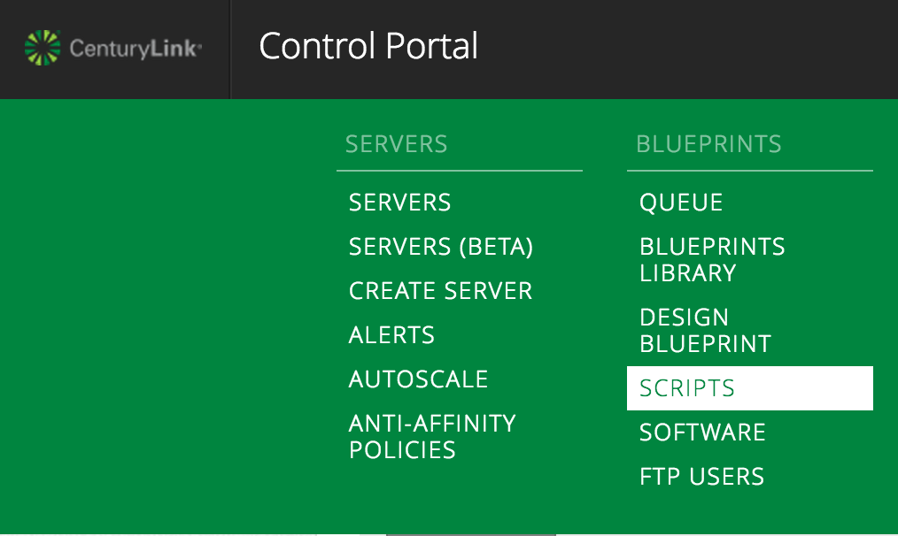
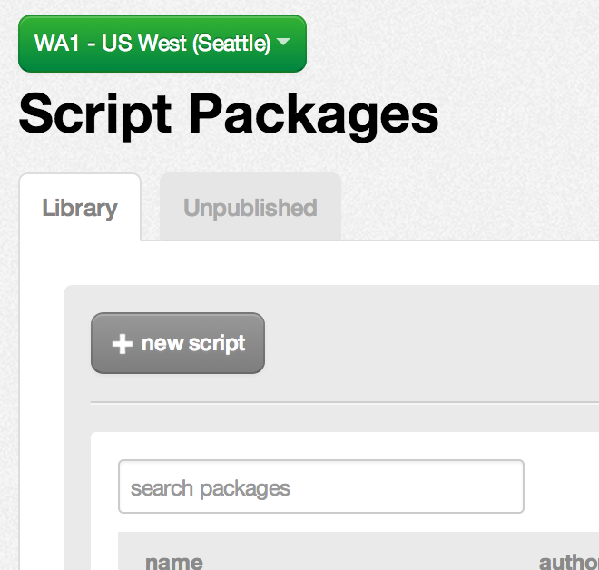
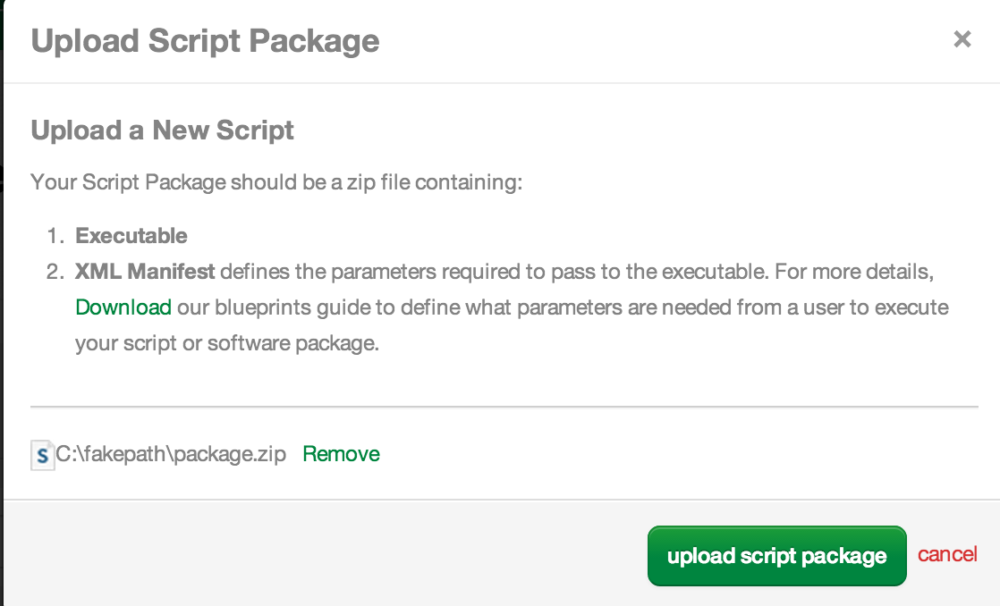
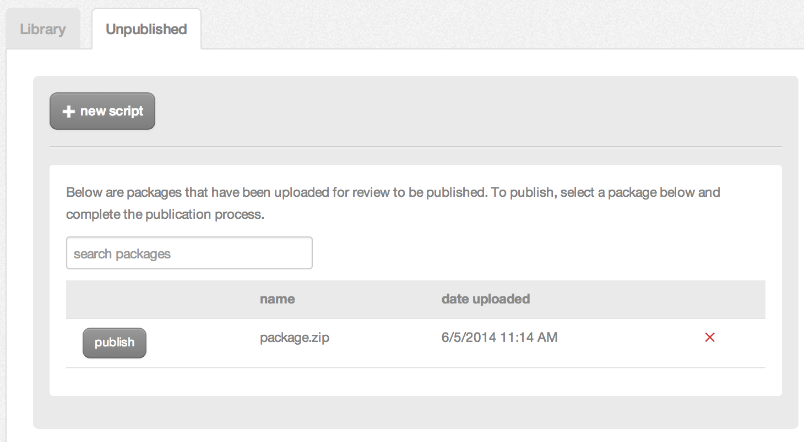
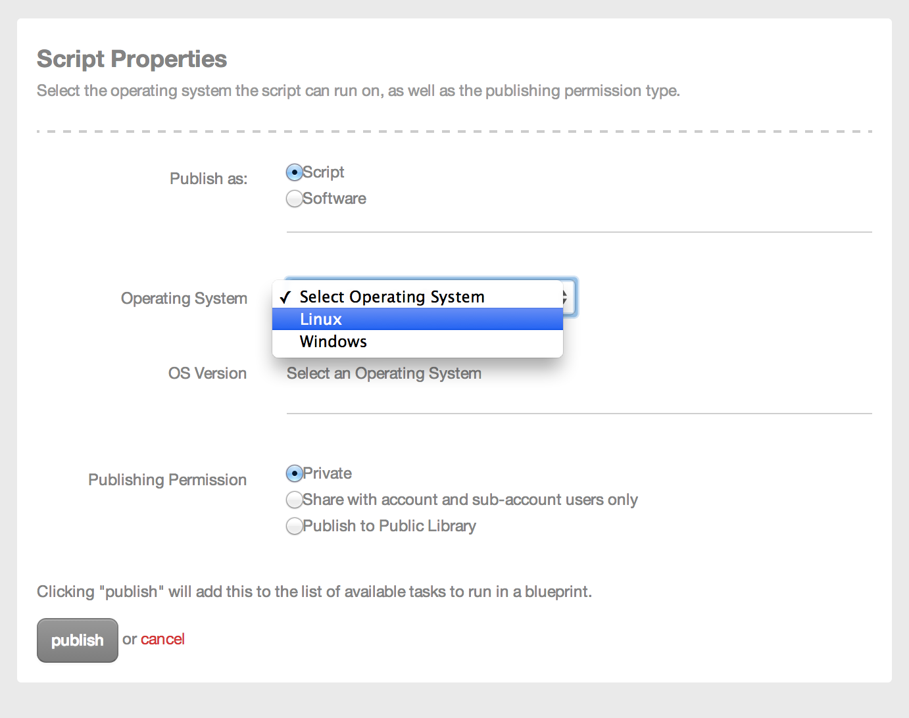
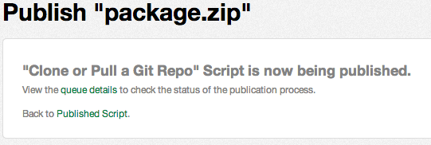
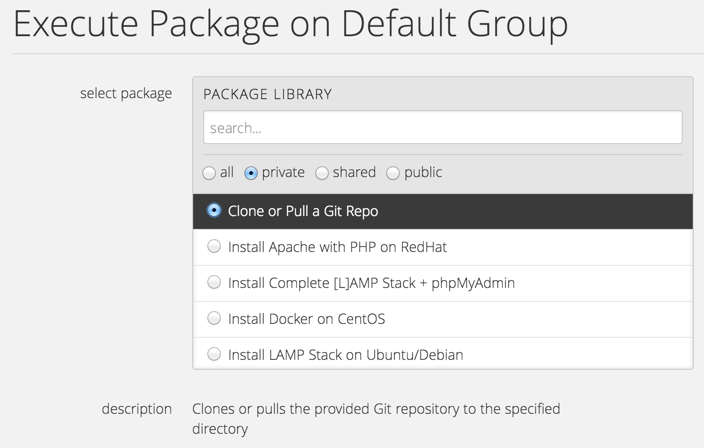
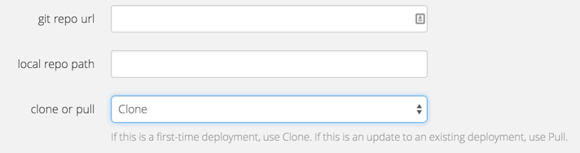
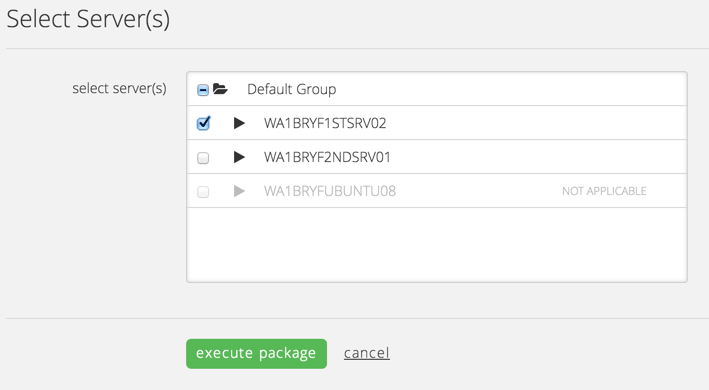

{{{
  "title": "Automated Application Deployment to Multiple Servers",
  "date": "10-8-2014",
  "author": "Bryan Friedman",
  "attachments": [
    {
      "url": "../attachments/DKH2UpNYni9uEqvvZlTl0xsun-package.zip",
      "type": "application/zip",
      "file_name": "package.zip"
    }
  ],
  "contentIsHTML": false
}}}

### Description
Most modern application architectures require the same code to be deployed to many servers. Whether you are running a load-balanced web app, a database cluster, a distributed set of batch jobs, or all of the above, you are faced with maintaining code parity across all nodes, ensuring you have the latest code at every available location. While there are a number of sophisticated deployment tools available (Octopus, Go, Packer, etc.), sometimes all that’s required is simply copying the code from a repository to a specific location on each server. On Lumen Cloud, we will see in the following example that no matter what the deployment model, Blueprint scripts can help you make this task easy, automated, and repeatable.

In this scenario, we have an app written in PHP with code maintained in a GitHub repository. This app is deployed to three web servers sitting behind a load balancer running RedHat with Apache and PHP already installed. In order to deploy updated code from the repo to all of the servers, we will create a script to pull the code from GitHub to a specified path on the server, and then use the control portal to run that script on all three servers. Although we are using a simple git script on Linux to deploy our application in this example, the pattern described below can be used to perform *any* scriptable deployment action across many servers with any OS.

### Steps
Write a shell script to clone or pull from Git repository.

1. Before creating any Blueprints or Scripts in the Control Portal, write a shell script that will run on a RedHat Linux server. It will need three command line parameters:
   ```
   # Take parameters from command line
   ACTION="$1"    # Either "clone" or "pull" depending on first time deployment or update
   GITREPO="$2"   # The URI for the repository
   APPPATH="$3"   # The path on the server to deploy to
   ```

2. Next, ensure that git package is installed on server.
   ```
   # Ensure git is installed
   yum -y install git</pre>
   ```

3. Finally, depending on the defined parameters, either “clone” or “pull” the specified repository to the specified path.
   ```
   if [ "$ACTION" = "clone" ] ; then
      git clone "$GITREPO" "$APPPATH"
   elif [ "$ACTION" = "pull" ] ; then
      cd "$APPPATH"
      git pull
   fi
   ```

### Create the script package
For details on creating script packages in general, refer to the article [Blueprints Script and Software Package Management](../Blueprints/blueprints-script-and-software-package-management.md).
1. Save the script from Step 1 as `install.sh`.

2. Now, create the package manifest XML with all the information needed to upload the script to the control portal. This file contains the name and description of the package, along with the parameters needed and the command to execute. The three parameters defined above are passed to the command as Global parameters, so they will only be requested once and applied to all servers.
   ```
   <Manifest>
   <Metadata>
      <UUID>74b6ac7b-6848-4adc-9ecf-f1fc21b26561</UUID>
      <Name>Clone or Pull a Git Repo</Name>
      <Description>
      Clones or pulls the provided Git repository to the specified directory
      </Description>
   </Metadata>
   <Parameters>
      <Parameter Name="Git Repo URL" Type="String" Variable="T3.GitRepo.URL" Prompt="Global" />
      <Parameter Name="Local Repo Path" Type="String" Variable="T3.GitRepo.LocalPath" Prompt="Global" />
      <Parameter Name="Clone or Pull" Type="Option" Variable="T3.GitRepo.CloneOrPull" Prompt="Global" Hint="If this is a first-time deployment, use Clone. If this is an update to an existing deployment, use Pull.">
        <Option Name="Clone" Value="clone" />
        <Option Name="Pull" Value="pull" />
      </Parameter>
   </Parameters>
   <Execution>
      <Mode>Ssh</Mode>
      <Command>install.sh ${T3.GitRepo.CloneOrPull} ${T3.GitRepo.URL} ${T3.GitRepo.LocalPath}</Command>
      <Persistent>false</Persistent>
   </Execution>
   </Manifest>
   ```

3. Save this file as `package.manifest`.

4. Create a ZIP file that contains the two files just created (`package.manifest` and `install.sh`) at the top level (not nested in a folder). Save this ZIP file as `package.zip`.

### Upload the script to the control portal
(For details on creating script packages in general, refer to the article [Blueprints Script and Software Package Management](../Blueprints/blueprints-script-and-software-package-management.md).
1. Login to control portal and navigate to the Scripts page.
   

2. Click **+ new script**.
   

3. Choose "Browser Upload" and then upload the <code>package.zip</code> file.
   

4. Now publish the package by clicking **publish** next to the package name in the list of unpublished packages.
   

5. Click **next** on the displayed information page and then select the desired attributes for the package. In this example, select "Scripts", "Linux" (selecting only RedHat Linux in this case) and finally "Private". Then, click **publish**.
   

6. The package is queued for publishing. Once the publish operation is complete, it is a usable script. (You can click the "Details Page" link to check the status of the publish.)
   

### Execute script on [multiple] server(s) within a group.
(Alternatively, you could create a Blueprint and use this Script as the last task of the build procedure.)
1. From the group page, select **execute package** from the actions menu.

2. Select the package you uploaded in the previous steps. It should be listed under "private" as seen here:
   

3. Now enter the values for the parameters that were defined as the prompts indicate. First, the path to your Git repository, then the path to deploy the app to on the server, and finally whether you want to clone the repository, or just pull the latest code. The first time you deploy the app, you should choose "Clone" to set it up for the first time, but every time after, select "Pull" to simply update the code with the latest release.
   

4. Finally, select the servers to execute the script on and click **execute package**.
   

5. You will then be redirected to the Queue page to see the status of the running task. When it is completed, log on to one of the servers or load the application to confirm it has been updated.
