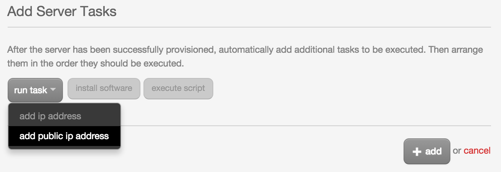
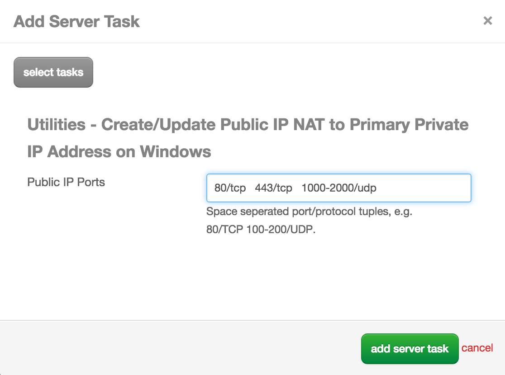

{{{
  "title": "NATing Public IP to Primary Private IP as Part of a Blueprint",
  "date": "9-2-2015",
  "author": "<a href='https://twitter.com/KeithResar'>@KeithResar</a>",
  "attachments": [],
  "contentIsHTML": false
}}}

### Challenge

When designing Blueprints using the *Blueprint Designer* there is a temping task available called **add public ip address**.

When executing this task the following happens:

* An additional private IP address will be assigned to the server
* This new private IP address will receive a public NAT
* Only specific ports can be enabled through the dialogue
* The default egress IP will continue to be an un-NATed primary private IP

### Desired Behavior

Many customers designing Blueprints desire the following behavior:

* NAT public IP address to their existing primary IP address
* Permit traffic with destined towards arbitrary ports

## Solution

This is solved by including one of the following packages in your Blueprint instead of the tempting, but likely unwanted, **add public ip address** task.

* [Create/Update Public IP NAT to Primary Private IP Address on **Linux**](https://control.ctl.io/Blueprints/Packages/Details?uuid=58c00f0e-6af6-41c1-a50f-307ec22f8b83&classification=Script&type=AccountLibrary)
* [Create/Update Public IP NAT to Primary Private IP Address on **Windows**](https://control.ctl.io/Blueprints/Packages/Details?uuid=1def33fd-4870-4e84-975e-f84f9baf641a&classification=Script&type=AccountLibrary)

Specify the ports to open as a *Design Time* parameter and use the following `port/protocol` syntax:

* Single port - 80/tcp 443/tcp 53/udp
* Port range - 1-1024/tcp

Specify multiple port/protocol tuples with space delimiters.

