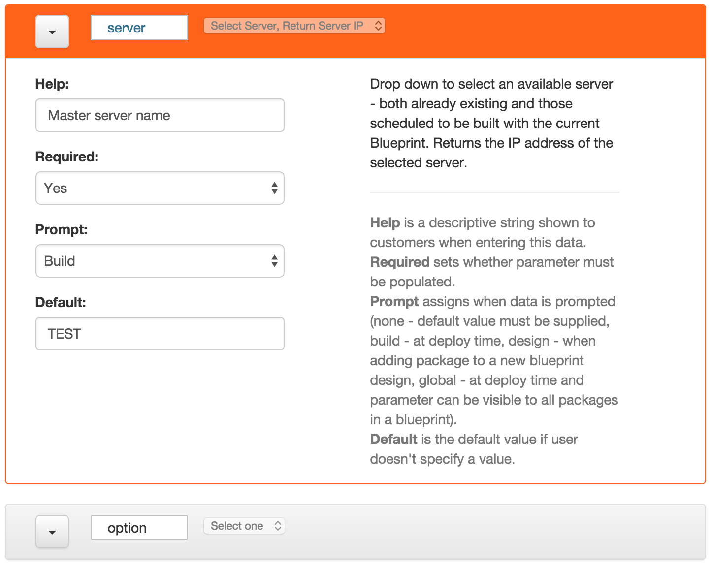

{{{
  "title": "Blueprint Package Manifest Builder Wizard",
  "date": "6-09-2015",
  "author": "<a href='https://twitter.com/KeithResar'>@KeithResar</a>",
  "attachments": [],
  "contentIsHTML": false
}}}

Take advantage of our web-based [Blueprint Package Manifest Builder Wizard](http://centurylinkcloud.github.io/blueprint-package-manifest-builder/) to:

* Discover the user and system generated data collector widgets
* Create a functional package.manifest file
* Export customized shell script templates

For a more in-depth review of how to manually create a Blueprint Package or to review package specifications reference the [Blueprints Script and Software Package Management article](blueprints-script-and-software-package-management.md).

### Wizard UI

The wizard screen is divided into four primary components.  See details on each in the Wizard Usage section of this article.

1. Package Foundational Definition.  Define package-level attributes such as names and identifiers
2. User and System Parameter widgets.  Drag and drop one or more of these into section (3) as you build your package design.
3. Zero or more parameters.  Add these by dragging widgets from the user and system parameter columns in section (2).
4. Template export functions

### Wizard Usage

Access the [Blueprint Package Manifest Builder Wizard](http://centurylinkcloud.github.io/blueprint-package-manifest-builder/) and follow these steps to successfully create your package.

1. **Package Foundational Definition**

  Inside the green panel define package level attributes.

  

  * Package name (need not be unique)
  * Description
  * Execution mode (update to match SSH or Linux or another option for Windows)

  A number of advanced options are also exposed.

  * UUID is a unique ID associated with your package.  A new one is automatically generated for you when the page loads.  Take note that if you are updating an existing package the UUID is typically re-used
  * Command is the actual executable or script associated with your package.  Any parameters selected in the next step will be appended to this command line during actual execution (e.g. if you have a String parameter defined called "email" then the command is automatically re-written to `install.sh '${email}'` when exporting the manifest).

2. **Parameter Widget Inventory**

  

  Select from a dozen different widget types to collect the information your scripts need during design and deploy time.

  To use these widgets drag them into the center column.  More detail on each widget is available after adding them into your package project.

3. **Customizing Parameters**

  

  Once a parameter is added into the package project you can expand the widget for more details on the parameter itself and to further configure its behavior. All parameters must have a name at minimum.  Expand the menu at the top-left to delete or clone an existing parameter

4. **Export package.manifest**

  

  Click the "Export package.manifest" button to save a copy of the package.manifest. This file includes all the package foundational definitions and parameter configurations.

5. **Export Bash Script Template**

  

  Click the "Export Bash Template" button to access a bash shell script template customized to use the parameters defined in your project.

6. **Export PowerShell Script Template**

  

  Click the "Export PowerShell Template" button to access a PowerShell shell script template customized to use the parameters defined in your project.
