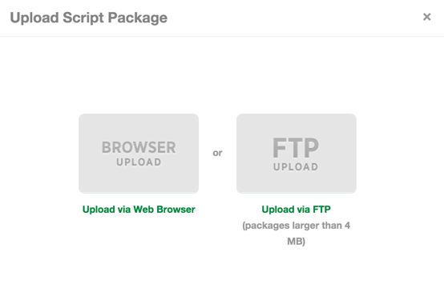

{{{
  "title": "Blueprints Script and Software Package Management",
  "date": "12-18-2014",
  "author": "Trent Anderson",
  "attachments": [],
  "contentIsHTML": true
}}}

<strong>Last updated:  2/3/2015 03:05 PST</strong>

Description

Software and script packages (henceforth referred to as "packages") are one way that Blueprint Designers can customize their environments. They can be configured to run scripts and executables or install software. The definition of a package is
  also responsible for generating the UI at Blueprint deployment time to gather the requisite set of parameters from the User.

Package Format

Packages must be .zip files and contain the following:

<table>
  <tbody>
    <tr>
      <td>
        
<strong>Name</strong>
        

      </td>
      <td>
        
<strong>Description</strong>
        

      </td>
    </tr>
    <tr>
      <td>
        
<strong>package.manifest</strong>
        

      </td>
      <td>
        
Defines the metadata, parameter list and execution guidelines for the Package.

        
An Xml Schema (.xsd) is available to validate the package.manifest file before uploading.

        
<em>This file is required in all Packages.</em>
        

      </td>
    </tr>
    <tr>
      <td>
        
<strong>[executable]</strong>
        

      </td>
      <td>
        
At least one executable file must be included in the Package. CenturyLink Cloud supports the following executable types:

        
-        Standard .exe

        
-        Command line scripts (anything that can be run from cmd.exe for Windows or the shell on Linux)

        
-        PowerShell scripts (.ps1 files)

        
<em>* Note: The permissions of this file for Linux scripts must be set to be executable (chmod 755). In order to best achieve this, the file must be created and zipped on a Linux or Unix-based platform.</em>
        

      </td>
    </tr>
    <tr>
      <td>
        
<strong>[resources]</strong>
        

      </td>
      <td>
        
Any additional files that the main executable may require for proper execution.

        
The executable is run from the Package root folder, so any file/folders should be accessed relative to the root.

      </td>
    </tr>
  </tbody>
</table>

<em>Note: The zip file should be created on a comparable environment to the one in which the script will be running. In other words, for a script that will run on Linux, it should be created on a Unix-based platform, and for a Windows script, it should be created on a Windows machine.</em>

This rest of this document will explain how to construct the package.manifest file and explain what information is available to the package at execution time.

&lt;Manifest&gt; Element

The root node for the package manifest.

<pre>&lt;Manifest&gt;   &lt;Metadata&gt;   &lt;Parameters&gt;   &lt;Execution&gt; &lt;/Manifest&gt;</pre>
<h3>Parent Element</h3>

None.

<h3>Attributes</h3>

None.

<h3>Child Elements</h3>
<table>
  <tbody>
    <tr>
      <td>
        
<strong>Name</strong>
        

      </td>
      <td>
        
<strong>Description</strong>
        

      </td>
    </tr>
    <tr>
      <td>
        
<strong>Metadata</strong>
        

      </td>
      <td>
        
Provides descriptive information regarding the package, its contents and capabilities.

      </td>
    </tr>
    <tr>
      <td>
        
<strong>Parameters</strong>
        

      </td>
      <td>
        
Defines parameters that are used during execution of the package.

      </td>
    </tr>
    <tr>
      <td>
        
<strong>Execution</strong>
        

      </td>
      <td>
        
Defines how the package it to be executed

      </td>
    </tr>
  </tbody>
</table>
&lt;Metadata&gt; Element

Provides descriptive information to uniquely identify the package, its contents and capabilities.

<pre>&lt;Metadata&gt;   &lt;UUID&gt;   &lt;Parameters&gt;   &lt;Name&gt;   &lt;Description&gt; &lt;/Manifest&gt;</pre>
<h3>Parent Element</h3>

&lt;Manifest&gt;

<h3>Attributes</h3>

None.

<h3>Child Elements</h3>
<table>
  <tbody>
    <tr>
      <td>
        
<strong>Name</strong>
        

      </td>
      <td>
        
<strong>Description</strong>
        

      </td>
    </tr>
    <tr>
      <td>
        
<strong>UUID</strong>
        

      </td>
      <td>
        
A GUID that uniquely identifies the Package.
           This value is used internally by the Blueprint deployment process as well as to identify a Package when updates are submitted.

        
<em>This value should not be changed for minor updates (i.e. updated script logic).</em>
        

        
<em>This value should be changed for major update (i.e. updated parameter list).</em>
        

      </td>
    </tr>
    <tr>
      <td>
        
<strong>Name</strong>
        

      </td>
      <td>
        
The name of the Package.

        
<em>Max length: 100 characters</em>
        

      </td>
    </tr>
    <tr>
      <td>
        
<strong>Description</strong>
        

      </td>
      <td>
        
A detailed description of the Package.

        
This value is used to display information to designers who choose to add this Package to their Blueprint.

      </td>
    </tr>
  </tbody>
</table>
&lt;Parameters&gt; Element

Defines the list of parameters required to execute the Package.

<pre>&lt;Parameters&gt;   &lt;Parameter&gt; &lt;/Parameters&gt;</pre>
<h3>Parent Element</h3>

&lt;Manifest&gt;

<h3>Attributes</h3>

None.

<h3>Child Elements</h3>
<table>
  <tbody>
    <tr>
      <td>
        
<strong>Name</strong>
        

      </td>
      <td>
        
<strong>Description</strong>
        

      </td>
    </tr>
    <tr>
      <td>
        
<strong>Parameter</strong>
        

      </td>
      <td>
        
See &lt;Parameter&gt; Element.

      </td>
    </tr>
  </tbody>
</table>
<h3>&lt;Parameter&gt; Element</h3>

Defines how a Parameter will be presented in the UI.

<pre>&lt;Parameter Name= Type= Variable= Hint= Prompt= Global= Regex= &gt;   &lt;Option&gt; &lt;/Parameter&gt;</pre>
<h4>Parent Element</h4>

&lt;Parameters&gt;

<h4>Attributes</h4>
<table>
  <tbody>
    <tr>
      <td>
        
<strong>Name</strong>
        

      </td>
      <td>
        
<strong>Description</strong>
        

      </td>
      <td>
        
<strong>Required?</strong>
        

      </td>
    </tr>
    <tr>
      <td>
        
<strong>Name</strong>
        

      </td>
      <td>
        
Display name for the Parameter.

        
<em>Ignored if Prompt = ‘none’.</em>
        

      </td>
      <td>
        
Yes

      </td>
    </tr>
    <tr>
      <td>
        
<strong>Type</strong>
        

      </td>
      <td>
        
The Parameter type.

        
<em>See below</em><em> for values</em>
        

      </td>
      <td>
        
Yes

      </td>
    </tr>
    <tr>
      <td>
        
<strong>Variable</strong>
        

      </td>
      <td>
        
This is a variable name which you can refer to in the execution command for your package. Our recommendation is that you name your variables to include your CenturyLink Cloud account alias and your Package Name (e.g. T3.install-ad.DomainName) to ensure
          that you don’t encounter any name conflicts with other scripts you’ve included in a Blueprint.

      </td>
      <td>
        
Yes

      </td>
    </tr>
    <tr>
      <td>
        
<strong>Hint</strong>
        

      </td>
      <td>
        
Additional description to communicate the meaning/use of the Parameter. If specified this will be displayed below the input field on the Blueprint deployment form.

        
<em>Ignored if Prompt = ‘none’</em>
        

      </td>
      <td>
        
No

      </td>
    </tr>
    <tr>
      <td>
        
<strong>Default</strong>
        

      </td>
      <td>
        
Sets the default parameter value. If you specify a default it cannot be empty.

      </td>
      <td>
        
No

      </td>
    </tr>
    <tr>
      <td>
        
<strong>Prompt</strong>
        

      </td>
      <td>
        <ul>
          <li>None: Parameter will have no representation in the UI</li>
          <li>Build: Parameter will be prompted for when a Blueprint is being built</li>
          <li>Design: Parameter will be prompted for when Blueprint is being designed/deployed</li>
          <li>Global: Parameter will be prompted only once when it exists in multiple packages</li>
        </ul>
        
<em>Default = ‘None’</em>
        

      </td>
      <td>
        
No

      </td>
    </tr>
    <tr>
      <td>
        
<strong>Global</strong>
        

      </td>
      <td>
        
True to indicate that is Parameter is defined in multiple Packages but should only be prompted for once at Blueprint Deployment.

        
<em>Default = ‘false’ All reference to this Parameter in all Packages will have the same value.</em>
        

      </td>
      <td>
        
No

      </td>
    </tr>
    <tr>
      <td>
        
<strong>Regex</strong>
        

      </td>
      <td>
        
A Regular Expression to validate user input for a String Parameter.

        
<em>Ignored if Type != ‘String’</em>
        

      </td>
      <td>
        
No

      </td>
    </tr>
    <tr>
      <td>
        
<strong>Required</strong>
        

      </td>
      <td>
        
A Boolean value indicating if this parameter requires a value or not.

        
<em>Default = 'true'</em>
        

      </td>
      <td>
        
No

      </td>
    </tr>
  </tbody>
</table>
<h4>Parameter Type</h4>
<table>
  <tbody>
    <tr>
      <td>
        
<strong>Type</strong>
        

      </td>
      <td>
        
<strong>Description</strong>
        

      </td>
      <td>
        
UI Element

      </td>
    </tr>
    <tr>
      <td>
        
<strong>Network</strong>
        

      </td>
      <td>
        
The CenturyLink Cloud internal network name.

        
The list contains all networks that belong to the account, and the user is required to select one.

        
<em>It is unlikely that a Package would ever need this piece of information.</em>
        

      </td>
      <td>
        
Drop Down List

      </td>
    </tr>
    <tr>
      <td>
        
<strong>Numeric</strong>
        

      </td>
      <td>
        
A numeric value.

        
The text is validated to ensure only numeric values are accepted.

      </td>
      <td>
        
Textbox

      </td>
    </tr>
    <tr>
      <td>
        
<strong>Option</strong>
        

      </td>
      <td>
        
A list of values where one item must be selected.

        
<em>1 or more </em><em>Option</em><em> elements must be defined.</em>
        

      </td>
      <td>
        
Drop Down List

      </td>
    </tr>
    <tr>
      <td>
        
<strong>MultiSelect</strong>
        

      </td>
      <td>
        
A list of values where any number of items may be selected.

        
<em>1 or more </em><em>Option</em><em> elements must be defined.</em>
        

      </td>
      <td>
        
Checkbox List

      </td>
    </tr>
    <tr>
      <td>
        
<strong>Password</strong>
        

      </td>
      <td>
        
A masked string value.

        
<em>Strong password validation will be enforced.</em>
        

      </td>
      <td>
        
Password box

      </td>
    </tr>
    <tr>
      <td>
        
<strong>Server</strong>
        

      </td>
      <td>
        
A list of server names.

        
The list will include all existing servers as well as any servers that will be built as part of the Blueprint.

      </td>
      <td>
        
Drop Down List

      </td>
    </tr>
    <tr>
      <td>
        
<strong>ServerIP</strong>
        

      </td>
      <td>
        
A list of server name where the selected value is IP Address.

        
The list will include all existing servers, all servers that will be deployed as part of the Blueprint as well as an option to manually enter an IP Address.

      </td>
      <td>
        
Drop Down List

      </td>
    </tr>
    <tr>
      <td>
        
<strong>String</strong>
        

      </td>
      <td>
        
A generic string.

        
<em>If Regex is supplied, the value will be validated using the specified regular expression</em>
        

      </td>
      <td>
        
Textbox

      </td>
    </tr>
  </tbody>
</table>
<h4>System Parameters</h4>

Named Parameters defined by CenturyLink Cloud that can be accessed from within the Package.
   <em>To use a System Parameter it must be defined in the Parameter list with Prompt=’none’</em>

<table>
  <tbody>
    <tr>
      <td>
        
Name

      </td>
      <td>
        
<strong>Description</strong>
        

      </td>
    </tr>
    <tr>
      <td>
        
<strong>T3.Identity.User</strong>
        

      </td>
      <td>
        
The username of the individual initiating the Blueprint deployment.

      </td>
    </tr>
    <tr>
      <td>
        
<strong>T3.Server.Name</strong>
        

      </td>
      <td>
        
The name of the current server being built.

      </td>
    </tr>
    <tr>
      <td>
        
<strong>T3.Server.IPAddress</strong>
        

      </td>
      <td>
        
The IP Address of the current server being built.

      </td>
    </tr>
    <tr>
      <td>
        
<strong>T3.Server.Password</strong>
        

      </td>
      <td>
        
The local Administrator password of the current server being built.

      </td>
    </tr>
    <tr>
      <td>
        
<strong>T3.Identity.Account</strong>
        

      </td>
      <td>
        
The account alias that this Blueprint is being deployed under.

      </td>
    </tr>
    <tr>
        <td valign="top" width="174">
        
<strong>T3.Datacenter</strong>

        </td>
        <td valign="top" width="624">
        
The data center that the Blueprint is being deployed in.

        </td>
    </tr>
  </tbody>
</table>
<h3>&lt;Option&gt; Element</h3>

Defines the options for Option and MultiSelect Parameters

<pre>&lt;Option Name= Value= /&gt;</pre>
<h4>Parent Element</h4>

&lt;Parameter&gt;

<h4>Attributes</h4>
<table>
  <tbody>
    <tr>
      <td>
        
<strong>Name</strong>
        

      </td>
      <td>
        
<strong>Description</strong>
        

      </td>
    </tr>
    <tr>
      <td>
        
<strong>Name</strong>
        

      </td>
      <td>
        
The name of the option.

        
This value is used to label the option in the UI

      </td>
    </tr>
    <tr>
      <td>
        
<strong>Value</strong>
        

      </td>
      <td>
        
The value of the option.

      </td>
    </tr>
  </tbody>
</table>

&lt;Execution&gt; Element

Defines how the Package should be executed.

<pre>&lt;Metadata&gt;   &lt;Mode&gt;   &lt;Command&gt; &lt;/Manifest&gt;</pre>
<h3>Parent Element</h3>

&lt;Manifest&gt;

<h3>Attributes</h3>

None.

<h3>Child Elements</h3>
<table>
  <tbody>
    <tr>
      <td>
        
<strong>Name</strong>
        

      </td>
      <td>
        
<strong>Description</strong>
        

      </td>
    </tr>
    <tr>
      <td>
        
<strong>Mode</strong>
        

      </td>
      <td>
        <table>
          <tbody>
            <tr>
              <td>
                
<strong>Name</strong>
                

              </td>
              <td>
                
<strong>Details</strong>
                

              </td>
            </tr>
            <tr>
              <td>
                
<strong>Command</strong>
                

              </td>
              <td>
                
Windows Only

                
Executes the package as the local administrator by calling the command specified from a command prompt.

              </td>
            </tr>
            <tr>
              <td>
                
<strong>PowerShell</strong>
                

              </td>
              <td>
                
Windows Only

                
Executes the package via Remote PowerShell as the local administrator.

                
<em>Note: ‘Negotiate’ Authentication mode is used when establishing the remote connection.</em>
                

              </td>
            </tr>
            <tr>
              <td>
                
<strong>Ssh</strong>
                

              </td>
              <td>
                
Supported on Linux

              </td>
            </tr>
          </tbody>
        </table>
        
<em>Package is copied to remote server and executed from the root of the Package directory.</em>
        

      </td>
    </tr>
    <tr>
      <td>
        
<strong>Command</strong>
        

      </td>
      <td>
        
The command to be executed.

        
You can specify Parameters to be passed to the Package using the following format:

        
${Parameter.Variable}

        
All Parameters specified in the Parameter list will be replaced with the appropriate values at runtime.

        
<em>Command must be relative to the root of the Package directory.  </em>
        

        
Example:

        
/dir/my.cmd ${My.Custom.Value}

        
Executes the my.cmd file located in a sub folder called ‘dir’,  replacing ${My.Custom.Value} with its runtime value.

      </td>
    </tr>
    <tr>
      <td>
        
<strong>RebootOnSuccess</strong>
        

      </td>
      <td>
        
(Boolean) - Valid values are: ‘true’ or ‘false’

        
true – Specify ‘true’ to reboot the server once the package has executed.

        
false – (default) The server will not reboot.

      </td>
    </tr>
    <tr>
      <td>
        
<strong>Persistent</strong>
        

      </td>
      <td>
        
(Boolean) - Valid values are: ‘true’ or ‘false’

        
true – Specify ‘true’ to persist the package on the server.

        
false – (default) The package will not be persisted after execution.

      </td>
    </tr>
  </tbody>
</table>

  

Uploading and Publishing a Package

Once the package.manifest has been created, validated, and zipped with the all other required files, the following steps should be followed to get the package uploaded and published to the Control Portal.

<ol>
  <li>Login to control portal and navigate to the Scripts page.
     
  </li>
  <li>Click on the "+ new script" button.
     
  </li>
  <li>You will be presented with two options for uploading the package: Browser or FTP. For packages less than 4MB, you can easily upload directly through your web browser by choosing "Browser Upload". For packages larger than 4MB, they <em>must</em> be
    uploaded using the "FTP Upload" option, but this option is available for smaller packages as well. Selecting the "FTP Upload" option will create an FTP account and path and display the credentials and URL to use for uploading. (Note that you
    may <a href="../Control Portal/ftp-users-in-control-portal.md">create your own FTP users </a>for this purpose. Packages must be placed in the root folder as indicated by the display. Once uploaded, Package zip files
    will appear in the Unpublished list.)
     
  </li>
  <li>If you chose "Browser Upload" you will see a prompt allowing you to browse for the file. Select the zip file that contains the package.manifest and supporting files and then click "upload script package" to upload it to the server. (If you chose
    the "FTP Upload" option, after uploading the package to the folder using an FTP client, click on the "Unpublished" tab and move on to step 5.)
     
  </li>
  <li>Now publish the package by clicking the "publish" button next to the package name in the list of unpublished packages.
     
  </li>
  <li>The publication process will then load and perform basic validation of the package. If successful, you will be presented with a form showing the contents of your Manifest as well as a sample UI form with the parameters that will be prompted for at deployment
    time. If everything looks right, click the "next" button to move on.</li>
  <li>You will be presented with a page where you can specify additional metadata for the package. First, choose to publish the package as a "Script" or "Software". (There is no functional difference here, just categorization.) Then choose the desired Operating
    System flavor (Linux or Windows) followed by checking the box next to the specific versions of the OS that the package supports (i.e. Windows 2003 or 2008, Ubuntu vs. Redhat, etc.). The last step is to select the visibility of the package. Private
    packages are only visible to users in the account where it was created, Shared packages are visible to users in the account where it was created and all sub-accounts underneath, and Public packages are available to all accounts. (Please review
    <a
    href="../Blueprints/creating-public-blueprint-packages.md">Creating Public Blueprint Packages </a>before publishing a public package.) Finally, click the "Publish" button to kick off the publishing process.
       
  </li>
  <li>The package is then queued for asynchronous publishing and the deploy time will depend upon the size of the package. Once the publish operation is complete, it will appear in the package library. (You can click the "Details Page" link to check the status
    of the publish.)
     
     
  </li>
</ol>
