{{{
  "title": "Creating Blueprints with Privacy Setting of Private Shared",
  "date": "10-14-2014",
  "author": "Richard Seroter",
  "attachments": [
    {
      "file_name": "Attached File",
      "url": "../attachments/Balancing Agility Cost and Control.pdf",
      "type": "application/pdf"
    }
  ],
  "related_products": [
    {
      "title": "Hyperscale Server",
      "description": "Lightning-quick servers in the public cloud with 100% flash storage. Breakthrough performance for data and web scale architectures.",
      "link": "/hyperscale"
    },
    {
      "title": "Private Cloud",
      "description": "Our stack, isolated and dedicated to you. Deploy in over 55 CenturyLink locations around the world.",
      "link": "/private-cloud"
    }
  ],
  "contentIsHTML": true
}}}

<strong>Description:</strong>

Blueprints created in the CenturyLink Cloud Platform can have one of three possible privacy settings: <strong>public</strong>, <strong>private</strong>, and <strong>private shared</strong>. <strong>Public</strong> blueprints are visible to any customer using
  the CenturyLink Cloud Control Portal and are most widely used for general purpose environments (e.g. “Single Exchange Server”, “Primary Domain Controller”) that use default server templates. <strong>Private</strong> blueprints are only available for viewing or
  deployment by users within a given account. It makes sense to use this setting when building blueprints that have unique server templates or configurations that are specific to an organization or business unit. <strong>Private shared</strong> blueprints
  are those which are visible to users within a given account as well as any users in sub-accounts. Use this setting when creating blueprints that should be private to a specific organization (i.e. parent account) but are relevant to the sub-account holders
  who may represent business units or customers.

<strong>Steps:</strong>

<strong>1. Ensure That Primary Account Has Sub-Accounts</strong>

<ul>
  <li>View account details for the parent account and select the “Sub Accounts” option.
     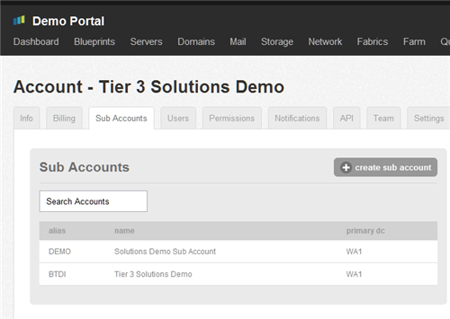
  </li>
  <li>In the image above, clicking the name of the topmost account (which is the sub account) displays the sub account details, including a reference to the parent account.
     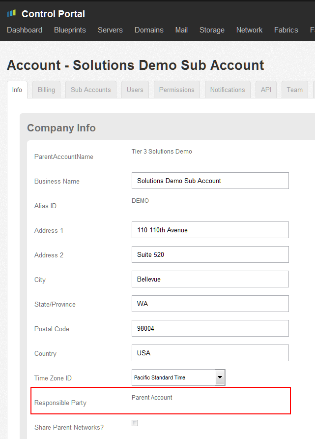
  </li>
</ul>

<strong>2. Create Private Blueprint from Parent Account</strong>

<ul>
  <li>Find the “Create Blueprint” link on the Control Portal navigation menu.
     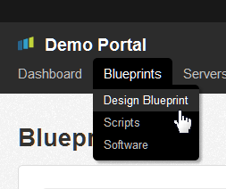
  </li>
  <li>Create a new blueprint with the Privacy Setting set to <strong>Private</strong>.
     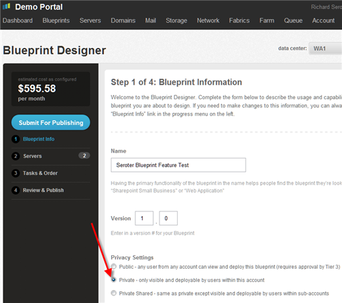
  </li>
  <li>Finish building the blueprint (see KB article <a href="../Blueprints/how-to-build-a-blueprint.md">How to build a Blueprint</a> for full details on completing a blueprint) and submit it for publishing.</li>
  <li>While staying within the parent account, navigate to the “All Blueprints” page by clicking the "Blueprints” item in the navigation menu.
     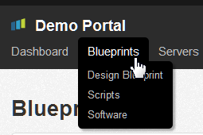
  </li>
  <li>Search for and locate the just-created blueprint. In the screenshot below, note that the blueprint was successfully found by searching for a partial name.
     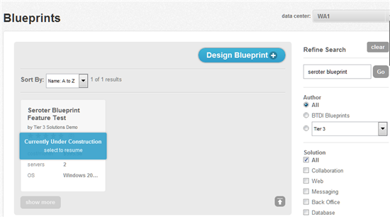
  </li>
</ul>

<strong>3. Attempt to Locate this Blueprint From a Sub Account</strong>

<ul>
  <li>Log into the Control Portal using the credentials of a user in a sub account of the parent that created the blueprint.
     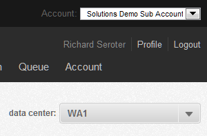
  </li>
  <li>Search for the blueprint created by the parent account. In the screenshot below, note that the blueprint was not found by searching for a partial name or searching the master list.
     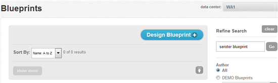
  </li>
  <li>The blueprint was not found because the Privacy Setting of “Private” prevented the blueprint from being visible to any other account, including sub accounts.</li>
</ul>

<strong>4. Switch Blueprint’s Privacy Setting to Private Shared</strong>

<ul>
  <li>Log into the Control Portal as a user in the parent account.</li>
  <li>Locate the recently created blueprint and select it for editing.
     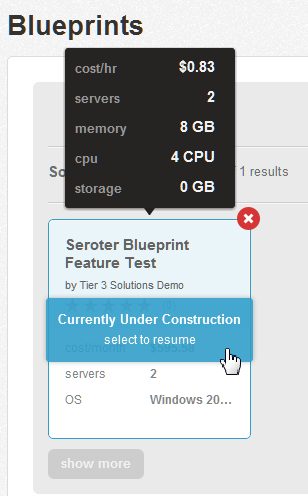
  </li>
  <li>On the first page of the Blueprint Designer, switch the Privacy Setting to <strong>Private Shared</strong>.
     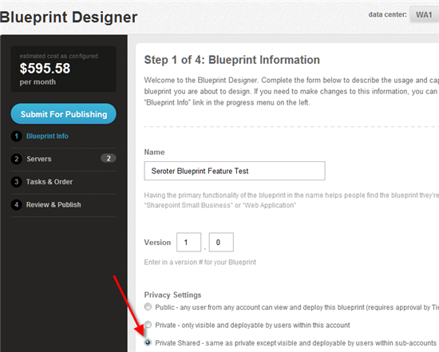
  </li>
  <li>Save the blueprint by completing the Blueprint Designer wizard and republishing it. After publication, locate the blueprint and confirm that it has shared visibility.
     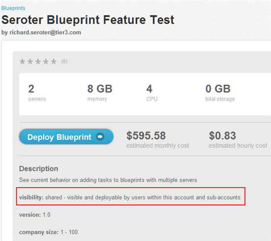
  </li>
</ul>

<strong>5. Access Private Shared Blueprint from Sub Account</strong>

<ul>
  <li>Log into Control Portal using a user that is part of the sub account.
     
  </li>
  <li>Search for the blueprint created by the parent account. In the screenshot below, note that the blueprint was successfully found by searching for a partial name.
     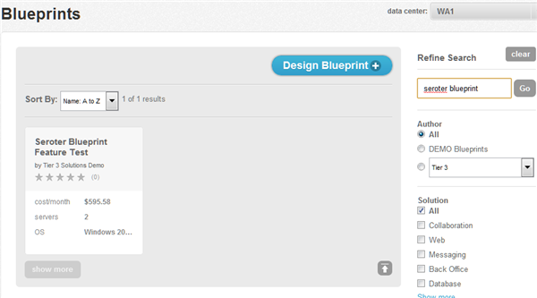
  </li>
  <li>This user in the sub account is now able to deploy this blueprint as they wish.</li>
</ul>
