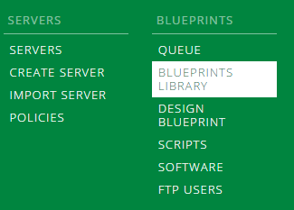
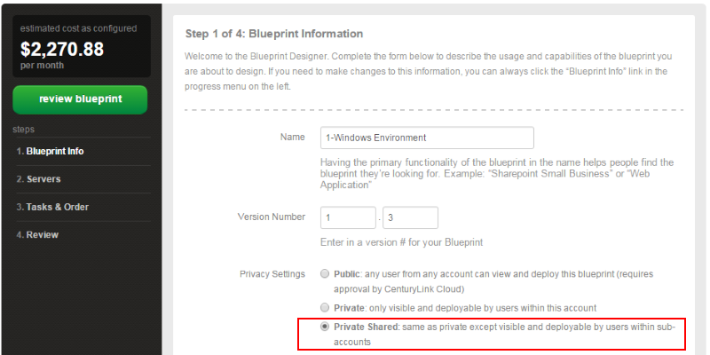
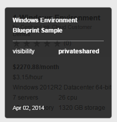
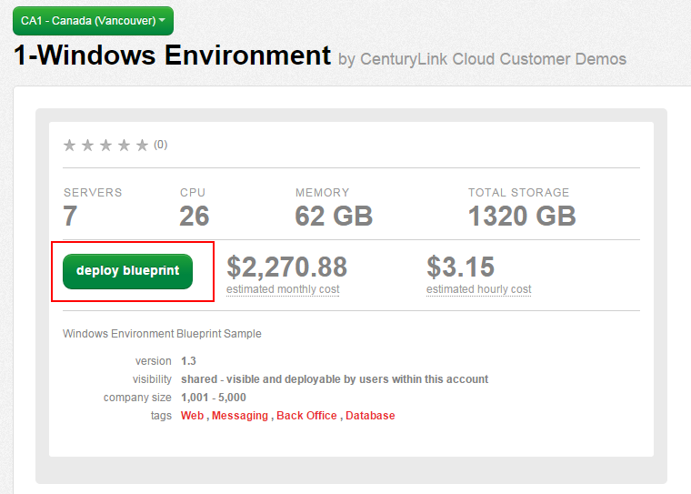

{{{
  "title": "Creating Blueprints with Privacy Setting of Private Shared",
  "date": "11-10-2015",
  "author": "Chris Little",
  "attachments": [],
  "contentIsHTML": false
}}}

### Overview
Blueprints created in the CenturyLink Cloud Platform can have one of three possible privacy settings:
* **Public:** Public blueprints are visible to any customer using the CenturyLink Cloud Control Portal and are most widely used for general purpose environments (e.g. “Single Exchange Server”, “Primary Domain Controller”) that use default server templates.
* **Private:** Private blueprints are only available for viewing or deployment by users within a given account. It makes sense to use this setting when building blueprints that have unique server templates or configurations that are specific to an organization or business unit.
* **Private Shared:** Private Shared blueprints are those which are visible to users within a given account as well as any users in sub-accounts. Use this setting when creating blueprints that should be private to a specific organization (i.e. parent account) but are relevant to the sub-account holders who may represent business units or customers

### Prerequisites

* A CenturyLink Cloud Account
* [Sub Account](../Accounts & Users/creating-a-sub-account.md)

### Steps

For an overall guide to creating blueprints refer to our [guide.](../Blueprints/how-to-build-a-blueprint.md)

1. Login to your Control Portal parent account.

2. Navigate to Blueprints, Blueprints Library.

    

3. Select Create New Blueprint and in the **blueprint information** dialog box select **Private Shared** in the Privacy section.

    

4. Complete [your blueprint configuration](../Blueprints/how-to-build-a-blueprint.md) and publish it.

    

### Verify Blueprint Privacy settings

1. Login (or switch context) to your Sub Account.

2. Navigate to Blueprints, Blueprints Library.

    

3. Confirm the previously created blueprint is available to deploy in the sub account.

    
