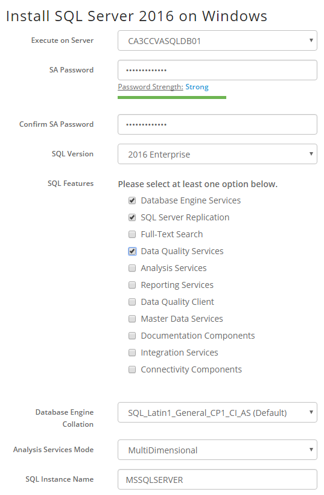

{{{
  "title": "Deploy Microsoft SQL Server using Blueprint",
  "date": "4-29-2015",
  "author": "Chris Little",
  "attachments": [],
  "contentIsHTML": false
}}}

### Overview

CenturyLink Cloud customers can procure and deploy Microsoft SQL Server licensing within the Control Portal. Microsoft SQL Server is licensed via the Microsoft SPLA program. By using the CenturyLink Cloud public blueprint customers have multiple ways to consume and install this business critical database software.

### Prerequisites

* A CenturyLink Cloud Account
* Supported Guest Operating Systems are deployed and in a running state:
    * Windows 2008 R2 Standard 64-bit
    * Windows 2008 R2 Enterprise 64-bit
    * Windows 2008 R2 Datacenter 64-bit
    * Windows 2012 Datacenter 64-bit
    * Windows 2012 R2 Data Center 64-bit
* ~15 GB Free Storage on C:\
* The Supported SQL Server Editions via blueprint are as follows:
    * SQL Server 2008 R2 Web Edition
    * SQL Server 2008 R2 Standard Edition
    * SQL Server 2008 R2 Enterprise Edition
    * SQL Server 2012 Web Edition
    * SQL Server 2012 Standard Edition
    * SQL Server 2012 Enterprise Edition
    * SQL Server 2014 Web Edition
    * SQL Server 2014 Standard Edition
    * SQL Server 2014 Enterprise Edition
* Validate the Hardware and Software Requirements for Installing SQL Server are met:
    * [SQL Server 2008 R2](//msdn.microsoft.com/en-us/library/ms143506%28v=sql.105%29.aspx)
    * [SQL Server 2012](//msdn.microsoft.com/en-us/library/ms143506%28v=sql.110%29.aspx)
    * [SQL Server 2014](//msdn.microsoft.com/en-us/library/ms143506%28v=sql.120%29.aspx)

### Exceptions

This KB does not apply to [Managed Microsoft SQL Customers.](//www.ctl.io/managed-services/ms-sql)

### General Notes

The following are quick tips/notes based on past experiences with customers leveraging this blueprint

* It is not possible at the current time to install SQL to a drive other than C:\ via blueprint. Customers can modify the SQL database, tempdb, log locations post install to other volumes using SQL tools
* The fee's for Microsoft SQL server will be applied automatically to the customers invoice when using the public blueprint. These fee's are available in the [Pricing Catalog](//www.ctl.io/pricing). If you are unsure what these fee's are please contact your account manager.
* Licensing fee's are adjusted based on number of vCPU allocated to a virtual machine. By using tools like Autoscale, customers billing will be modified as vCPU configurations change.
* Customers can **add features** to an existing SQL instance or **add new** SQL instances by running the blueprint multiple times on the same server.

### Installing Microsoft SQL Server using Group Tasks

1. Navigate to the Servers Menu in Control.

    

2. Browse to the Group that houses the VM(s) you want to deploy SQL. Select Action, Execute Package.

    

3. Search for **SQL** and select the **Install SQL Server on Windows** blueprint.

    

4. Select SQL Installation Options.

    Input the appropriate parameters based on the SQL server requirements for your application.

    Select the VM(s) in the Group you want to deploy SQL. Customers can choose an individual VM or multiple. (Quick Tip: Only supported Guest Operating Systems will be shown)

    

### Installing Microsoft SQL Server using Blueprints Library

1. Navigate to the Blueprint Library in Control.

    

2. Search for **SQL** and select **Install SQL Server on Existing Server.**

    

3. Select Deploy blueprint.

    

4. Input the appropriate parameters based on the SQL server requirements for your application and select the Virtual Machine you wish to execute the install against.

    

5. Confirm the virtual machine(s), features and select Deploy Blueprint.

    
