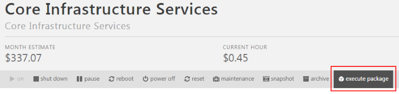

{{{
  "title": "Deploy Microsoft Windows 2012 Active Directory Domain Services",
  "date": "3-23-2017",
  "author": "Chris Little",
  "attachments": [],
  "contentIsHTML": false
}}}

### Deploy Microsoft Windows 2012 Active Directory Domain Services using CenturyLink Cloud Blueprint
CenturyLink Cloud customers can deploy Microsoft Windows 2012 Active Directory Domain Servers using the Execute Packages functions or Blueprints within the Control Portal. Public Packages are available for both the primary and secondary domain controllers.

### Prerequisites
* A CenturyLink Cloud Account
* Supported Guest Operating Systems
  * Windows 2012 Datacenter 64-bit
  * Windows 2012 R2 Datacenter 64-bit

### Exceptions
This article does not apply to [Managed Active Directory Customers](../Managed Services/getting-started-with-managed-active-directory.md).

#### General Notes
The following are general notes based for customers leveraging this Blueprint:
* These scripts deploy a greenfield domain in a new forest.  
* Customers should follow Microsoft Active Directory Domain Services best practices post deployment in configuration of the new Domain.
* The Virtual Servers will reboot during the process.

### Deploying Windows 2012 Active Directory Domain Services using Group Tasks
Customers who wish to layer Windows 2012 Active Directory Domain Services onto existing Virtual Machines can use the steps below to automate this process. When deploying a greenfield environment with new virtual servers it is recommended customers use the Blueprint model described later in this KB article titled "Deploying Windows 2012 Active Directory Domain Services using Blueprints."

1. Navigate to the Servers Menu in Control.

   

2. Browse to the Group that houses the VM(s) you want to deploy Active Directory Domain Services.  Select Execute Package.
   
3. Search for 'active directory', select the Install Active Directory on Windows 2012 (1 of 2) [Primary Node] Blueprint and finally choose the virtual server you wish to be the primary domain controller. We must deploy the primary domain controller initially prior to creating a secondary. Input the Domain Name (FQDN) and safe mode administrator password for the new domain.
   
4. Use the Queue to validate the package executes properly and completes.
   
5. Connect to the Primary Domain Controller and validate Active Directory Domain Services were successful.
   
6. With the Primary Domain Controller deployed, leverage the execute package (Steps 1-3) feature to deploy the Install Active Directory on Windows 2012 (2 of 2) [Secondary Node] Blueprint on the virtual server you wish to be the secondary domain controller. Input following details:
   * Primary DNS IP Address: The Private IP address of the Primary Domain Controller
   * Domain Name:  FQDN of the Domain you wish to create a Secondary Domain Controller
   * User:  Domain Administrator Name, Typically 'Administrator'
   * User Domain:  FQDN in which the Domain Administrator Account resides, Typically the same domain but if there are trusts or other services in place this may be different.  
   * User Password:  Password for the Domain Administrator Account
   * Safe (Mode) Admin Password: Safe Mode Password of the Domain
   
7. Use the Queue to check status of the script execution and once complete validate the secondary domain controller is functional.
   

### Deploying Windows 2012 Active Directory Domain Services using Blueprints
Customers who are building greenfield environments in the CenturyLink Cloud may wish to use Blueprints to deploy Single or Dual Domain Controllers and Active Directory Domain Services in an automated fashion. Blueprint provide a tool for customers to build environments for multiple deployments.  

To Deploy Windows 2012 Active Directory Domain Services using this approach follow the [How to Build a Blueprint](how-to-build-a-blueprint.md) Knowledge Base article and use the public script packages Install Active Directory on Windows 2012 (1 of 2) [Primary Node] & Install Active Directory on Windows 2012 (2 of 2) [Secondary Node] in conjunction with Windows 2012 Virtual Machine builds.

