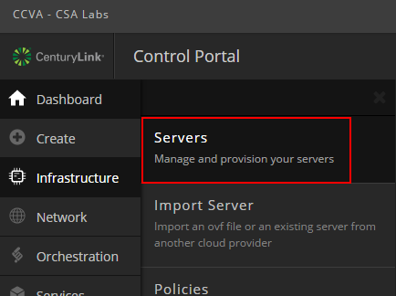

{{{
  "title": "Evaluate Microsoft SQL Server using Blueprints",
  "date": "8-17-2016",
  "author": "Chris Little",
  "attachments": [],
  "contentIsHTML": false
}}}

### Table of Contents

* [Overview](#overview)
* [Use Cases](#use-cases)
* [Prerequisites](#prerequisites)
* [Exceptions](#exceptions)
* [General Notes](#general-notes)
* [Installing Microsoft SQL Server Evaluation using Execute Package](#installing-microsoft-sql-server-evaluation-using-execute-package)
* [Installing Microsoft SQL Server Evaluation using Blueprint Library](#installing-microsoft-sql-server-evaluation-using-blueprint-library)

### Overview
Lumen Cloud customers can deploy evaluation Microsoft SQL Server software within the Control Portal. By using the Lumen Cloud public Blueprint customers have multiple ways to install this business critical database software.

### Use Cases
* Potential customers who wish to leverage our [Free Trial](//www.ctl.io/free-trial) program to test drive Lumen Cloud and avoid using up credits with paid production Microsoft SQL Licenses.
* Potential customers who wish to leverage our [Velocity Program](//www.ctl.io/velocity-migration/) for migrations or defined proof of concepts and avoid using up credits with paid production Microsoft SQL Licenses.
* Any current customer who wishes to evaluate Microsoft SQL Server for various business proof of concepts on public cloud.

### Prerequisites
* A Lumen Cloud Account
* ~20 GB Free Storage on C:\
* Operating System and SQL Server Edition aligns in a supported fashion:

SQL Server Edition|Supported Operating Systems
------------------|---------------------------
SQL Server 2014 Evaluation 64-bit (Enterprise Edition)|Windows 2012 Datacenter 64-bit Windows 2012 R2 Datacenter 64-bit
SQL Server 2016 Evaluation 64-bit (Enterprise Edition)|Windows 2012 Datacenter 64-bit Windows 2012 R2 Datacenter 64-bit Windows 2016 Datacenter 64-bit

* Validate the Hardware and Software Requirements for Installing SQL Server are met:
    * [SQL Server 2014](//msdn.microsoft.com/en-us/library/ms143506%28v=sql.120%29.aspx)
    * [SQL Server 2016](//msdn.microsoft.com/en-us/library/ms143506%28v=sql.130%29.aspx)

### Exceptions
* This KB does not apply to [Managed Microsoft SQL Customers.](//www.ctl.io/managed-services/ms-sql).

### General Notes
The following are quick tips/notes based on past experiences with customers leveraging this Blueprint.

* Customers who wish to move to a production/paid license must [deploy a new virtual machine and SQL instance](../Blueprints/deploy-microsoft-sql-server-using-blueprint.md) with the version desired and migrate their data.
* The Blueprint deploys evaluation software that includes all the features of Enterprise edition.
* It is not possible at the current time to install SQL to a drive other than C:\ via Blueprint. Customers can modify the SQL database, tempdb, log locations post install to other volumes using SQL tools.
* Customers can **add features** to an existing SQL instance by running the Blueprint multiple times on the same server and only selecting the additional features required.
* Customers can **add new** SQL instances by running the Blueprint multiple times on the same server.

### Installing Microsoft SQL Server Evaluation using Execute Package
1. Navigate to the Infrastructure > Servers Menu in Control.
   

2. Browse to the Group that houses the VM(s) you want to deploy SQL. Select Execute Package.
   

3. Search for **Install SQL** and select the **Install SQL Server Evaluation on Windows** package.
   

4. Select SQL Installation Options.
   * Input the appropriate parameters based on the SQL server requirements for your application.
   * Select the VM(s) in the Group you want to deploy SQL then execute. Customers can choose an individual VM or multiple. (Quick Tip: Only supported Guest Operating Systems will be shown)
   

### Installing Microsoft SQL Server Evaluation using Blueprint Library
1. Navigate to Orchestration > Blueprint Library in Control.
   

2. Search for **Install SQL** and select **Install SQL Server Evaluation on Existing Server.** Select Deploy Blueprint.
   

3. Input the appropriate parameters based on the SQL server requirements for your application and select the Virtual Machine you wish to execute the install against. Select Next: (Step 2).
   

4. Confirm the virtual machine(s), features and select Deploy Blueprint.
   
