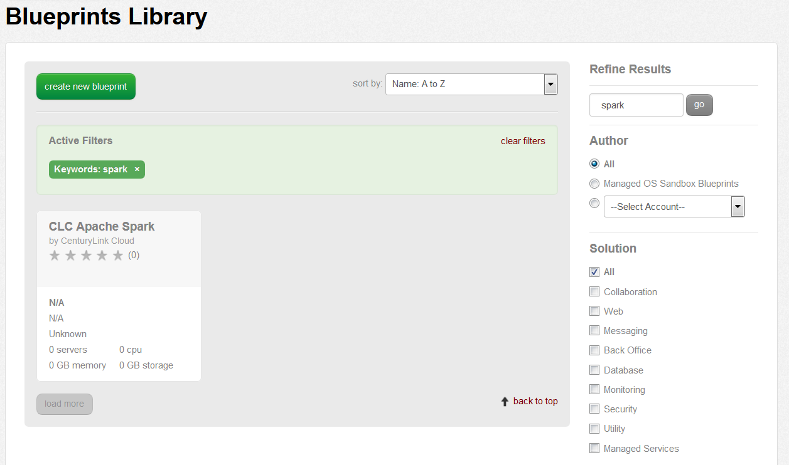
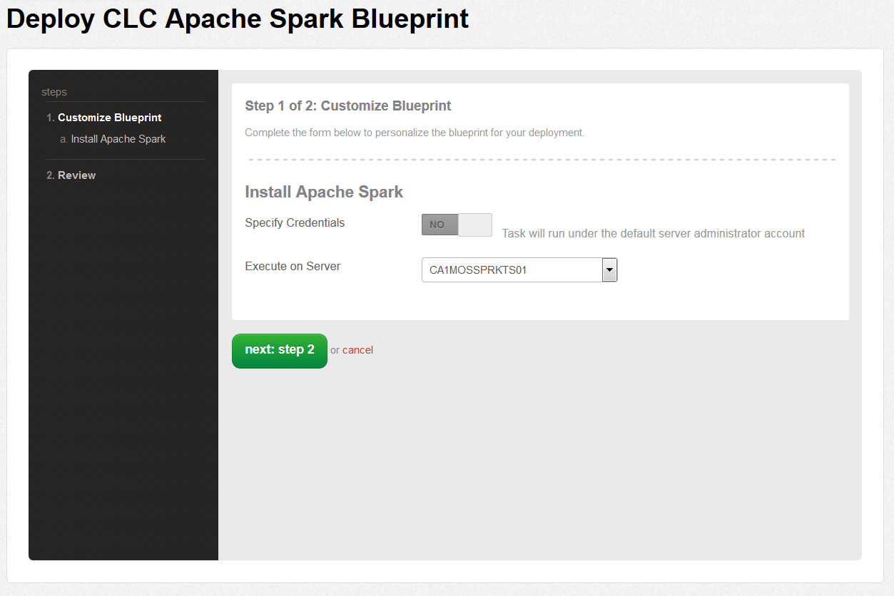
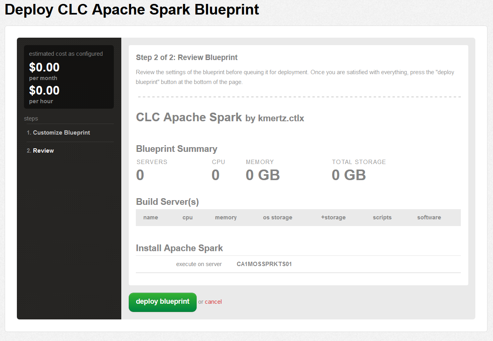
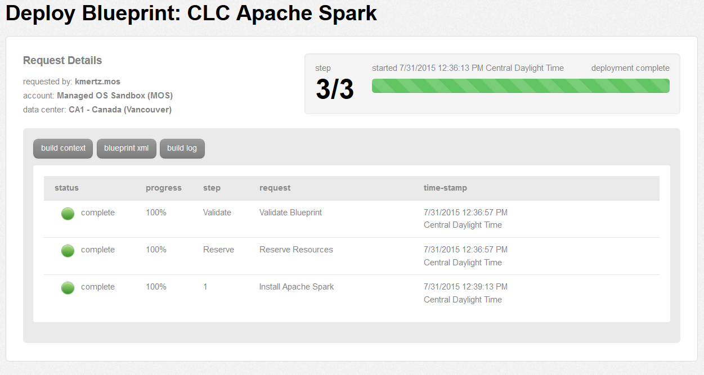

{{{
  "title": "Getting Started with Apache Spark",
  "date": "07-28-2015",
  "author": "Kyle Mertz",
  "attachments": [],
  "contentIsHTML": false
}}}

##Overview

Apache Spark is available for install on a standalone CentOS 6 64-bit VM in CenturyLink Cloud.

 

**1. Navigate to the Blueprints Library and search for "spark".  Then choose the Apache Spark install Blueprint.**

 

**2. After clicking to deploy your Blueprint, select the CentOS VM that you'd like to install Apache Spark onto.**

 

**3. Review the details of your build and then click "deploy blueprint" at the bottom.**

 

**4. Verify your build completed successfully.**

 

###Details

After the build is complete, your SPARK_HOME will be located at: 
>/usr/local/spark-1.4.1-bin-hadoop2.4

For more information on how to use Apache Spark, you can go [HERE](http://spark.apache.org/docs/latest/quick-start.html).
